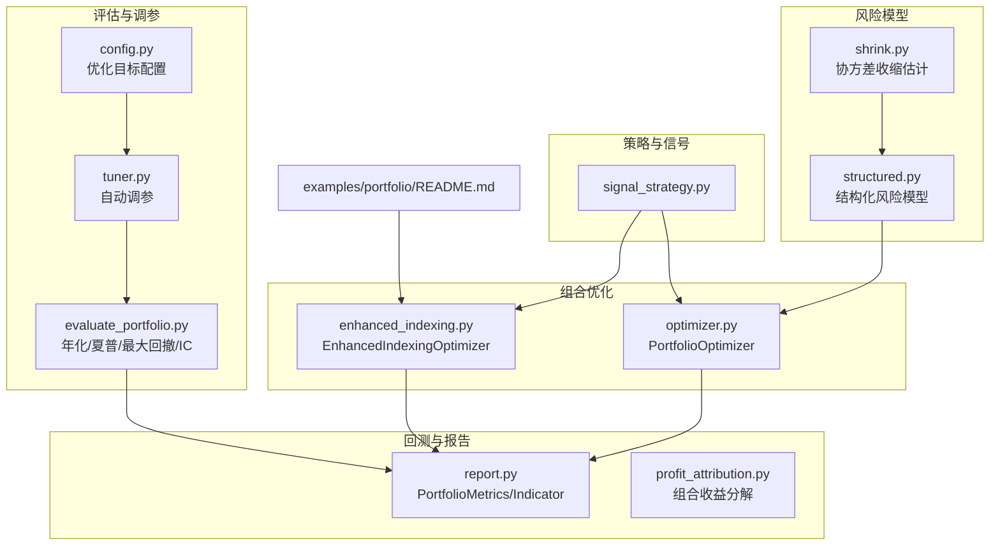
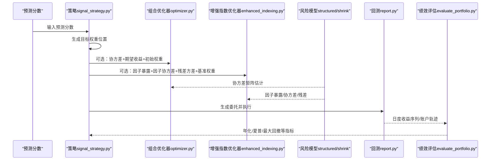
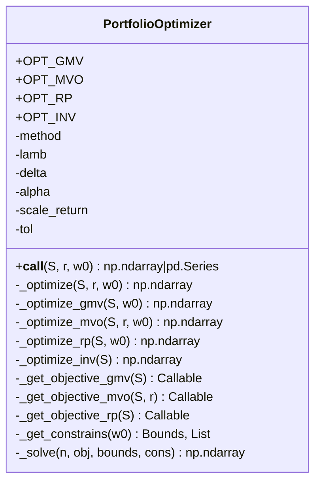
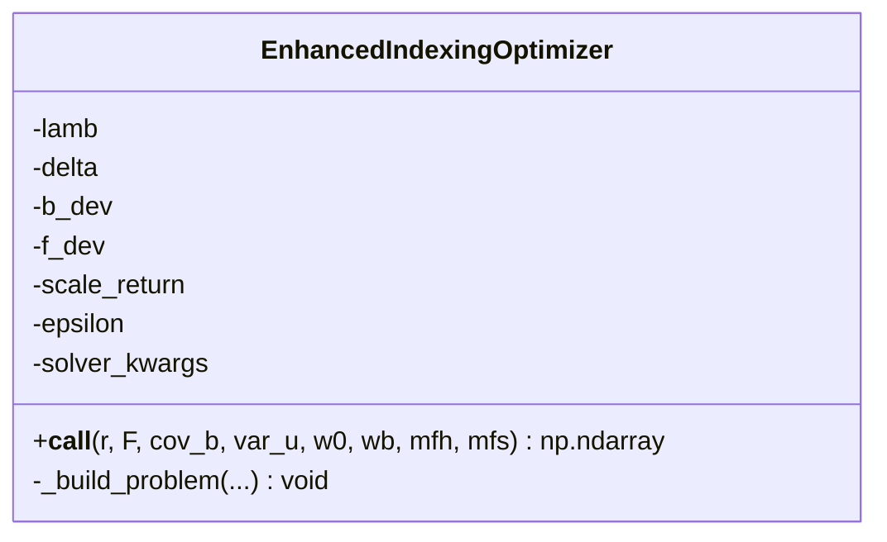
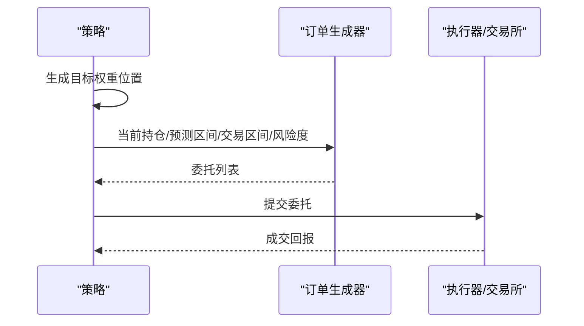
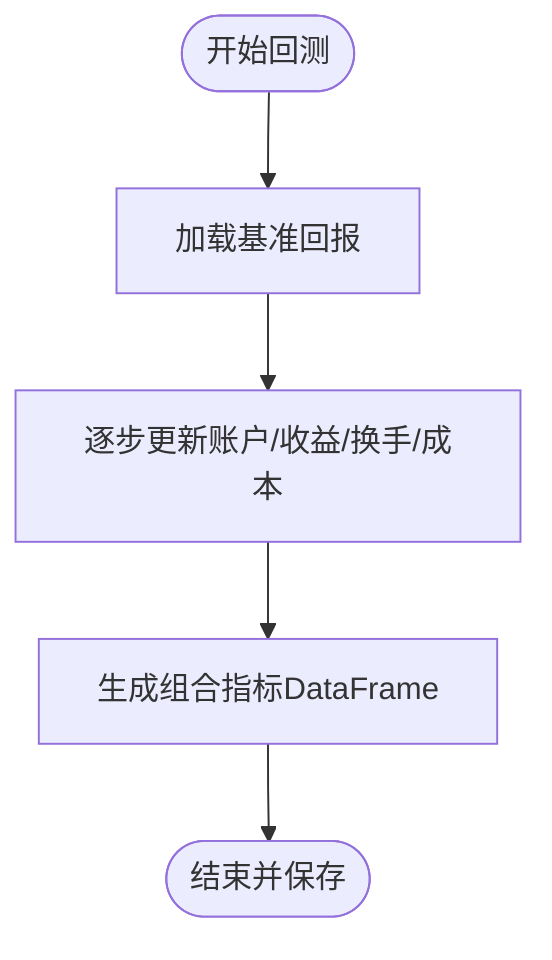
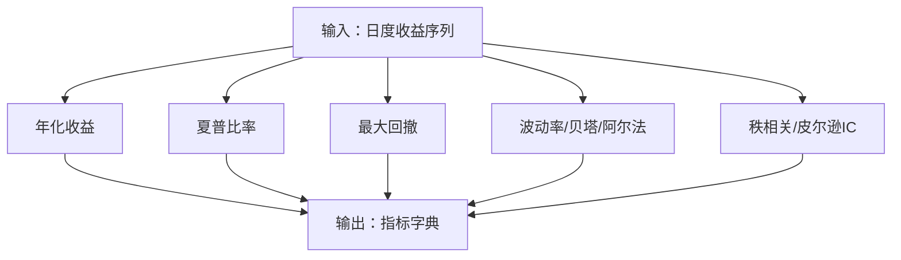
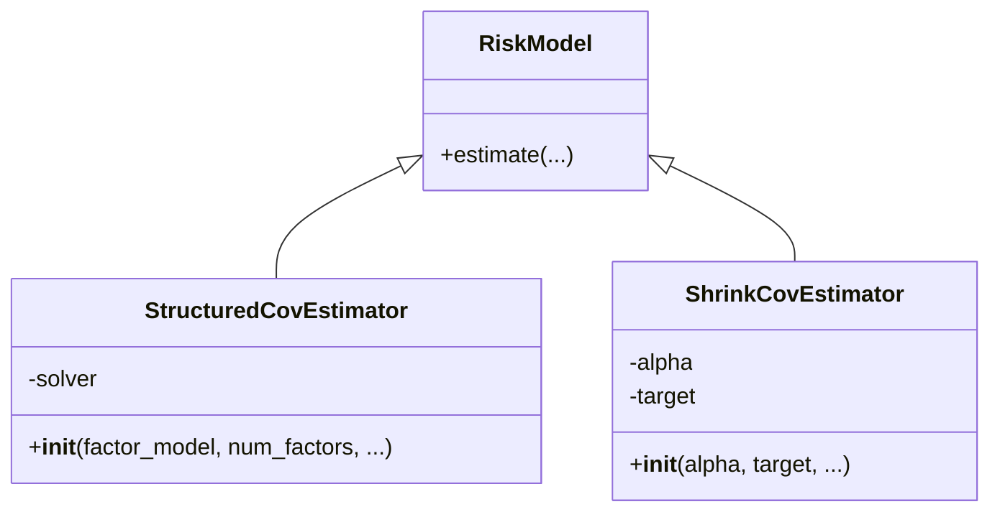
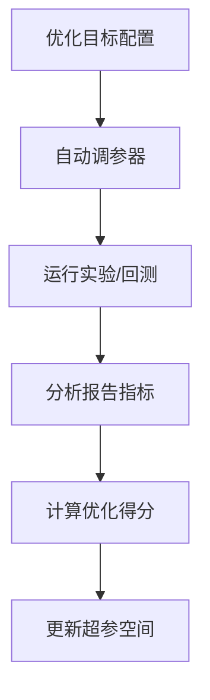
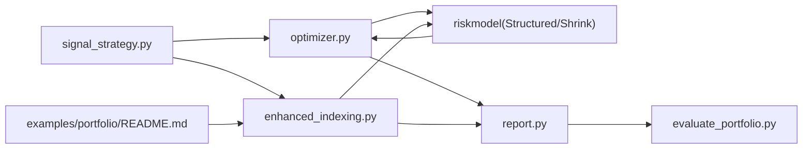

# 多策略组合

<cite>
**本文引用的文件**
- [evaluate_portfolio.py](file://qlib/contrib/evaluate_portfolio.py)
- [optimizer.py](file://qlib/contrib/strategy/optimizer/optimizer.py)
- [enhanced_indexing.py](file://qlib/contrib/strategy/optimizer/enhanced_indexing.py)
- [report.py](file://qlib/backtest/report.py)
- [README.md（示例：组合优化）](file://examples/portfolio/README.md)
- [signal_strategy.py](file://qlib/contrib/strategy/signal_strategy.py)
- [config.py（调参器配置）](file://qlib/contrib/tuner/config.py)
- [tuner.py（调参器）](file://qlib/contrib/tuner/tuner.py)
- [structured.py（结构化风险模型）](file://qlib/model/riskmodel/structured.py)
- [shrink.py（收缩估计器）](file://qlib/model/riskmodel/shrink.py)
- [profit_attribution.py](file://qlib/backtest/profit_attribution.py)
- [strategy.rst（策略组件文档）](file://docs/component/strategy.rst)
</cite>

## 目录
1. [引言](#引言)
2. [项目结构](#项目结构)
3. [核心组件](#核心组件)
4. [架构总览](#架构总览)
5. [详细组件分析](#详细组件分析)
6. [依赖关系分析](#依赖关系分析)
7. [性能考量](#性能考量)
8. [故障排查指南](#故障排查指南)
9. [结论](#结论)
10. [附录](#附录)

## 引言
本文件面向希望在Qlib中构建“多策略组合系统”的读者，系统性阐述策略池管理、组合权重分配、策略筛选与评价、权重动态调整、策略相关性与互补性分析、组合风险管理与监控（含VaR与压力测试思路）、以及回测与优化实践。内容以代码为依据，辅以图示帮助理解。

## 项目结构
围绕多策略组合的关键模块分布如下：
- 组合优化与权重分配：contrib/strategy/optimizer（含通用投资组合优化器、增强指数优化器）
- 组合回测与报告：backtest/report.py（账户与指标、基准采样、交易指标聚合）
- 组合绩效与风险度量：contrib/evaluate_portfolio.py（年化收益、夏普比率、最大回撤、IC等）
- 策略执行与信号：contrib/strategy/signal_strategy.py（基于预测分数生成目标权重并下单）
- 风险模型：model/riskmodel（结构化因子模型、协方差收缩估计）
- 示例与文档：examples/portfolio（增强指数策略示例）、docs/component/strategy.rst（策略组件说明）
- 调参与优化：contrib/tuner（优化目标与因子配置）

**图表来源**
- [optimizer.py:14-112](file://qlib/contrib/strategy/optimizer/optimizer.py#L14-L112)
- [enhanced_indexing.py:15-111](file://qlib/contrib/strategy/optimizer/enhanced_indexing.py#L15-L111)
- [report.py:22-247](file://qlib/backtest/report.py#L22-L247)
- [profit_attribution.py:101-123](file://qlib/backtest/profit_attribution.py#L101-L123)
- [evaluate_portfolio.py:105-245](file://qlib/contrib/evaluate_portfolio.py#L105-L245)
- [signal_strategy.py:359-372](file://qlib/contrib/strategy/signal_strategy.py#L359-L372)
- [structured.py:45-65](file://qlib/model/riskmodel/structured.py#L45-L65)
- [shrink.py:54-70](file://qlib/model/riskmodel/shrink.py#L54-L70)
- [README.md（示例：组合优化）:1-48](file://examples/portfolio/README.md#L1-L48)
- [config.py（调参器配置）:59-90](file://qlib/contrib/tuner/config.py#L59-L90)
- [tuner.py（调参器）:141-167](file://qlib/contrib/tuner/tuner.py#L141-L167)

**章节来源**
- [optimizer.py:14-112](file://qlib/contrib/strategy/optimizer/optimizer.py#L14-L112)
- [enhanced_indexing.py:15-111](file://qlib/contrib/strategy/optimizer/enhanced_indexing.py#L15-L111)
- [report.py:22-247](file://qlib/backtest/report.py#L22-L247)
- [profit_attribution.py:101-123](file://qlib/backtest/profit_attribution.py#L101-L123)
- [evaluate_portfolio.py:105-245](file://qlib/contrib/evaluate_portfolio.py#L105-L245)
- [signal_strategy.py:359-372](file://qlib/contrib/strategy/signal_strategy.py#L359-L372)
- [structured.py:45-65](file://qlib/model/riskmodel/structured.py#L45-L65)
- [shrink.py:54-70](file://qlib/model/riskmodel/shrink.py#L54-L70)
- [README.md（示例：组合优化）:1-48](file://examples/portfolio/README.md#L1-L48)
- [config.py（调参器配置）:59-90](file://qlib/contrib/tuner/config.py#L59-L90)
- [tuner.py（调参器）:141-167](file://qlib/contrib/tuner/tuner.py#L141-L167)

## 核心组件
- 投资组合优化器（PortfolioOptimizer）
  - 支持最小方差（GMV）、均值-方差（MVO）、风险平价（RP）、反波动率（Inv）等方法；可施加换手约束、L2正则；支持预期收益缩放以匹配波动率。
- 增强指数优化器（EnhancedIndexingOptimizer）
  - 面向基准跟踪误差优化，支持基准偏离与因子暴露约束、总换手约束、强制持有/卖出掩码；采用凸优化求解。
- 组合回测与报告（PortfolioMetrics/Indicator）
  - 记录账户价值、日收益、换手、成本、基准回报等；支持按频率重采样基准；聚合订单级指标（成交金额、价值、价格优势等）。
- 组合绩效与风险度量（evaluate_portfolio.py）
  - 提供日度收益序列到年化收益、夏普比率、最大回撤、贝塔/阿尔法、波动率、秩相关/皮尔逊IC等指标。
- 策略执行（signal_strategy.py）
  - 基于预测分数生成目标权重位置，并通过订单生成器转换为实际委托列表。
- 风险模型（riskmodel）
  - 结构化因子模型（PCA/FA）与协方差收缩估计，用于协方差矩阵估计与稳定化。
- 示例与文档（examples/portfolio/README.md、docs/component/strategy.rst）
  - 展示如何用增强指数策略结合风险模型进行组合优化，并给出基准权重准备与工作流说明。

**章节来源**
- [optimizer.py:14-112](file://qlib/contrib/strategy/optimizer/optimizer.py#L14-L112)
- [enhanced_indexing.py:15-111](file://qlib/contrib/strategy/optimizer/enhanced_indexing.py#L15-L111)
- [report.py:22-247](file://qlib/backtest/report.py#L22-L247)
- [evaluate_portfolio.py:105-245](file://qlib/contrib/evaluate_portfolio.py#L105-L245)
- [signal_strategy.py:359-372](file://qlib/contrib/strategy/signal_strategy.py#L359-L372)
- [structured.py:45-65](file://qlib/model/riskmodel/structured.py#L45-L65)
- [shrink.py:54-70](file://qlib/model/riskmodel/shrink.py#L54-L70)
- [README.md（示例：组合优化）:1-48](file://examples/portfolio/README.md#L1-L48)
- [strategy.rst（策略组件文档）:253-282](file://docs/component/strategy.rst#L253-L282)

## 架构总览
下图展示从“预测信号”到“组合权重”再到“回测报告”的关键流程，以及风险模型与优化器的集成路径。

**图表来源**
- [signal_strategy.py:359-372](file://qlib/contrib/strategy/signal_strategy.py#L359-L372)
- [optimizer.py:65-112](file://qlib/contrib/strategy/optimizer/optimizer.py#L65-L112)
- [enhanced_indexing.py:87-111](file://qlib/contrib/strategy/optimizer/enhanced_indexing.py#L87-L111)
- [structured.py:45-65](file://qlib/model/riskmodel/structured.py#L45-L65)
- [shrink.py:54-70](file://qlib/model/riskmodel/shrink.py#L54-L70)
- [report.py:153-201](file://qlib/backtest/report.py#L153-L201)
- [evaluate_portfolio.py:105-140](file://qlib/contrib/evaluate_portfolio.py#L105-L140)

## 详细组件分析

### 组件A：组合优化器（PortfolioOptimizer）
- 方法族
  - GMV：最小化投资组合方差，无短卖与满仓约束。
  - MVO：在期望收益与方差之间折中，受风险厌恶参数控制。
  - RP：风险平价，使各资产对总风险的边际贡献相等。
  - Inv：反波动率权重归一化。
- 约束与正则
  - 无卖空与满仓约束；可选换手约束；可选L2正则抑制过拟合。
  - 可将预期收益缩放到与协方差波动率一致，提升优化稳定性。
- 输出
  - 返回权重向量或带索引的Series。

**图表来源**
- [optimizer.py:14-112](file://qlib/contrib/strategy/optimizer/optimizer.py#L14-L112)
- [optimizer.py:114-266](file://qlib/contrib/strategy/optimizer/optimizer.py#L114-L266)

**章节来源**
- [optimizer.py:14-112](file://qlib/contrib/strategy/optimizer/optimizer.py#L14-L112)
- [optimizer.py:114-266](file://qlib/contrib/strategy/optimizer/optimizer.py#L114-L266)

### 组件B：增强指数优化器（EnhancedIndexingOptimizer）
- 目标
  - 在基准跟踪误差与超额收益之间权衡，最大化超额收益减去跟踪误差风险。
- 约束
  - 基准偏离上下界、因子暴露上下界、总换手上限、强制持有/卖出掩码。
- 求解
  - 使用凸优化求解器，失败时尝试移除换手约束作为后备方案；最终去除极小权重并归一化。

**图表来源**
- [enhanced_indexing.py:15-111](file://qlib/contrib/strategy/optimizer/enhanced_indexing.py#L15-L111)
- [enhanced_indexing.py:112-202](file://qlib/contrib/strategy/optimizer/enhanced_indexing.py#L112-L202)

**章节来源**
- [enhanced_indexing.py:15-111](file://qlib/contrib/strategy/optimizer/enhanced_indexing.py#L15-L111)
- [enhanced_indexing.py:112-202](file://qlib/contrib/strategy/optimizer/enhanced_indexing.py#L112-L202)

### 组件C：策略执行与信号（signal_strategy.py）
- 关键流程
  - 将预测分数映射为目标权重位置；
  - 通过订单生成器将目标权重转换为委托列表；
  - 结合交易时段、滑点/手续费、风险系数等生成交易决策。

**图表来源**
- [signal_strategy.py:359-372](file://qlib/contrib/strategy/signal_strategy.py#L359-L372)

**章节来源**
- [signal_strategy.py:359-372](file://qlib/contrib/strategy/signal_strategy.py#L359-L372)

### 组件D：回测与报告（report.py）
- 职责
  - 记录每日账户价值、日收益、换手、成本、基准回报等；
  - 支持基准回报的频率重采样与样本；
  - 聚合订单级指标（成交金额、价值、价格优势等）。
- 输出
  - 生成组合指标DataFrame，便于后续绩效评估。

**图表来源**
- [report.py:96-201](file://qlib/backtest/report.py#L96-L201)

**章节来源**
- [report.py:22-247](file://qlib/backtest/report.py#L22-L247)

### 组件E：组合绩效与风险度量（evaluate_portfolio.py）
- 能力
  - 从持仓序列构造日度收益序列；
  - 计算年化收益、夏普比率、最大回撤、波动率、贝塔/阿尔法、秩相关/皮尔逊IC等。
- 应用
  - 用于策略筛选与组合监控。

**图表来源**
- [evaluate_portfolio.py:105-245](file://qlib/contrib/evaluate_portfolio.py#L105-L245)

**章节来源**
- [evaluate_portfolio.py:105-245](file://qlib/contrib/evaluate_portfolio.py#L105-L245)

### 组件F：风险模型（structured.py / shrink.py）
- 结构化风险模型
  - 支持PCA/因子分析两类潜因子模型，估计结构化协方差矩阵。
- 协方差收缩估计
  - 支持多种收缩方法与目标（常方差、常相关、单因子），提高协方差估计稳定性。

**图表来源**
- [structured.py:45-65](file://qlib/model/riskmodel/structured.py#L45-L65)
- [shrink.py:54-70](file://qlib/model/riskmodel/shrink.py#L54-L70)

**章节来源**
- [structured.py:45-65](file://qlib/model/riskmodel/structured.py#L45-L65)
- [shrink.py:54-70](file://qlib/model/riskmodel/shrink.py#L54-L70)

### 组件G：策略筛选与调参（tuner/config.py / tuner.py）
- 优化目标配置
  - 支持以不同报告类型与因子作为优化目标（如信息比率、最大回撤等），并指定优化方向（最小/最大/相关性）。
- 自动调参
  - 读取回测分析结果，根据配置计算得分并驱动超参搜索。

**图表来源**
- [config.py（调参器配置）:59-90](file://qlib/contrib/tuner/config.py#L59-L90)
- [tuner.py（调参器）:141-167](file://qlib/contrib/tuner/tuner.py#L141-L167)

**章节来源**
- [config.py（调参器配置）:59-90](file://qlib/contrib/tuner/config.py#L59-L90)
- [tuner.py（调参器）:141-167](file://qlib/contrib/tuner/tuner.py#L141-L167)

## 依赖关系分析
- 策略层依赖优化器与风险模型：策略将预测分数转化为目标权重，优化器依赖协方差与预期收益，风险模型提供协方差估计。
- 回测层产出日度收益序列，供绩效评估模块计算各类指标。
- 文档与示例指导如何准备基准权重与风险模型数据，形成闭环。

**图表来源**
- [signal_strategy.py:359-372](file://qlib/contrib/strategy/signal_strategy.py#L359-L372)
- [optimizer.py:65-112](file://qlib/contrib/strategy/optimizer/optimizer.py#L65-L112)
- [enhanced_indexing.py:87-111](file://qlib/contrib/strategy/optimizer/enhanced_indexing.py#L87-L111)
- [structured.py:45-65](file://qlib/model/riskmodel/structured.py#L45-L65)
- [shrink.py:54-70](file://qlib/model/riskmodel/shrink.py#L54-L70)
- [report.py:153-201](file://qlib/backtest/report.py#L153-L201)
- [evaluate_portfolio.py:105-140](file://qlib/contrib/evaluate_portfolio.py#L105-L140)
- [README.md（示例：组合优化）:1-48](file://examples/portfolio/README.md#L1-L48)

**章节来源**
- [signal_strategy.py:359-372](file://qlib/contrib/strategy/signal_strategy.py#L359-L372)
- [optimizer.py:65-112](file://qlib/contrib/strategy/optimizer/optimizer.py#L65-L112)
- [enhanced_indexing.py:87-111](file://qlib/contrib/strategy/optimizer/enhanced_indexing.py#L87-L111)
- [structured.py:45-65](file://qlib/model/riskmodel/structured.py#L45-L65)
- [shrink.py:54-70](file://qlib/model/riskmodel/shrink.py#L54-L70)
- [report.py:153-201](file://qlib/backtest/report.py#L153-L201)
- [evaluate_portfolio.py:105-140](file://qlib/contrib/evaluate_portfolio.py#L105-L140)
- [README.md（示例：组合优化）:1-48](file://examples/portfolio/README.md#L1-L48)

## 性能考量
- 优化稳定性
  - 使用风险模型估计协方差并进行收缩，有助于数值稳定与泛化。
  - 对预期收益进行波动率缩放，避免收益尺度主导优化。
- 计算复杂度
  - 协方差矩阵求逆/特征分解与凸优化问题规模随资产数增长；建议在资产维度较高时采用结构化模型或稀疏估计。
- 实盘执行
  - 换手约束与订单生成器设置可降低冲击成本与滑点影响；回测阶段应尽量贴近真实市场参数。

[本节为通用指导，不直接分析具体文件]

## 故障排查指南
- 优化未收敛或失败
  - 检查协方差矩阵是否正定；考虑启用收缩估计或增加L2正则。
  - 若开启换手约束导致不可行，可尝试移除换手约束后回退。
- 基准数据缺失
  - 确认基准配置正确且时间范围覆盖回测区间；若Series为空，需检查数据准备步骤。
- 绩效指标异常
  - 确保日度收益序列与初始资产值一致；检查是否存在极端异常值或零收益期过多导致统计不稳定。

**章节来源**
- [enhanced_indexing.py:166-191](file://qlib/contrib/strategy/optimizer/enhanced_indexing.py#L166-L191)
- [report.py:96-121](file://qlib/backtest/report.py#L96-L121)
- [evaluate_portfolio.py:178-192](file://qlib/contrib/evaluate_portfolio.py#L178-L192)

## 结论
Qlib的多策略组合体系以“预测信号—组合优化—回测评估—风险建模”为主线，既支持传统均值-方差与风险平价等静态权重方法，也支持面向基准跟踪误差的增强指数优化。通过统一的回测与报告框架，配合风险模型估计与自动调参能力，可在实践中实现稳健的策略筛选与权重动态调整。

[本节为总结性内容，不直接分析具体文件]

## 附录

### A. 策略选择与筛选机制
- 历史表现评估
  - 使用日度收益序列计算年化收益、夏普比率、最大回撤等指标，作为策略筛选基础。
- 相关性与IC
  - 通过秩相关/皮尔逊IC衡量预测分数与未来收益的线性/单调关系，辅助策略池多样性与质量判断。

**章节来源**
- [evaluate_portfolio.py:143-245](file://qlib/contrib/evaluate_portfolio.py#L143-L245)
- [strategy.rst（策略组件文档）:253-282](file://docs/component/strategy.rst#L253-L282)

### B. 权重动态调整方法
- 基于预测准确率的权重更新
  - 可在滚动窗口内计算IC或信息比率，作为权重调整信号；与换手约束结合，避免频繁调整。
- 风险平价权重
  - 使用RP方法在波动率估计基础上实现风险贡献均衡，适合多策略组合分散化。

**章节来源**
- [optimizer.py:169-178](file://qlib/contrib/strategy/optimizer/optimizer.py#L169-L178)
- [optimizer.py:205-218](file://qlib/contrib/strategy/optimizer/optimizer.py#L205-L218)

### C. 策略相关性与互补性分析
- 收益相关性与分散化
  - 通过组合收益序列与个股收益的相关性、组合波动率分解（因子/特定风险）评估互补性与分散化效果。
- 组合收益分解
  - 利用收益归因模块按行业/风格等维度分解组合收益来源。

**章节来源**
- [profit_attribution.py:101-123](file://qlib/backtest/profit_attribution.py#L101-L123)

### D. 风险管理与监控
- 组合VaR与压力测试
  - 可基于历史模拟法或参数法（正态/半正态）估算组合VaR；压力测试可引入极端市场情景（如黑天鹅事件）下的收益分布。
- 监控指标
  - 持续跟踪年化收益、夏普比率、最大回撤、换手率、贝塔/阿尔法等，建立阈值预警。

**章节来源**
- [evaluate_portfolio.py:159-227](file://qlib/contrib/evaluate_portfolio.py#L159-L227)

### E. 回测与优化实践案例
- 增强指数策略
  - 准备基准权重与风险模型数据，使用增强指数优化器在跟踪误差与超额收益间取得平衡。
- 自动调参
  - 配置优化目标与因子，自动搜索最优超参组合，提升策略鲁棒性。

**章节来源**
- [README.md（示例：组合优化）:1-48](file://examples/portfolio/README.md#L1-L48)
- [config.py（调参器配置）:59-90](file://qlib/contrib/tuner/config.py#L59-L90)
- [tuner.py（调参器）:141-167](file://qlib/contrib/tuner/tuner.py#L141-L167)