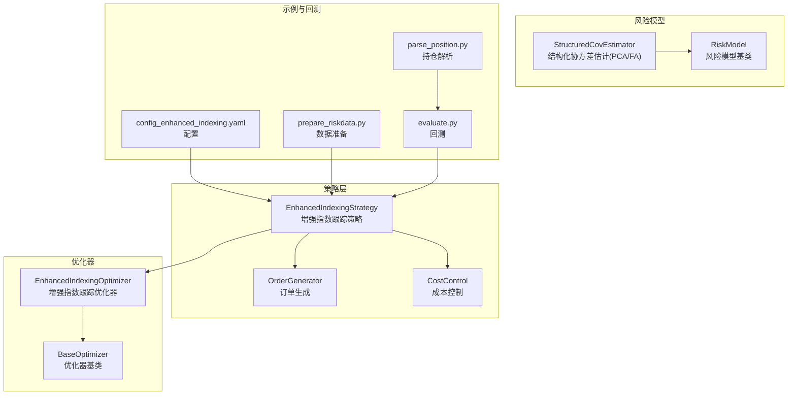
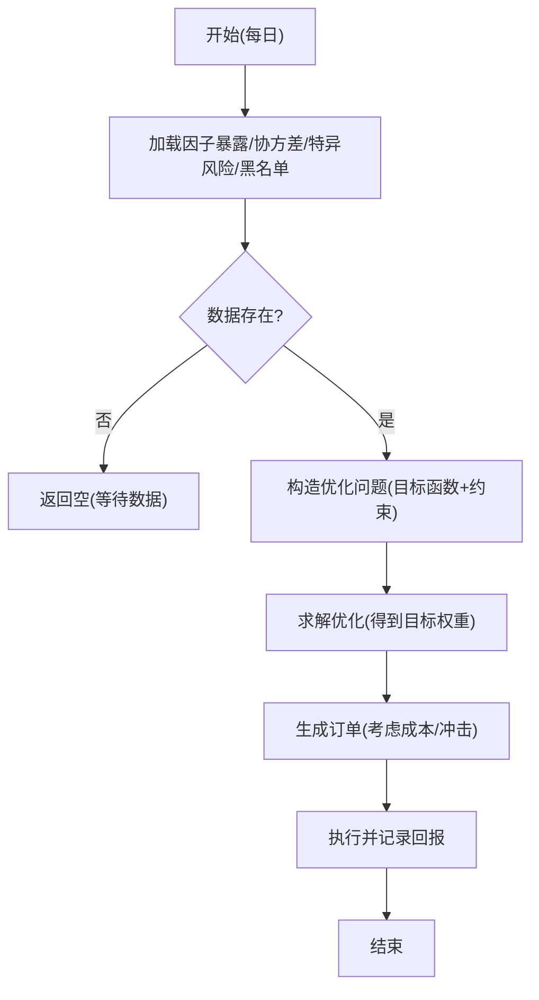
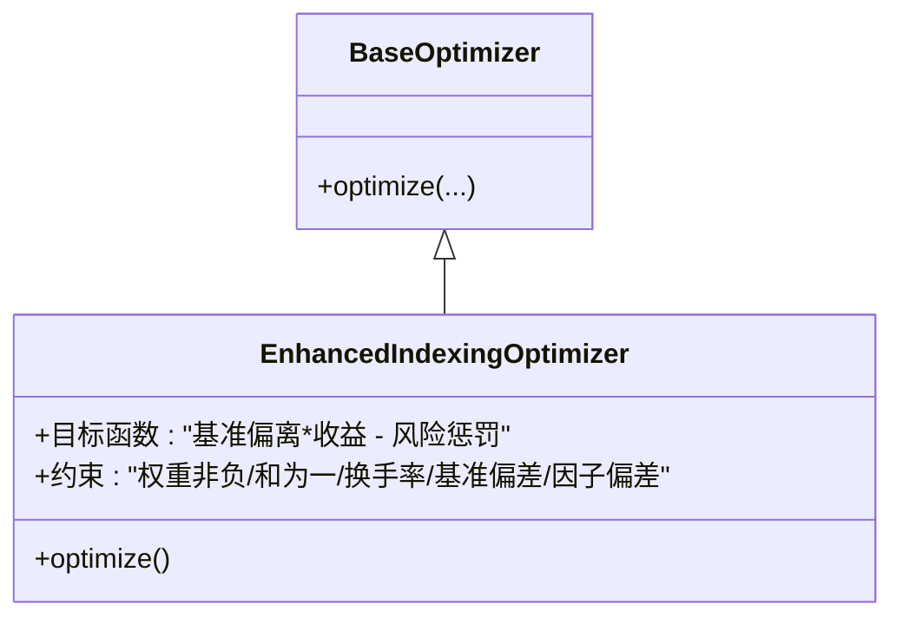
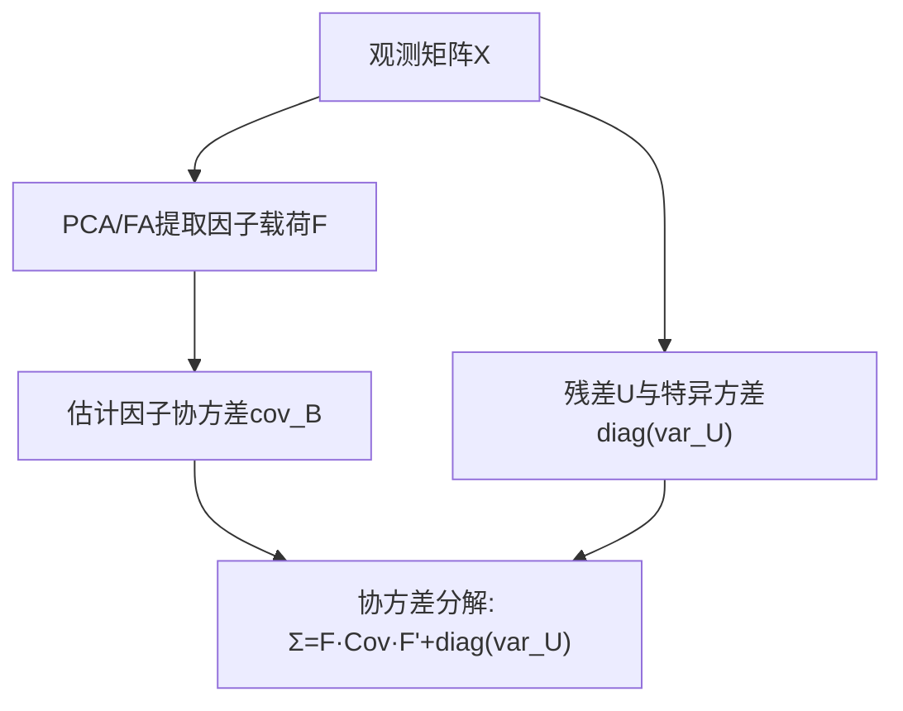
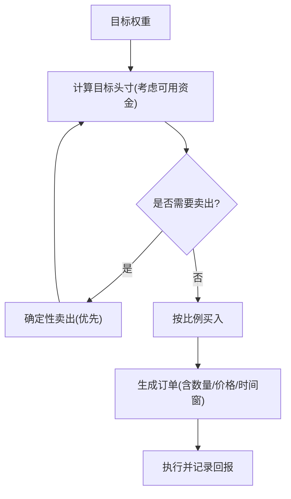
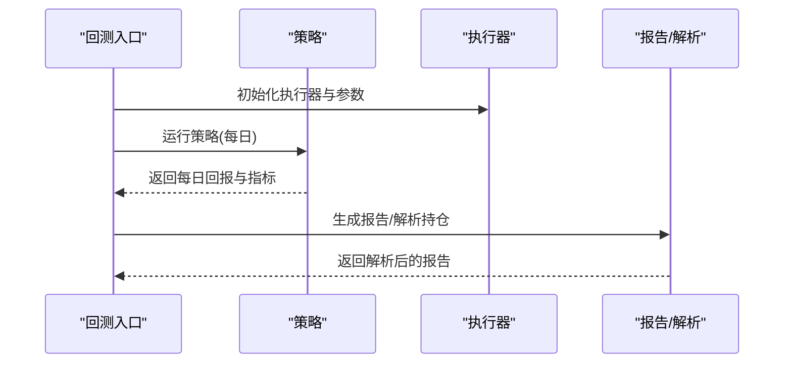
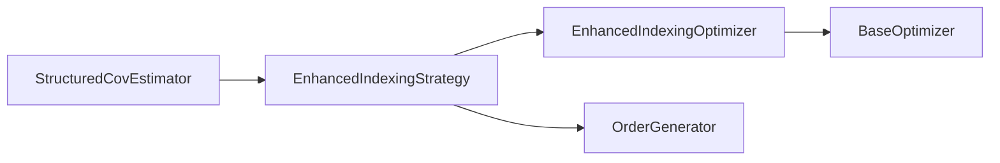

# 投资组合优化

<cite>
**本文引用的文件**   
- [qlib/contrib/strategy/optimizer/enhanced_indexing.py](file://qlib/contrib/strategy/optimizer/enhanced_indexing.py)
- [qlib/contrib/strategy/optimizer/base.py](file://qlib/contrib/strategy/optimizer/base.py)
- [qlib/contrib/strategy/signal_strategy.py](file://qlib/contrib/strategy/signal_strategy.py)
- [qlib/contrib/strategy/order_generator.py](file://qlib/contrib/strategy/order_generator.py)
- [qlib/contrib/strategy/cost_control.py](file://qlib/contrib/strategy/cost_control.py)
- [qlib/model/riskmodel/structured.py](file://qlib/model/riskmodel/structured.py)
- [qlib/model/riskmodel/base.py](file://qlib/model/riskmodel/base.py)
- [examples/portfolio/config_enhanced_indexing.yaml](file://examples/portfolio/config_enhanced_indexing.yaml)
- [examples/portfolio/prepare_riskdata.py](file://examples/portfolio/prepare_riskdata.py)
- [qlib/contrib/evaluate.py](file://qlib/contrib/evaluate.py)
- [qlib/contrib/report/analysis_position/parse_position.py](file://qlib/contrib/report/analysis_position/parse_position.py)
</cite>

## 目录
1. [引言](#引言)
2. [项目结构](#项目结构)
3. [核心组件](#核心组件)
4. [架构总览](#架构总览)
5. [详细组件分析](#详细组件分析)
6. [依赖关系分析](#依赖关系分析)
7. [性能考量](#性能考量)
8. [故障排查指南](#故障排查指南)
9. [结论](#结论)
10. [附录](#附录)

## 引言
本文件面向Qlib投资组合优化系统，围绕“增强指数跟踪”策略展开，系统性梳理从理论到实现的关键路径：现代投资组合理论与风险模型、Black-Litterman模型的背景知识、增强指数跟踪的目标函数与约束、协方差矩阵估计与因子风险模型、多因子模型在优化中的应用、优化参数调优与回测评估。文档同时结合仓库中现有代码模块与示例配置，给出可操作的实现步骤与可视化流程图，帮助读者快速理解并落地相关策略。

## 项目结构
与投资组合优化直接相关的核心目录与文件如下：
- 策略层
  - 增强指数跟踪策略：[signal_strategy.py](file://qlib/contrib/strategy/signal_strategy.py)
  - 订单生成与成本控制：[order_generator.py](file://qlib/contrib/strategy/order_generator.py)、[cost_control.py](file://qlib/contrib/strategy/cost_control.py)
- 优化器
  - 基类与增强指数跟踪优化器：[base.py](file://qlib/contrib/strategy/optimizer/base.py)、[enhanced_indexing.py](file://qlib/contrib/strategy/optimizer/enhanced_indexing.py)
- 风险模型
  - 结构化协方差估计（PCA/FA）：[structured.py](file://qlib/model/riskmodel/structured.py)、[base.py](file://qlib/model/riskmodel/base.py)
- 示例与回测
  - 增强指数跟踪配置与数据准备：[config_enhanced_indexing.yaml](file://examples/portfolio/config_enhanced_indexing.yaml)、[prepare_riskdata.py](file://examples/portfolio/prepare_riskdata.py)
  - 回测与报告解析：[evaluate.py](file://qlib/contrib/evaluate.py)、[parse_position.py](file://qlib/contrib/report/analysis_position/parse_position.py)



**图表来源**
- [qlib/contrib/strategy/signal_strategy.py:375-460](file://qlib/contrib/strategy/signal_strategy.py#L375-L460)
- [qlib/contrib/strategy/optimizer/base.py](file://qlib/contrib/strategy/optimizer/base.py)
- [qlib/contrib/strategy/optimizer/enhanced_indexing.py:1-44](file://qlib/contrib/strategy/optimizer/enhanced_indexing.py#L1-L44)
- [qlib/contrib/strategy/order_generator.py:112-140](file://qlib/contrib/strategy/order_generator.py#L112-L140)
- [qlib/contrib/strategy/cost_control.py:44-79](file://qlib/contrib/strategy/cost_control.py#L44-L79)
- [qlib/model/riskmodel/base.py](file://qlib/model/riskmodel/base.py)
- [qlib/model/riskmodel/structured.py:11-65](file://qlib/model/riskmodel/structured.py#L11-L65)
- [examples/portfolio/config_enhanced_indexing.yaml](file://examples/portfolio/config_enhanced_indexing.yaml)
- [examples/portfolio/prepare_riskdata.py](file://examples/portfolio/prepare_riskdata.py)
- [qlib/contrib/evaluate.py:208-290](file://qlib/contrib/evaluate.py#L208-L290)
- [qlib/contrib/report/analysis_position/parse_position.py:38-62](file://qlib/contrib/report/analysis_position/parse_position.py#L38-L62)

**章节来源**
- [qlib/contrib/strategy/signal_strategy.py:375-460](file://qlib/contrib/strategy/signal_strategy.py#L375-L460)
- [qlib/contrib/strategy/optimizer/enhanced_indexing.py:1-44](file://qlib/contrib/strategy/optimizer/enhanced_indexing.py#L1-L44)
- [qlib/contrib/strategy/order_generator.py:112-140](file://qlib/contrib/strategy/order_generator.py#L112-L140)
- [qlib/contrib/strategy/cost_control.py:44-79](file://qlib/contrib/strategy/cost_control.py#L44-L79)
- [qlib/model/riskmodel/structured.py:11-65](file://qlib/model/riskmodel/structured.py#L11-L65)
- [examples/portfolio/config_enhanced_indexing.yaml](file://examples/portfolio/config_enhanced_indexing.yaml)
- [examples/portfolio/prepare_riskdata.py](file://examples/portfolio/prepare_riskdata.py)
- [qlib/contrib/evaluate.py:208-290](file://qlib/contrib/evaluate.py#L208-L290)
- [qlib/contrib/report/analysis_position/parse_position.py:38-62](file://qlib/contrib/report/analysis_position/parse_position.py#L38-L62)

## 核心组件
- 增强指数跟踪策略（EnhancedIndexingStrategy）
  - 负责加载每日风险数据（因子暴露、因子协方差、特异风险、黑名单），并驱动优化器生成目标权重，再由订单生成器转换为交易指令。
  - 关键点：支持按日期缓存风险数据；缺失特异风险时采用保守填充；支持黑名单过滤。
- 增强指数跟踪优化器（EnhancedIndexingOptimizer）
  - 实现增强指数跟踪的二次规划目标函数与约束集合，包括基准偏离限制、因子偏离限制、换手率限制、非负权重与权重和约束等。
- 风险模型（StructuredCovEstimator）
  - 基于潜在因子模型（PCA/FA）估计协方差矩阵，分解为因子风险与特异风险两部分，便于在优化中分别建模。
- 订单生成与成本控制（OrderGenerator/CostControl）
  - 将目标权重映射为可执行的下单清单，考虑交易成本、滑点与冲击限制，确保同步买卖与确定性卖出优先。
- 回测与报告（evaluate/parse_position）
  - 提供标准化回测入口与报告生成，解析持仓状态与买卖信号，辅助策略效果评估。

**章节来源**
- [qlib/contrib/strategy/signal_strategy.py:375-460](file://qlib/contrib/strategy/signal_strategy.py#L375-L460)
- [qlib/contrib/strategy/optimizer/enhanced_indexing.py:15-44](file://qlib/contrib/strategy/optimizer/enhanced_indexing.py#L15-L44)
- [qlib/model/riskmodel/structured.py:11-65](file://qlib/model/riskmodel/structured.py#L11-L65)
- [qlib/contrib/strategy/order_generator.py:112-140](file://qlib/contrib/strategy/order_generator.py#L112-L140)
- [qlib/contrib/strategy/cost_control.py:44-79](file://qlib/contrib/strategy/cost_control.py#L44-L79)
- [qlib/contrib/evaluate.py:208-290](file://qlib/contrib/evaluate.py#L208-L290)
- [qlib/contrib/report/analysis_position/parse_position.py:38-62](file://qlib/contrib/report/analysis_position/parse_position.py#L38-L62)

## 架构总览
下图展示了从“信号/评分”到“目标权重”再到“订单执行”的完整闭环，以及风险模型数据的输入路径。

```mermaid
sequenceDiagram
    participant STR as "策略<br/>EnhancedIndexingStrategy"
    participant OPT as "优化器<br/>EnhancedIndexingOptimizer"
    participant ORD as "订单生成<br/>OrderGenerator"
    participant RM as "风险模型数据<br/>因子暴露/协方差/特异风险"
    participant EXE as "执行器/回测"
    
    STR->>RM: "加载当日风险数据(因子暴露/协方差/特异风险/黑名单)"
    STR->>OPT: "输入当前权重、基准权重、预期收益、风险参数"
    OPT-->>STR: "输出目标权重(满足约束)"
    STR->>ORD: "传入目标权重与可用资金"
    ORD-->>STR: "返回订单列表(含买卖/数量/价格)"
    STR->>EXE: "执行订单并记录回报与指标"
```

**图表来源**
- [qlib/contrib/strategy/signal_strategy.py:375-460](file://qlib/contrib/strategy/signal_strategy.py#L375-L460)
- [qlib/contrib/strategy/optimizer/enhanced_indexing.py:15-44](file://qlib/contrib/strategy/optimizer/enhanced_indexing.py#L15-L44)
- [qlib/contrib/strategy/order_generator.py:112-140](file://qlib/contrib/strategy/order_generator.py#L112-L140)
- [qlib/contrib/evaluate.py:208-290](file://qlib/contrib/evaluate.py#L208-L290)

## 详细组件分析

### 增强指数跟踪策略（EnhancedIndexingStrategy）
- 功能职责
  - 按日加载风险模型数据，构建因子暴露、因子协方差、特异风险与黑名单。
  - 通过优化器计算目标权重，再由订单生成器转化为可执行订单。
- 数据加载与缓存
  - 支持按日期缓存，避免重复I/O；当特异风险缺失时进行填充；黑名单用于过滤不可交易标的。
- 与优化器/订单生成器的交互
  - 优化器接收当前权重、基准权重、预期收益、风险参数与各类约束，输出目标权重。
  - 订单生成器根据目标权重、可用资金与交易成本生成订单。



**图表来源**
- [qlib/contrib/strategy/signal_strategy.py:436-460](file://qlib/contrib/strategy/signal_strategy.py#L436-L460)
- [qlib/contrib/strategy/optimizer/enhanced_indexing.py:15-44](file://qlib/contrib/strategy/optimizer/enhanced_indexing.py#L15-L44)
- [qlib/contrib/strategy/order_generator.py:112-140](file://qlib/contrib/strategy/order_generator.py#L112-L140)

**章节来源**
- [qlib/contrib/strategy/signal_strategy.py:375-460](file://qlib/contrib/strategy/signal_strategy.py#L375-L460)
- [qlib/contrib/strategy/order_generator.py:112-140](file://qlib/contrib/strategy/order_generator.py#L112-L140)

### 增强指数跟踪优化器（EnhancedIndexingOptimizer）
- 目标函数与变量
  - 决策变量：目标权重向量
  - 目标函数：基准偏离与预期收益的线性项，减去因子风险与特异风险的二次惩罚项
  - 风险厌恶参数：控制收益与风险的权衡
- 约束集合
  - 权重非负与和为一
  - 换手率上限（基于期初权重）
  - 基准偏差上下限
  - 因子偏差上下限
- 求解方式
  - 采用二次规划框架进行数值求解，具体实现依赖外部优化库接口。



**图表来源**
- [qlib/contrib/strategy/optimizer/base.py](file://qlib/contrib/strategy/optimizer/base.py)
- [qlib/contrib/strategy/optimizer/enhanced_indexing.py:15-44](file://qlib/contrib/strategy/optimizer/enhanced_indexing.py#L15-L44)

**章节来源**
- [qlib/contrib/strategy/optimizer/enhanced_indexing.py:15-44](file://qlib/contrib/strategy/optimizer/enhanced_indexing.py#L15-L44)

### 风险模型与协方差估计（StructuredCovEstimator）
- 假设与分解
  - 观测可由多个潜在因子解释：X = B·F^T + U
  - 协方差分解：Σ = F·Cov(B^T)·F^T + diag(var(U))
- 方法选择
  - PCA：主成分分析提取因子
  - FA：因子分析提取因子
- 在优化中的应用
  - 为增强指数跟踪提供因子暴露矩阵F、因子协方差cov_B与特异风险var_U，用于目标函数与约束的构建。



**图表来源**
- [qlib/model/riskmodel/structured.py:11-65](file://qlib/model/riskmodel/structured.py#L11-L65)
- [qlib/model/riskmodel/base.py](file://qlib/model/riskmodel/base.py)

**章节来源**
- [qlib/model/riskmodel/structured.py:11-65](file://qlib/model/riskmodel/structured.py#L11-L65)
- [qlib/model/riskmodel/base.py](file://qlib/model/riskmodel/base.py)

### 多因子模型在优化中的应用
- 因子载荷估计
  - 使用PCA或FA估计因子载荷矩阵F，作为优化中的因子暴露输入。
- 风险归因分析
  - 可用F、cov_B与特异风险对组合风险进行归因，识别因子风险与特异风险贡献。
- 与Black-Litterman模型的关系
  - Black-Litterman模型通过引入投资者观点对先验分布进行贝叶斯修正，形成新的预期收益与协方差。该仓库未直接提供BL实现，但可将BL的预期收益与协方差作为增强指数跟踪优化器的输入，从而在统一框架下完成优化。

**章节来源**
- [qlib/model/riskmodel/structured.py:11-65](file://qlib/model/riskmodel/structured.py#L11-L65)

### 订单生成与成本控制
- 目标：将目标权重映射为可执行订单，控制交易成本与市场冲击
- 关键机制
  - 确定性卖出优先，释放现金后按比例买入
  - 考虑交易成本率与最低手续费，调整可交易金额
  - 支持交易影响上限与黑名单过滤



**图表来源**
- [qlib/contrib/strategy/order_generator.py:112-140](file://qlib/contrib/strategy/order_generator.py#L112-L140)
- [qlib/contrib/strategy/cost_control.py:44-79](file://qlib/contrib/strategy/cost_control.py#L44-L79)

**章节来源**
- [qlib/contrib/strategy/order_generator.py:112-140](file://qlib/contrib/strategy/order_generator.py#L112-L140)
- [qlib/contrib/strategy/cost_control.py:44-79](file://qlib/contrib/strategy/cost_control.py#L44-L79)

### 回测与报告解析
- 回测入口
  - 统一的回测函数负责初始化执行器、交易所参数、基准与账户，并返回报告与持仓
- 报告解析
  - 解析每日持仓，标注买卖状态，便于进一步分析策略行为



**图表来源**
- [qlib/contrib/evaluate.py:208-290](file://qlib/contrib/evaluate.py#L208-L290)
- [qlib/contrib/report/analysis_position/parse_position.py:38-62](file://qlib/contrib/report/analysis_position/parse_position.py#L38-L62)

**章节来源**
- [qlib/contrib/evaluate.py:208-290](file://qlib/contrib/evaluate.py#L208-L290)
- [qlib/contrib/report/analysis_position/parse_position.py:38-62](file://qlib/contrib/report/analysis_position/parse_position.py#L38-L62)

## 依赖关系分析
- 组件耦合
  - 策略依赖优化器与订单生成器；优化器依赖风险模型数据；风险模型由结构化协方差估计器提供。
- 外部依赖
  - 优化器内部使用二次规划求解器（cvxpy等）；回测依赖模拟执行器与交易所抽象。
- 潜在循环依赖
  - 当前模块间为单向依赖，无明显循环。



**图表来源**
- [qlib/model/riskmodel/structured.py:11-65](file://qlib/model/riskmodel/structured.py#L11-L65)
- [qlib/contrib/strategy/signal_strategy.py:375-460](file://qlib/contrib/strategy/signal_strategy.py#L375-L460)
- [qlib/contrib/strategy/optimizer/enhanced_indexing.py:15-44](file://qlib/contrib/strategy/optimizer/enhanced_indexing.py#L15-L44)
- [qlib/contrib/strategy/order_generator.py:112-140](file://qlib/contrib/strategy/order_generator.py#L112-L140)
- [qlib/contrib/strategy/optimizer/base.py](file://qlib/contrib/strategy/optimizer/base.py)

**章节来源**
- [qlib/model/riskmodel/structured.py:11-65](file://qlib/model/riskmodel/structured.py#L11-L65)
- [qlib/contrib/strategy/signal_strategy.py:375-460](file://qlib/contrib/strategy/signal_strategy.py#L375-L460)
- [qlib/contrib/strategy/optimizer/enhanced_indexing.py:15-44](file://qlib/contrib/strategy/optimizer/enhanced_indexing.py#L15-L44)
- [qlib/contrib/strategy/order_generator.py:112-140](file://qlib/contrib/strategy/order_generator.py#L112-L140)
- [qlib/contrib/strategy/optimizer/base.py](file://qlib/contrib/strategy/optimizer/base.py)

## 性能考量
- 风险模型估计
  - PCA/FA的因子数量与样本长度直接影响估计稳定性；建议通过滚动窗口与交叉验证选择最优因子数。
- 优化求解
  - 二次规划规模随资产数增长而增加；可通过稀疏化协方差、分块求解或降维技术提升效率。
- 订单生成
  - 成本控制与交易影响上限会降低换手率，提高执行效率；需平衡成本与跟踪误差。
- 回测开销
  - 报告解析与每日数据加载可能成为瓶颈；建议缓存风险数据与复用中间结果。

## 故障排查指南
- 风险数据缺失
  - 现象：策略无法加载当日风险数据
  - 排查：确认风险数据目录结构与文件命名一致；检查特异风险缺失时的填充逻辑
  - 参考：[signal_strategy.py:436-460](file://qlib/contrib/strategy/signal_strategy.py#L436-L460)
- 优化失败或无解
  - 现象：优化器报错或返回无效权重
  - 排查：检查约束是否过严（如换手率/偏差上限）、协方差矩阵是否正定、预期收益是否合理
  - 参考：[enhanced_indexing.py:15-44](file://qlib/contrib/strategy/optimizer/enhanced_indexing.py#L15-L44)
- 订单异常
  - 现象：订单数量为零或与预期不符
  - 排查：核对可用资金、交易成本率、交易影响上限与黑名单过滤
  - 参考：[order_generator.py:112-140](file://qlib/contrib/strategy/order_generator.py#L112-L140)
- 回测指标异常
  - 现象：收益/波动/最大回撤异常
  - 排查：检查回测参数（成本、最小手续费、频率）、报告解析逻辑
  - 参考：[evaluate.py:208-290](file://qlib/contrib/evaluate.py#L208-L290)、[parse_position.py:38-62](file://qlib/contrib/report/analysis_position/parse_position.py#L38-L62)

**章节来源**
- [qlib/contrib/strategy/signal_strategy.py:436-460](file://qlib/contrib/strategy/signal_strategy.py#L436-L460)
- [qlib/contrib/strategy/optimizer/enhanced_indexing.py:15-44](file://qlib/contrib/strategy/optimizer/enhanced_indexing.py#L15-L44)
- [qlib/contrib/strategy/order_generator.py:112-140](file://qlib/contrib/strategy/order_generator.py#L112-L140)
- [qlib/contrib/evaluate.py:208-290](file://qlib/contrib/evaluate.py#L208-L290)
- [qlib/contrib/report/analysis_position/parse_position.py:38-62](file://qlib/contrib/report/analysis_position/parse_position.py#L38-L62)

## 结论
Qlib的投资组合优化体系以“增强指数跟踪”为核心，通过清晰的策略-优化-执行链路与可插拔的风险模型，实现了从理论到实践的闭环。结构化协方差估计为优化提供了稳健的因子与特异风险分解，配合严格的约束与成本控制，能够在控制跟踪误差的同时追求超额收益。建议在实际部署中结合滚动窗口与超参搜索完善风险模型与优化参数，并通过回测与报告解析持续迭代策略表现。

## 附录
- 示例配置与数据准备
  - 增强指数跟踪配置：[config_enhanced_indexing.yaml](file://examples/portfolio/config_enhanced_indexing.yaml)
  - 风险数据准备脚本：[prepare_riskdata.py](file://examples/portfolio/prepare_riskdata.py)
- 相关参考
  - 现代投资组合理论与Black-Litterman模型的背景知识可结合通用金融教材与论文进行学习，本仓库未直接提供BL实现，但可在统一框架下接入。