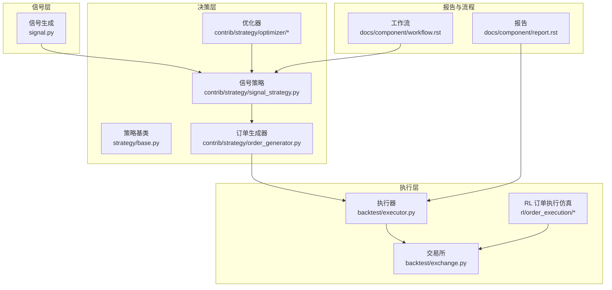
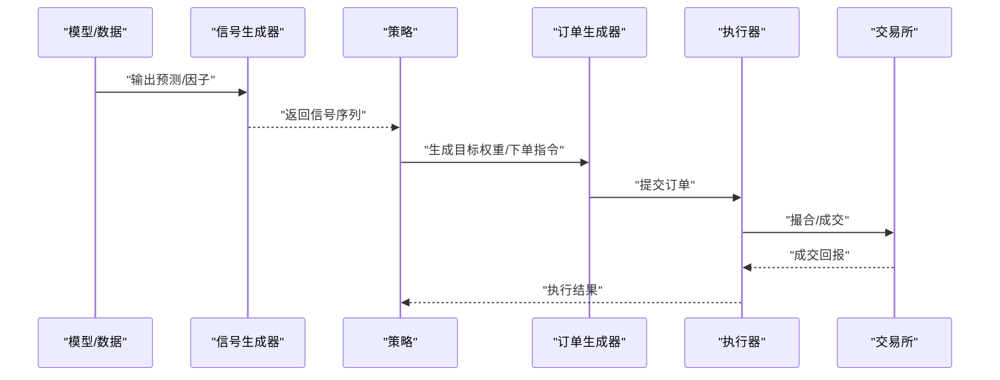
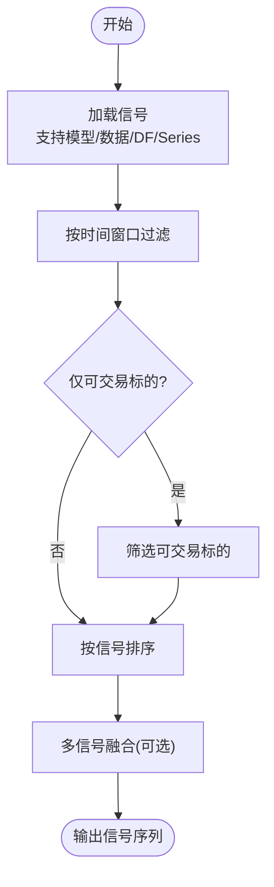
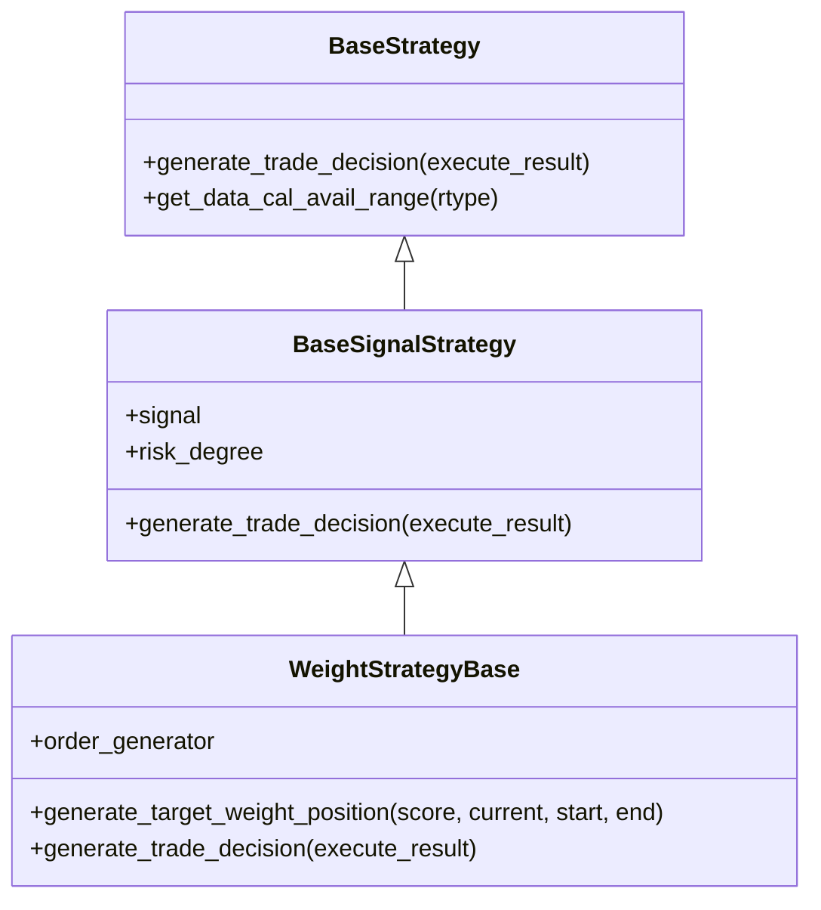
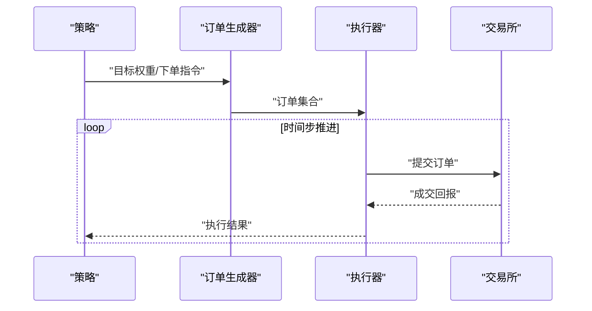
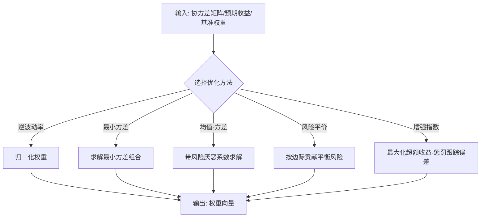
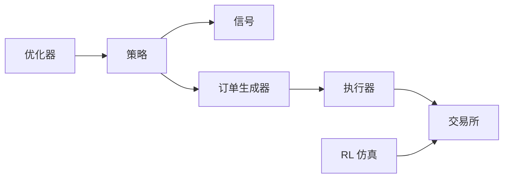

# 策略开发系统

<cite>
**本文引用的文件**
- [qlib/backtest/signal.py](file://qlib/backtest/signal.py)
- [qlib/backtest/decision.py](file://qlib/backtest/decision.py)
- [qlib/backtest/executor.py](file://qlib/backtest/executor.py)
- [qlib/backtest/exchange.py](file://qlib/backtest/exchange.py)
- [qlib/contrib/strategy/signal_strategy.py](file://qlib/contrib/strategy/signal_strategy.py)
- [qlib/strategy/base.py](file://qlib/strategy/base.py)
- [qlib/contrib/strategy/order_generator.py](file://qlib/contrib/strategy/order_generator.py)
- [qlib/contrib/strategy/optimizer/optimizer.py](file://qlib/contrib/strategy/optimizer/optimizer.py)
- [qlib/contrib/strategy/optimizer/enhanced_indexing.py](file://qlib/contrib/strategy/optimizer/enhanced_indexing.py)
- [qlib/rl/order_execution/simulator_simple.py](file://qlib/rl/order_execution/simulator_simple.py)
- [qlib/rl/order_execution/strategy.py](file://qlib/rl/order_execution/strategy.py)
- [examples/benchmarks/LightGBM/workflow_config_lightgbm_Alpha158.yaml](file://examples/benchmarks/LightGBM/workflow_config_lightgbm_Alpha158.yaml)
- [examples/tutorial/README.md](file://examples/tutorial/README.md)
- [docs/component/strategy.rst](file://docs/component/strategy.rst)
- [docs/component/workflow.rst](file://docs/component/workflow.rst)
- [docs/component/report.rst](file://docs/component/report.rst)
- [alpha158_factor_guide.md](file://alpha158_factor_guide.md)
</cite>

## 目录
1. [引言](#引言)
2. [项目结构](#项目结构)
3. [核心组件](#核心组件)
4. [架构总览](#架构总览)
5. [详细组件分析](#详细组件分析)
6. [依赖关系分析](#依赖关系分析)
7. [性能考量](#性能考量)
8. [故障排查指南](#故障排查指南)
9. [结论](#结论)
10. [附录](#附录)

## 引言
本文件面向希望基于 Qlib 构建量化策略的开发者，系统化梳理策略框架的设计与实现，覆盖信号生成、交易决策、订单执行与风险控制等核心环节。文档从代码级视角解析信号处理机制（过滤、排序、组合）、交易决策逻辑（多策略组合、仓位管理、风险控制），并提供因子策略、动量策略、均值回归策略等实际开发示例与回测优化方法，最后总结部署与监控的最佳实践。

## 项目结构
Qlib 的策略体系由“信号层”“决策层”“执行层”三大部分构成，并辅以报告与优化模块：
- 信号层：负责从模型或数据中生成信号，支持多种来源与格式。
- 决策层：根据信号与市场约束生成交易决策，支持权重型策略与规则型策略。
- 执行层：对接交易所与仿真器，完成订单生成、撮合与回报统计。
- 报告与优化：提供回测报告、指标分析与组合优化能力。

图示来源
- [qlib/backtest/signal.py](file://qlib/backtest/signal.py)
- [qlib/strategy/base.py](file://qlib/strategy/base.py)
- [qlib/contrib/strategy/signal_strategy.py](file://qlib/contrib/strategy/signal_strategy.py)
- [qlib/contrib/strategy/order_generator.py](file://qlib/contrib/strategy/order_generator.py)
- [qlib/contrib/strategy/optimizer/optimizer.py](file://qlib/contrib/strategy/optimizer/optimizer.py)
- [qlib/backtest/executor.py](file://qlib/backtest/executor.py)
- [qlib/backtest/exchange.py](file://qlib/backtest/exchange.py)
- [qlib/rl/order_execution/simulator_simple.py](file://qlib/rl/order_execution/simulator_simple.py)
- [docs/component/report.rst](file://docs/component/report.rst)
- [docs/component/workflow.rst](file://docs/component/workflow.rst)

章节来源
- [docs/component/strategy.rst](file://docs/component/strategy.rst)
- [docs/component/workflow.rst](file://docs/component/workflow.rst)

## 核心组件
- 信号生成与处理
  - 信号来源灵活，可来自模型预测、数据列、DataFrame 等；策略通过统一接口获取信号并进行过滤与排序。
- 交易决策
  - 基于信号生成目标权重或直接下单指令，支持仅交易可交易标的、按时间步推进等。
- 订单执行
  - 通过执行器与交易所对接，支持仿真执行与真实市场撮合；提供 RL 订单执行仿真作为补充。
- 组合优化
  - 提供逆波动率、最小方差、均值-方差、风险平价等多种优化器，支持增强指数跟踪优化。
- 报告与评估
  - 输出回测报告、指标与可视化，便于策略评估与迭代。

章节来源
- [qlib/backtest/signal.py](file://qlib/backtest/signal.py)
- [qlib/contrib/strategy/signal_strategy.py](file://qlib/contrib/strategy/signal_strategy.py)
- [qlib/contrib/strategy/order_generator.py](file://qlib/contrib/strategy/order_generator.py)
- [qlib/contrib/strategy/optimizer/optimizer.py](file://qlib/contrib/strategy/optimizer/optimizer.py)
- [qlib/contrib/strategy/optimizer/enhanced_indexing.py](file://qlib/contrib/strategy/optimizer/enhanced_indexing.py)
- [qlib/backtest/executor.py](file://qlib/backtest/executor.py)
- [qlib/backtest/exchange.py](file://qlib/backtest/exchange.py)
- [docs/component/report.rst](file://docs/component/report.rst)

## 架构总览
下图展示从信号到执行的关键交互路径与职责划分：

图示来源
- [qlib/backtest/signal.py](file://qlib/backtest/signal.py)
- [qlib/contrib/strategy/signal_strategy.py](file://qlib/contrib/strategy/signal_strategy.py)
- [qlib/contrib/strategy/order_generator.py](file://qlib/contrib/strategy/order_generator.py)
- [qlib/backtest/executor.py](file://qlib/backtest/executor.py)
- [qlib/backtest/exchange.py](file://qlib/backtest/exchange.py)

## 详细组件分析

### 信号处理机制
- 信号来源与格式
  - 支持从模型、数据集、Series、DataFrame 等多种来源生成信号；当为 DataFrame 时，当前版本仅使用第一列。
- 信号过滤与排序
  - 可按交易日时间窗口切片；支持仅考虑可交易标的，按可交易性筛选后再排序。
- 信号组合
  - 多信号可通过加权融合形成综合信号，再进入决策流程。

图示来源
- [qlib/backtest/signal.py](file://qlib/backtest/signal.py)
- [qlib/contrib/strategy/signal_strategy.py](file://qlib/contrib/strategy/signal_strategy.py)

章节来源
- [qlib/backtest/signal.py](file://qlib/backtest/signal.py)
- [qlib/contrib/strategy/signal_strategy.py](file://qlib/contrib/strategy/signal_strategy.py)

### 交易决策逻辑
- 权重型策略
  - 依据信号生成目标权重，再转换为订单列表；支持对当前持仓深拷贝保护，避免无限仓位。
- 规则型策略
  - 基于简单规则生成交易决策，适用于快速策略或规则过滤场景。
- 多策略组合
  - 通过外层策略限制数据日历范围，内层策略在限定范围内生成决策，实现嵌套执行。

图示来源
- [qlib/strategy/base.py](file://qlib/strategy/base.py)
- [qlib/contrib/strategy/signal_strategy.py](file://qlib/contrib/strategy/signal_strategy.py)

章节来源
- [qlib/strategy/base.py](file://qlib/strategy/base.py)
- [qlib/contrib/strategy/signal_strategy.py](file://qlib/contrib/strategy/signal_strategy.py)

### 订单生成与执行
- 订单生成
  - 将目标权重映射为买卖订单列表，考虑可交易性与交易单位。
- 执行器与交易所
  - 执行器按时间步推进，交易所负责撮合与费用计算；支持仿真与实盘。
- RL 订单执行仿真
  - 提供细粒度仿真环境，按分钟级切片模拟执行过程，便于研究执行成本与市场冲击。

图示来源
- [qlib/contrib/strategy/order_generator.py](file://qlib/contrib/strategy/order_generator.py)
- [qlib/backtest/executor.py](file://qlib/backtest/executor.py)
- [qlib/backtest/exchange.py](file://qlib/backtest/exchange.py)
- [qlib/rl/order_execution/simulator_simple.py](file://qlib/rl/order_execution/simulator_simple.py)
- [qlib/rl/order_execution/strategy.py](file://qlib/rl/order_execution/strategy.py)

章节来源
- [qlib/contrib/strategy/order_generator.py](file://qlib/contrib/strategy/order_generator.py)
- [qlib/backtest/executor.py](file://qlib/backtest/executor.py)
- [qlib/backtest/exchange.py](file://qlib/backtest/exchange.py)
- [qlib/rl/order_execution/simulator_simple.py](file://qlib/rl/order_execution/simulator_simple.py)
- [qlib/rl/order_execution/strategy.py](file://qlib/rl/order_execution/strategy.py)

### 组合优化与风险控制
- 经典优化器
  - 逆波动率、全局最小方差、均值-方差、风险平价等，支持非负权重与全仓约束。
- 增强指数跟踪优化
  - 在目标收益与跟踪误差之间折衷，支持基准权重与因子暴露约束。
- 风险控制要点
  - 通过风险系数与交易成本参数控制回撤与换手；在策略层面设置仓位上限与止盈止损。

图示来源
- [qlib/contrib/strategy/optimizer/optimizer.py](file://qlib/contrib/strategy/optimizer/optimizer.py)
- [qlib/contrib/strategy/optimizer/enhanced_indexing.py](file://qlib/contrib/strategy/optimizer/enhanced_indexing.py)

章节来源
- [qlib/contrib/strategy/optimizer/optimizer.py](file://qlib/contrib/strategy/optimizer/optimizer.py)
- [qlib/contrib/strategy/optimizer/enhanced_indexing.py](file://qlib/contrib/strategy/optimizer/enhanced_indexing.py)

### 实战示例与回测流程
- 因子策略示例
  - 使用 Alpha158 系列因子，结合 LightGBM 模型进行训练与回测，配置文件位于示例目录。
- 动量策略与均值回归策略
  - 可基于因子导出的信号进行排序与分层，分别构造动量与反转组合；参考因子手册中的动量、趋势、反转因子说明。
- 回测与优化
  - 通过工作流配置运行回测，使用报告模块评估指标；参数调优可结合网格搜索或贝叶斯优化（参见 Tuner 组件）。

章节来源
- [examples/benchmarks/LightGBM/workflow_config_lightgbm_Alpha158.yaml](file://examples/benchmarks/LightGBM/workflow_config_lightgbm_Alpha158.yaml)
- [alpha158_factor_guide.md](file://alpha158_factor_guide.md)
- [docs/component/workflow.rst](file://docs/component/workflow.rst)
- [docs/component/report.rst](file://docs/component/report.rst)

## 依赖关系分析
- 组件耦合
  - 策略依赖信号生成与订单生成器；执行器依赖交易所；优化器独立但常与策略配合。
- 外部依赖
  - 优化器依赖数值优化库；RL 仿真依赖市场数据与特征列；报告模块依赖执行器输出。
- 循环依赖
  - 当前模块间无明显循环依赖，职责边界清晰。

图示来源
- [qlib/contrib/strategy/signal_strategy.py](file://qlib/contrib/strategy/signal_strategy.py)
- [qlib/contrib/strategy/order_generator.py](file://qlib/contrib/strategy/order_generator.py)
- [qlib/backtest/executor.py](file://qlib/backtest/executor.py)
- [qlib/backtest/exchange.py](file://qlib/backtest/exchange.py)
- [qlib/contrib/strategy/optimizer/optimizer.py](file://qlib/contrib/strategy/optimizer/optimizer.py)
- [qlib/rl/order_execution/simulator_simple.py](file://qlib/rl/order_execution/simulator_simple.py)

章节来源
- [qlib/contrib/strategy/signal_strategy.py](file://qlib/contrib/strategy/signal_strategy.py)
- [qlib/contrib/strategy/order_generator.py](file://qlib/contrib/strategy/order_generator.py)
- [qlib/backtest/executor.py](file://qlib/backtest/executor.py)
- [qlib/backtest/exchange.py](file://qlib/backtest/exchange.py)
- [qlib/contrib/strategy/optimizer/optimizer.py](file://qlib/contrib/strategy/optimizer/optimizer.py)
- [qlib/rl/order_execution/simulator_simple.py](file://qlib/rl/order_execution/simulator_simple.py)

## 性能考量
- 信号与排序
  - 对大数据集进行信号过滤与排序时，建议使用向量化操作与缓存机制，减少重复计算。
- 订单生成
  - 在生成订单时优先按可交易性筛选，避免无效订单带来的执行成本。
- 执行器与仿真
  - 仿真执行可采用分钟级切片以逼近真实执行，同时注意数据粒度与切片步长的一致性。
- 优化器
  - 优化问题规模较大时，可考虑稀疏协方差估计与 warm start，提升收敛速度。

## 故障排查指南
- 信号为空
  - 若信号返回为空，策略将生成空订单；检查信号时间窗口与数据可用性。
- 可交易性问题
  - 仅可交易标的模式下，若当日无可交易标的，需确认交易约束与市场状态。
- 订单执行异常
  - 检查执行器频率、交易所费用参数与最小手续费设置；确认仿真数据完整性。
- 优化失败
  - 检查协方差矩阵正定性与约束边界；必要时放宽约束或调整风险系数。

章节来源
- [qlib/contrib/strategy/signal_strategy.py](file://qlib/contrib/strategy/signal_strategy.py)
- [qlib/backtest/exchange.py](file://qlib/backtest/exchange.py)
- [qlib/contrib/strategy/optimizer/optimizer.py](file://qlib/contrib/strategy/optimizer/optimizer.py)

## 结论
Qlib 的策略框架以清晰的三层架构实现了从信号到执行的闭环：信号层提供灵活的信号来源，决策层支持权重与规则两种策略范式，执行层兼顾仿真与实盘。配合组合优化与报告模块，开发者可以高效地完成策略开发、回测、优化与部署。建议在实践中遵循“先信号、后决策、再执行”的工程化流程，并以报告与指标驱动迭代。

## 附录
- 快速开始
  - 参考教程与示例，了解工作流配置与回测运行方式。
- 参考文档
  - 策略组件与工作流文档提供了更深入的 API 说明与最佳实践。

章节来源
- [examples/tutorial/README.md](file://examples/tutorial/README.md)
- [docs/component/strategy.rst](file://docs/component/strategy.rst)
- [docs/component/workflow.rst](file://docs/component/workflow.rst)