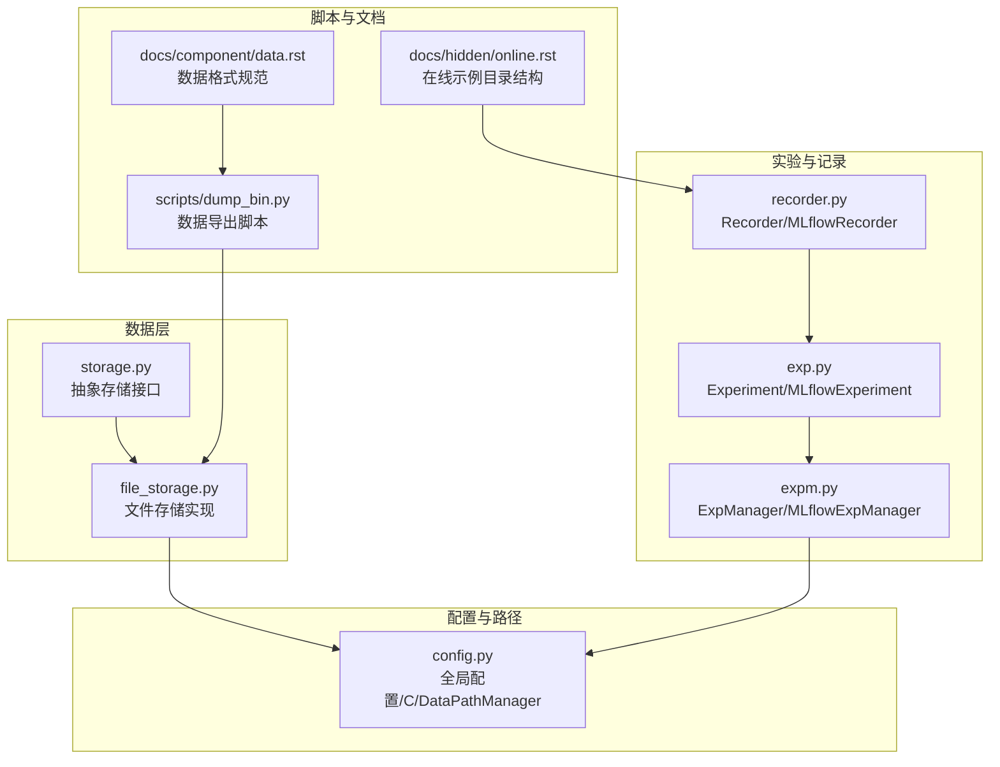
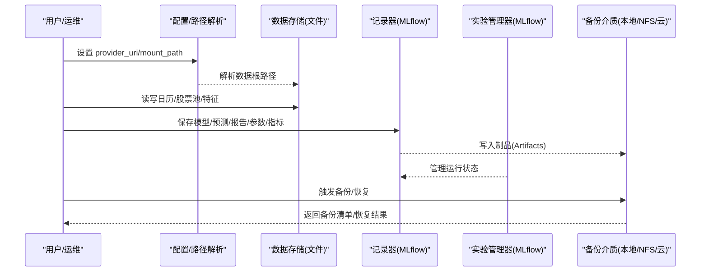
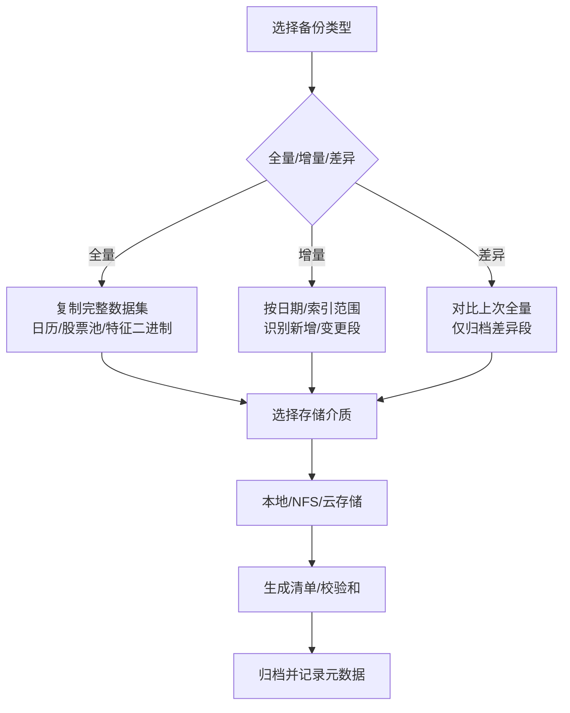
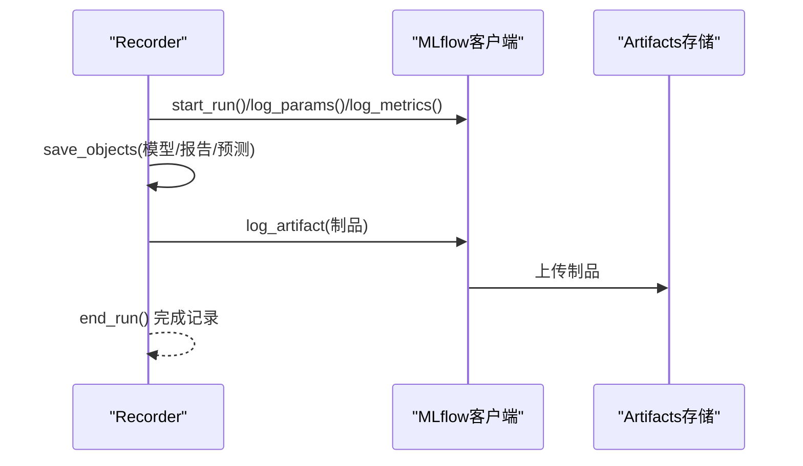
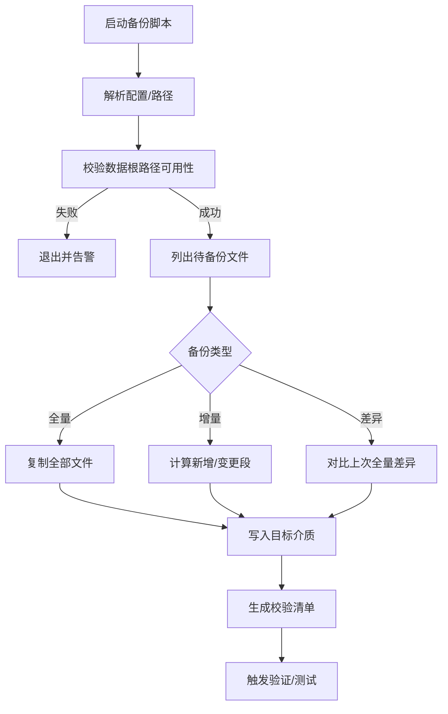
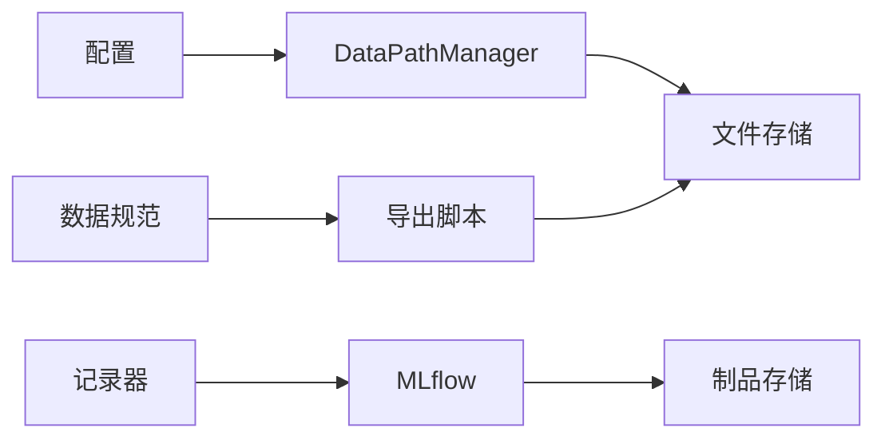

# 备份恢复

<cite>
**本文引用的文件**
- [qlib/workflow/recorder.py](file://qlib/workflow/recorder.py)
- [qlib/workflow/expm.py](file://qlib/workflow/expm.py)
- [qlib/workflow/exp.py](file://qlib/workflow/exp.py)
- [qlib/data/storage/storage.py](file://qlib/data/storage/storage.py)
- [qlib/data/storage/file_storage.py](file://qlib/data/storage/file_storage.py)
- [qlib/config.py](file://qlib/config.py)
- [scripts/dump_bin.py](file://scripts/dump_bin.py)
- [docs/component/data.rst](file://docs/component/data.rst)
- [docs/hidden/online.rst](file://docs/hidden/online.rst)
- [README.md](file://README.md)
</cite>

## 目录
1. [引言](#引言)
2. [项目结构](#项目结构)
3. [核心组件](#核心组件)
4. [架构总览](#架构总览)
5. [详细组件分析](#详细组件分析)
6. [依赖关系分析](#依赖关系分析)
7. [性能考量](#性能考量)
8. [故障排查指南](#故障排查指南)
9. [结论](#结论)
10. [附录](#附录)

## 引言
本方案面向 Qlib 的备份与恢复体系，围绕“数据备份策略（全量/增量/差异）”“备份内容范围（历史数据、模型权重、实验结果、配置文件等）”“备份存储介质（本地/NFS/云存储）”“自动化备份流程（定时任务、备份脚本、校验）”“灾难恢复计划（RTO/RPO、恢复流程、演练验证）”“备份监控、加密、清理等安全治理”展开，结合仓库中数据存储、实验记录、配置与脚本等实现进行落地设计。

## 项目结构
Qlib 的备份恢复涉及以下关键路径与模块：
- 数据层：日历、股票池、特征二进制存储（文件存储）
- 实验与记录：MLflow 记录器与实验管理器
- 配置与路径：全局配置、数据路径解析、NFS 支持
- 脚本与文档：数据导出脚本、数据格式规范、在线示例目录结构

图表来源
- [qlib/data/storage/storage.py:78-495](file://qlib/data/storage/storage.py#L78-L495)
- [qlib/data/storage/file_storage.py:1-380](file://qlib/data/storage/file_storage.py#L1-L380)
- [qlib/workflow/recorder.py:28-494](file://qlib/workflow/recorder.py#L28-L494)
- [qlib/workflow/exp.py:243-274](file://qlib/workflow/exp.py#L243-L274)
- [qlib/workflow/expm.py:317-364](file://qlib/workflow/expm.py#L317-L364)
- [qlib/config.py:325-423](file://qlib/config.py#L325-L423)
- [scripts/dump_bin.py:53-82](file://scripts/dump_bin.py#L53-L82)
- [docs/component/data.rst:129-155](file://docs/component/data.rst#L129-L155)
- [docs/hidden/online.rst:175-220](file://docs/hidden/online.rst#L175-L220)

章节来源
- [qlib/data/storage/storage.py:78-495](file://qlib/data/storage/storage.py#L78-L495)
- [qlib/data/storage/file_storage.py:1-380](file://qlib/data/storage/file_storage.py#L1-L380)
- [qlib/workflow/recorder.py:28-494](file://qlib/workflow/recorder.py#L28-L494)
- [qlib/workflow/exp.py:243-274](file://qlib/workflow/exp.py#L243-L274)
- [qlib/workflow/expm.py:317-364](file://qlib/workflow/expm.py#L317-L364)
- [qlib/config.py:325-423](file://qlib/config.py#L325-L423)
- [scripts/dump_bin.py:53-82](file://scripts/dump_bin.py#L53-L82)
- [docs/component/data.rst:129-155](file://docs/component/data.rst#L129-L155)
- [docs/hidden/online.rst:175-220](file://docs/hidden/online.rst#L175-L220)

## 核心组件
- 存储抽象与文件实现
  - 抽象层定义日历、股票池、特征三类存储接口，统一生命周期与访问语义
  - 文件实现基于 Provider URI 解析，支持本地与 NFS，按频率组织目录结构
- 实验与记录
  - Recorder/MLflowRecorder 封装参数、指标、标签与制品（Artifacts）上传下载
  - Experiment/MLflowExperiment 管理运行状态与活跃记录器
  - ExpManager/MLflowExpManager 提供实验创建、获取、并发控制
- 配置与路径
  - 全局配置维护 provider_uri、mount_path、缓存开关、日志等
  - DataPathManager 解析不同频率下的数据根路径，兼容本地与 NFS
- 导出与文档
  - dump_bin.py 提供从 CSV/Parquet 到二进制特征的导出能力
  - data.rst 规范数据格式字段与命名约定
  - online.rst 展示在线模式下用户数据目录结构（含模型/策略/报告）

章节来源
- [qlib/data/storage/storage.py:78-495](file://qlib/data/storage/storage.py#L78-L495)
- [qlib/data/storage/file_storage.py:21-380](file://qlib/data/storage/file_storage.py#L21-L380)
- [qlib/workflow/recorder.py:28-494](file://qlib/workflow/recorder.py#L28-L494)
- [qlib/workflow/exp.py:243-274](file://qlib/workflow/exp.py#L243-L274)
- [qlib/workflow/expm.py:317-364](file://qlib/workflow/expm.py#L317-L364)
- [qlib/config.py:325-423](file://qlib/config.py#L325-L423)
- [scripts/dump_bin.py:53-82](file://scripts/dump_bin.py#L53-L82)
- [docs/component/data.rst:129-155](file://docs/component/data.rst#L129-L155)
- [docs/hidden/online.rst:175-220](file://docs/hidden/online.rst#L175-L220)

## 架构总览
备份恢复系统在 Qlib 中的关键交互如下：

图表来源
- [qlib/config.py:325-423](file://qlib/config.py#L325-L423)
- [qlib/data/storage/file_storage.py:60-64](file://qlib/data/storage/file_storage.py#L60-L64)
- [qlib/workflow/recorder.py:397-494](file://qlib/workflow/recorder.py#L397-L494)
- [qlib/workflow/expm.py:317-364](file://qlib/workflow/expm.py#L317-L364)

## 详细组件分析

### 数据存储与备份范围
- 日历/股票池/特征三类存储通过文件实现，分别对应 calendars、instruments、features 目录下的具体文件
- 特征采用二进制格式，带起止索引元信息；日历/股票池为文本/CSV
- provider_uri 可为字符串或字典（按频率映射），mount_path 用于 NFS 挂载场景
- 备份范围建议
  - 历史数据：日历、股票池、特征二进制文件
  - 模型权重：由 Recorder 保存的制品（Artifacts）目录
  - 实验结果：MLflow 追踪 URI 下的实验/运行元数据与制品
  - 配置文件：provider_uri、mount_path、缓存开关等全局配置

图表来源
- [qlib/data/storage/file_storage.py:285-380](file://qlib/data/storage/file_storage.py#L285-L380)
- [qlib/data/storage/storage.py:84-495](file://qlib/data/storage/storage.py#L84-L495)
- [qlib/config.py:325-423](file://qlib/config.py#L325-L423)

章节来源
- [qlib/data/storage/storage.py:84-495](file://qlib/data/storage/storage.py#L84-L495)
- [qlib/data/storage/file_storage.py:285-380](file://qlib/data/storage/file_storage.py#L285-L380)
- [qlib/config.py:325-423](file://qlib/config.py#L325-L423)

### 实验记录与制品备份
- Recorder/MLflowRecorder 提供 save_objects、download_artifact、list_artifacts 等能力
- 实验运行期间自动记录参数、指标、标签，并可上传任意对象作为制品
- 建议将模型权重、预测结果、可视化报告、代码快照等纳入制品备份

图表来源
- [qlib/workflow/recorder.py:335-494](file://qlib/workflow/recorder.py#L335-L494)

章节来源
- [qlib/workflow/recorder.py:28-494](file://qlib/workflow/recorder.py#L28-L494)

### 自动化备份流程
- 定时任务
  - 使用系统级定时任务（如 cron）触发备份脚本
  - 脚本执行前先校验 provider_uri/mount_path 是否可达
- 备份脚本
  - 读取当前配置，定位数据根路径
  - 遍历日历/股票池/特征目录，按备份类型生成目标文件
  - 对制品目录（Artifacts）进行制品级备份
- 备份验证
  - 生成校验和（如 SHA256）
  - 校验清单与实际文件一致性
  - 执行小规模恢复测试（抽样恢复）

图表来源
- [qlib/config.py:325-423](file://qlib/config.py#L325-L423)
- [qlib/data/storage/file_storage.py:60-64](file://qlib/data/storage/file_storage.py#L60-L64)
- [qlib/workflow/recorder.py:475-494](file://qlib/workflow/recorder.py#L475-L494)

章节来源
- [qlib/config.py:325-423](file://qlib/config.py#L325-L423)
- [qlib/data/storage/file_storage.py:60-64](file://qlib/data/storage/file_storage.py#L60-L64)
- [qlib/workflow/recorder.py:475-494](file://qlib/workflow/recorder.py#L475-L494)

### 灾难恢复计划（RTO/RPO）
- RPO（恢复点目标）
  - 增量/差异备份可显著降低 RPO
  - 建议按日/小时生成增量，保留最近 N 个全量与若干增量
- RTO（恢复时间目标）
  - 通过并行解压/并行恢复提升速度
  - 预热缓存与制品索引，缩短加载时间
- 恢复流程
  - 选择最近可用备份集（全量+增量/差异）
  - 恢复数据根路径与制品目录
  - 重建/回放实验记录（必要时）
  - 运行健康检查与回归测试
- 测试验证
  - 定期进行“Restore-Test”演练
  - 验证数据完整性、模型可加载、实验可重现

章节来源
- [scripts/dump_bin.py:53-82](file://scripts/dump_bin.py#L53-L82)
- [docs/component/data.rst:129-155](file://docs/component/data.rst#L129-L155)

### 备份监控、加密与清理
- 监控
  - 记录每次备份的开始/结束时间、大小、校验结果
  - 告警阈值：失败率、延迟、空间不足
- 加密
  - 传输与静态加密（本地/NFS/云）均应启用
  - 对制品目录与配置文件进行分层加密
- 清理
  - 基于保留策略（如 30/90/365 天）清理过期备份
  - 定期清理无效/损坏文件与空目录

章节来源
- [qlib/workflow/recorder.py:335-494](file://qlib/workflow/recorder.py#L335-L494)
- [qlib/config.py:325-423](file://qlib/config.py#L325-L423)

## 依赖关系分析
- 组件耦合
  - 数据存储依赖配置中的 provider_uri/mount_path
  - 记录器依赖实验管理器提供的追踪 URI
  - 导出脚本依赖数据格式规范与存储实现
- 外部依赖
  - MLflow 用于实验追踪与制品管理
  - NFS 支持用于跨节点共享数据
- 潜在风险
  - NFS 挂载异常导致数据不可用
  - MLflow 后端不可达影响制品上传/下载
  - 配置错误导致路径解析失败

图表来源
- [qlib/config.py:325-423](file://qlib/config.py#L325-L423)
- [qlib/data/storage/file_storage.py:31-41](file://qlib/data/storage/file_storage.py#L31-L41)
- [qlib/workflow/recorder.py:263-285](file://qlib/workflow/recorder.py#L263-L285)
- [scripts/dump_bin.py:53-82](file://scripts/dump_bin.py#L53-L82)
- [docs/component/data.rst:129-155](file://docs/component/data.rst#L129-L155)

章节来源
- [qlib/config.py:325-423](file://qlib/config.py#L325-L423)
- [qlib/data/storage/file_storage.py:31-41](file://qlib/data/storage/file_storage.py#L31-L41)
- [qlib/workflow/recorder.py:263-285](file://qlib/workflow/recorder.py#L263-L285)
- [scripts/dump_bin.py:53-82](file://scripts/dump_bin.py#L53-L82)
- [docs/component/data.rst:129-155](file://docs/component/data.rst#L129-L155)

## 性能考量
- 存储性能
  - 特征采用二进制紧凑格式，适合批量读写与科学计算
  - 高频数据建议分片与并行处理
- 实验追踪
  - MLflow 异步日志与制品上传可能带来延迟，需合理设置并发
- 导出与备份
  - 导出脚本支持多进程，建议根据 CPU 与磁盘 IO 调整线程数
  - 备份阶段尽量避免重复压缩，优先使用压缩文件系统或原生压缩

章节来源
- [README.md:554-570](file://README.md#L554-L570)
- [scripts/dump_bin.py:53-82](file://scripts/dump_bin.py#L53-L82)
- [qlib/workflow/recorder.py:350-356](file://qlib/workflow/recorder.py#L350-L356)

## 故障排查指南
- 数据不可读
  - 检查 provider_uri/mount_path 是否正确解析
  - 确认 NFS 已挂载且权限正常
- 实验无法记录
  - 检查 MLflow 追踪 URI 可达性
  - 查看记录器状态与异步日志队列是否阻塞
- 备份失败
  - 校验目标介质空间与权限
  - 重试并查看校验清单与日志
- 恢复异常
  - 对比校验和，确认文件完整性
  - 重新初始化配置并重建索引/缓存

章节来源
- [qlib/config.py:325-423](file://qlib/config.py#L325-L423)
- [qlib/workflow/recorder.py:380-396](file://qlib/workflow/recorder.py#L380-L396)
- [qlib/data/storage/file_storage.py:65-74](file://qlib/data/storage/file_storage.py#L65-L74)

## 结论
本方案将 Qlib 的数据存储、实验记录与配置路径有机整合，形成覆盖“备份策略—备份范围—存储介质—自动化流程—灾备计划—安全治理”的闭环。通过明确各组件职责与依赖关系，配合定期演练与监控告警，可有效保障数据与实验资产的持续可用与可恢复性。

## 附录
- 在线模式数据目录示意（参考）
  - 用户数据根目录下按用户 ID 分桶，包含位置、报告、模型、策略、评分、交易等子目录与文件
- 数据格式规范（参考）
  - CSV/Parquet 文件命名与字段要求，确保导出与导入一致性

章节来源
- [docs/hidden/online.rst:175-220](file://docs/hidden/online.rst#L175-L220)
- [docs/component/data.rst:129-155](file://docs/component/data.rst#L129-L155)