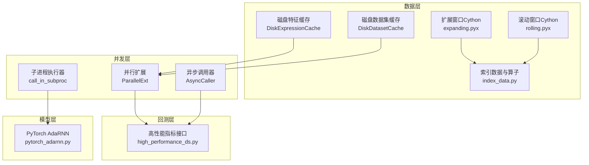
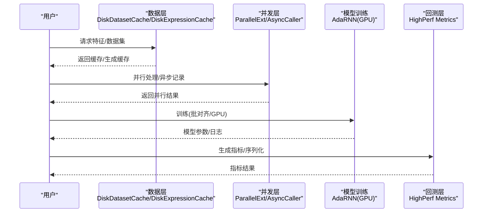
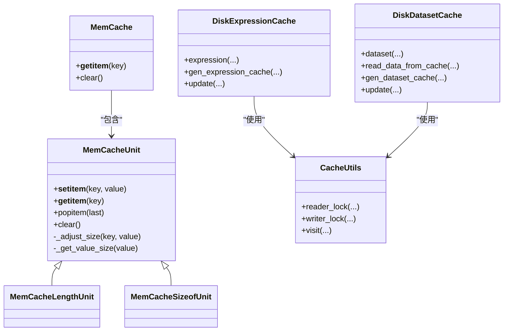
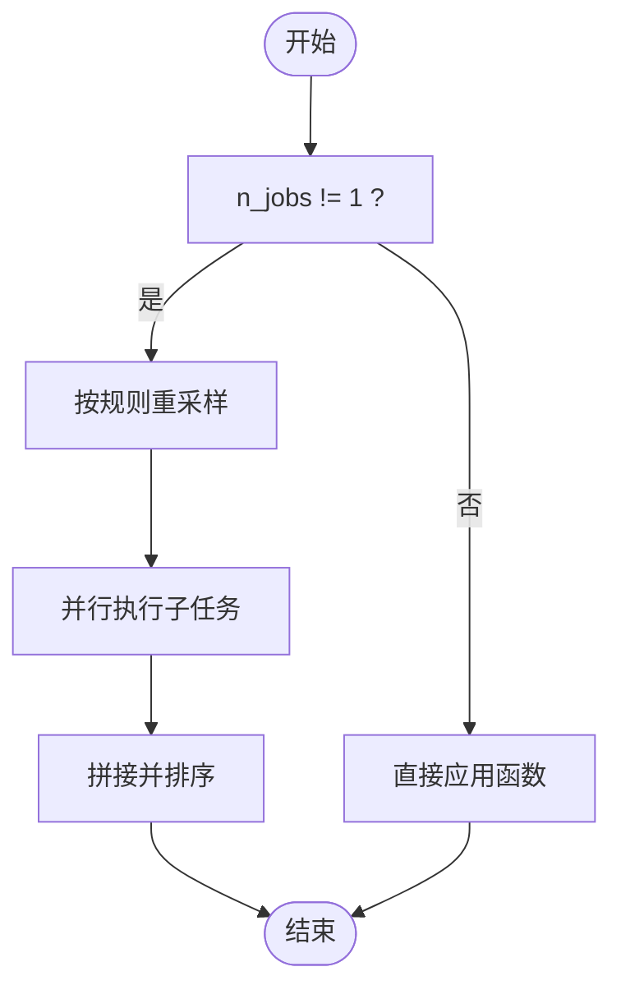
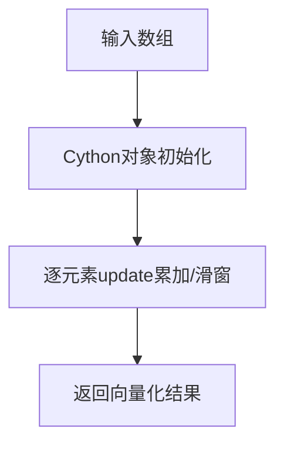
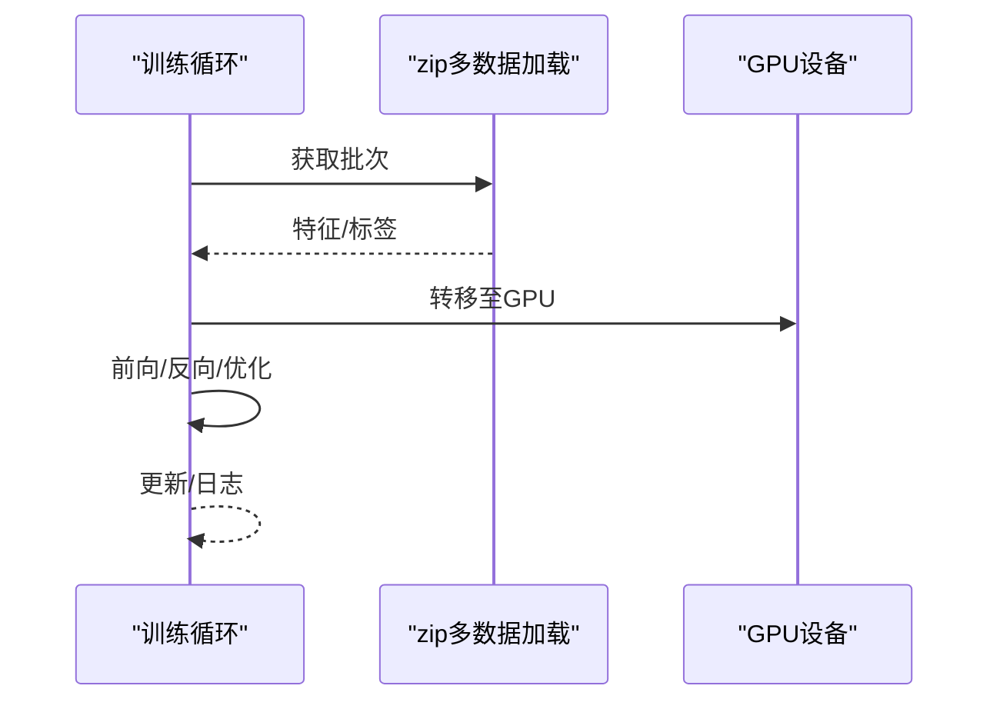
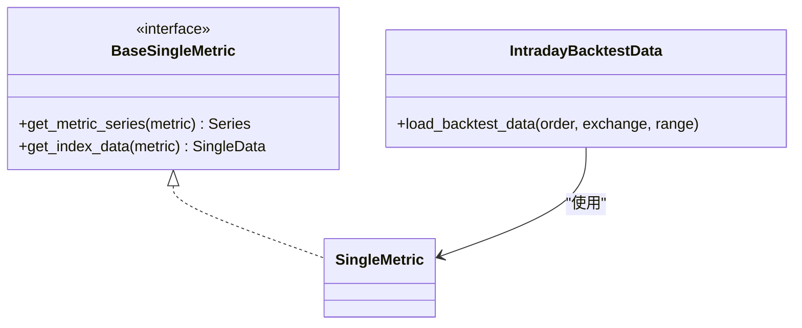
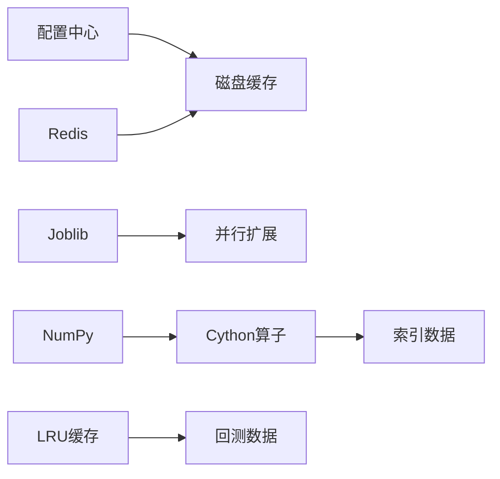

# 性能优化

<cite>
**本文引用的文件**
- [cache.py](file://qlib/data/cache.py)
- [paral.py](file://qlib/utils/paral.py)
- [expanding.pyx](file://qlib/data/_libs/expanding.pyx)
- [rolling.pyx](file://qlib/data/_libs/rolling.pyx)
- [native.py](file://qlib/rl/data/native.py)
- [high_performance_ds.py](file://qlib/backtest/high_performance_ds.py)
- [pytorch_adarnn.py](file://qlib/contrib/model/pytorch_adarnn.py)
</cite>

## 目录
1. [引言](#引言)
2. [项目结构](#项目结构)
3. [核心组件](#核心组件)
4. [架构总览](#架构总览)
5. [详细组件分析](#详细组件分析)
6. [依赖分析](#依赖分析)
7. [性能考量](#性能考量)
8. [故障排查指南](#故障排查指南)
9. [结论](#结论)
10. [附录](#附录)

## 引言
本指南聚焦于Qlib在数据与模型全链路中的性能优化实践，围绕以下维度展开：内存管理（缓存、内存池、GC调优）、并发处理（多进程并行、异步IO、线程池）、数据处理（向量化、Cython加速、数据压缩）、模型训练（GPU利用、批处理、梯度累积）、回测（数据预加载、并行回测、结果缓存），并给出性能监控指标、瓶颈分析方法与调优工具使用建议。目标是帮助读者在实际工程中系统性地提升Qlib运行效率与稳定性。

## 项目结构
Qlib的性能优化涉及多个层次：
- 数据层：缓存与磁盘特征/数据集缓存、索引与向量化算子、Cython加速滚动/扩展窗口计算
- 并发层：Joblib并行扩展、异步调用器、子进程执行器
- 回测层：高性能指标与序列化接口
- 模型层：PyTorch GPU训练与梯度控制

**图表来源**
- [cache.py:490-644](file://qlib/data/cache.py#L490-L644)
- [paral.py:20-70](file://qlib/utils/paral.py#L20-L70)
- [expanding.pyx:130-153](file://qlib/data/_libs/expanding.pyx#L130-L153)
- [rolling.pyx:185-208](file://qlib/data/_libs/rolling.pyx#L185-L208)
- [high_performance_ds.py:348-470](file://qlib/backtest/high_performance_ds.py#L348-L470)
- [pytorch_adarnn.py:149-177](file://qlib/contrib/model/pytorch_adarnn.py#L149-L177)

**章节来源**
- [cache.py:137-208](file://qlib/data/cache.py#L137-L208)
- [paral.py:20-130](file://qlib/utils/paral.py#L20-L130)
- [expanding.pyx:1-153](file://qlib/data/_libs/expanding.pyx#L1-L153)
- [rolling.pyx:1-208](file://qlib/data/_libs/rolling.pyx#L1-L208)
- [high_performance_ds.py:348-470](file://qlib/backtest/high_performance_ds.py#L348-L470)
- [pytorch_adarnn.py:149-177](file://qlib/contrib/model/pytorch_adarnn.py#L149-L177)

## 核心组件
- 内存缓存与磁盘缓存：支持按长度或字节大小限制的内存缓存，以及基于Redis锁的特征/数据集磁盘缓存，显著降低重复读取成本
- 并行执行：基于Joblib的并行扩展、复杂任务并行替换、异步调用器、子进程执行器，覆盖数据处理与模型训练场景
- Cython加速：扩展/滚动窗口的均值、斜率、残差、R²等计算，以C/C++实现减少Python循环开销
- 回测指标接口：定义可扩展的单指标与序列化接口，便于高效聚合与输出
- 训练优化：PyTorch模型中GPU设备检测、批处理对齐、梯度反转等机制

**章节来源**
- [cache.py:137-208](file://qlib/data/cache.py#L137-L208)
- [paral.py:20-130](file://qlib/utils/paral.py#L20-L130)
- [expanding.pyx:130-153](file://qlib/data/_libs/expanding.pyx#L130-L153)
- [rolling.pyx:185-208](file://qlib/data/_libs/rolling.pyx#L185-L208)
- [high_performance_ds.py:348-470](file://qlib/backtest/high_performance_ds.py#L348-L470)
- [pytorch_adarnn.py:149-177](file://qlib/contrib/model/pytorch_adarnn.py#L149-L177)

## 架构总览
下图展示从数据获取到回测输出的关键路径，以及性能优化点的落位。

**图表来源**
- [cache.py:696-748](file://qlib/data/cache.py#L696-L748)
- [paral.py:33-70](file://qlib/utils/paral.py#L33-L70)
- [pytorch_adarnn.py:149-177](file://qlib/contrib/model/pytorch_adarnn.py#L149-L177)
- [high_performance_ds.py:348-470](file://qlib/backtest/high_performance_ds.py#L348-L470)

## 详细组件分析

### 组件A：内存缓存与磁盘缓存
- 内存缓存
  - 支持“按项数”和“按字节数”两种限制策略，自动淘汰最旧条目，避免无限增长
  - 提供过期时间检查，结合业务访问计数与最后访问时间，辅助缓存健康度
- 磁盘缓存
  - 特征缓存：按表达式哈希生成文件名，写入二进制索引+数值，配合元信息文件记录访问与更新
  - 数据集缓存：HDF5存储，索引管理器定位区间，支持增量更新与并发读写锁
  - Redis分布式锁：确保多进程/多机环境下读写一致性，避免竞态

**图表来源**
- [cache.py:44-208](file://qlib/data/cache.py#L44-L208)
- [cache.py:490-644](file://qlib/data/cache.py#L490-L644)
- [cache.py:647-793](file://qlib/data/cache.py#L647-L793)

**章节来源**
- [cache.py:137-208](file://qlib/data/cache.py#L137-L208)
- [cache.py:490-644](file://qlib/data/cache.py#L490-L644)
- [cache.py:647-793](file://qlib/data/cache.py#L647-L793)

### 组件B：并发处理与异步IO
- 并行扩展
  - 基于Joblib的MultiprocessingBackend，支持maxtasksperchild，避免子进程长期占用导致的内存泄漏
  - 时间维度分组并行：按月/季度重采样后并行应用函数，再拼接排序
- 复杂任务并行
  - 自动识别嵌套结构中的delayed任务，统一调度执行并替换为结果
- 异步调用器
  - 单线程队列消费，避免主线程退出导致死锁；用于MLflow等外部记录的异步化
- 子进程执行器
  - 将易内存泄漏的重复执行封装在子进程中，执行完毕即回收

**图表来源**
- [paral.py:33-70](file://qlib/utils/paral.py#L33-L70)

**章节来源**
- [paral.py:20-70](file://qlib/utils/paral.py#L20-L70)
- [paral.py:132-295](file://qlib/utils/paral.py#L132-L295)
- [paral.py:72-130](file://qlib/utils/paral.py#L72-L130)
- [paral.py:298-333](file://qlib/utils/paral.py#L298-L333)

### 组件C：数据处理性能（向量化与Cython）
- 扩展窗口与滚动窗口
  - 使用Cython实现均值、斜率、残差、R²等，避免Python循环，显著提升吞吐
  - 通过deque/vector与滑动窗口累加和维护，常数级更新复杂度
- 索引数据与算子
  - 通过索引数据类与二元运算符绑定，实现广播与对齐，减少显式循环

**图表来源**
- [expanding.pyx:130-153](file://qlib/data/_libs/expanding.pyx#L130-L153)
- [rolling.pyx:185-208](file://qlib/data/_libs/rolling.pyx#L185-L208)

**章节来源**
- [expanding.pyx:1-153](file://qlib/data/_libs/expanding.pyx#L1-L153)
- [rolling.pyx:1-208](file://qlib/data/_libs/rolling.pyx#L1-L208)

### 组件D：模型训练性能（GPU利用与批处理）
- 设备检测与GPU利用
  - 通过设备属性判断是否启用GPU，减少不必要的CPU迁移
- 批对齐与梯度
  - 在多数据源zip迭代时进行形状一致性检查，避免无效批次；AdaGrad/梯度反转等技巧用于稳定训练

**图表来源**
- [pytorch_adarnn.py:149-177](file://qlib/contrib/model/pytorch_adarnn.py#L149-L177)

**章节来源**
- [pytorch_adarnn.py:149-177](file://qlib/contrib/model/pytorch_adarnn.py#L149-L177)

### 组件E：回测性能（预加载与并行）
- 高性能指标接口
  - 定义单指标与序列化接口，便于在回测中快速聚合与输出
- 回测数据缓存
  - 使用LRU缓存加载回测所需片段，减少重复IO

**图表来源**
- [high_performance_ds.py:348-470](file://qlib/backtest/high_performance_ds.py#L348-L470)
- [native.py:112-133](file://qlib/rl/data/native.py#L112-L133)

**章节来源**
- [high_performance_ds.py:348-470](file://qlib/backtest/high_performance_ds.py#L348-L470)
- [native.py:112-133](file://qlib/rl/data/native.py#L112-L133)

## 依赖分析
- 缓存模块依赖配置中心与Redis锁，保证跨进程一致性
- 并行模块依赖Joblib与多进程后端，结合maxtasksperchild控制子进程生命周期
- Cython模块编译为原生扩展，直接对接NumPy数组，避免Python层开销
- 回测模块通过LRU缓存与接口抽象，降低IO与重复计算

**图表来源**
- [cache.py:490-644](file://qlib/data/cache.py#L490-L644)
- [paral.py:20-70](file://qlib/utils/paral.py#L20-L70)
- [expanding.pyx:130-153](file://qlib/data/_libs/expanding.pyx#L130-L153)
- [rolling.pyx:185-208](file://qlib/data/_libs/rolling.pyx#L185-L208)
- [native.py:112-133](file://qlib/rl/data/native.py#L112-L133)

**章节来源**
- [cache.py:490-644](file://qlib/data/cache.py#L490-L644)
- [paral.py:20-70](file://qlib/utils/paral.py#L20-L70)
- [expanding.pyx:130-153](file://qlib/data/_libs/expanding.pyx#L130-L153)
- [rolling.pyx:185-208](file://qlib/data/_libs/rolling.pyx#L185-L208)
- [native.py:112-133](file://qlib/rl/data/native.py#L112-L133)

## 性能考量
- 内存管理
  - 合理设置内存缓存上限与淘汰策略，优先保留热点数据
  - 对大对象采用“按字节大小”限制，避免列表/字典等容器膨胀
  - 利用缓存过期与访问计数，定期清理冷数据
- 并发处理
  - 并行粒度：按时间维度重采样，避免过细切分导致调度开销
  - 子进程复用：通过maxtasksperchild限制任务数，防止内存泄漏
  - 异步化：对外部系统（如日志/指标）采用异步调用，避免阻塞主流程
- 数据处理
  - 优先使用Cython实现的扩展/滚动窗口，减少Python循环
  - 向量化操作与索引对齐，避免显式循环与重复拷贝
- 模型训练
  - GPU优先：自动检测设备，批量数据迁移一次完成
  - 批对齐：多数据源zip时先做形状校验，避免无效批次
  - 梯度控制：合理使用梯度裁剪/反转等技术，提升收敛稳定性
- 回测
  - 预加载：对高频片段使用LRU缓存，减少重复IO
  - 指标接口：通过统一接口聚合，避免多次遍历

[本节为通用指导，不直接分析具体文件]

## 故障排查指南
- 缓存异常
  - 现象：缓存读写冲突、元信息损坏
  - 排查：检查Redis锁状态、缓存目录权限、元信息文件完整性
  - 参考
    - [cache.py:217-293](file://qlib/data/cache.py#L217-L293)
- 并行卡顿
  - 现象：子进程长时间占用内存、CPU空转
  - 排查：调整maxtasksperchild、核对n_jobs与资源配额
  - 参考
    - [paral.py:20-31](file://qlib/utils/paral.py#L20-L31)
- Cython编译问题
  - 现象：扩展模块导入失败
  - 排查：确认Cython与NumPy版本兼容、重新编译扩展
  - 参考
    - [expanding.pyx:1-3](file://qlib/data/_libs/expanding.pyx#L1-L3)
    - [rolling.pyx:1-3](file://qlib/data/_libs/rolling.pyx#L1-L3)
- 回测数据缺失
  - 现象：回测片段加载为空
  - 排查：检查时间范围、LRU键生成逻辑、缓存命中情况
  - 参考
    - [native.py:112-133](file://qlib/rl/data/native.py#L112-L133)

**章节来源**
- [cache.py:217-293](file://qlib/data/cache.py#L217-L293)
- [paral.py:20-31](file://qlib/utils/paral.py#L20-L31)
- [expanding.pyx:1-3](file://qlib/data/_libs/expanding.pyx#L1-L3)
- [rolling.pyx:1-3](file://qlib/data/_libs/rolling.pyx#L1-L3)
- [native.py:112-133](file://qlib/rl/data/native.py#L112-L133)

## 结论
通过对缓存、并发、Cython算子、回测接口与模型训练的系统性优化，Qlib能够在大规模金融数据场景下显著提升吞吐与稳定性。建议在生产环境中结合业务特点，动态调整缓存策略、并行粒度与GPU批大小，并建立完善的监控与告警体系，持续迭代性能。

[本节为总结，不直接分析具体文件]

## 附录
- 性能监控指标建议
  - 缓存命中率、缓存淘汰率、缓存过期比例
  - 并行任务平均耗时、队列积压、子进程重启次数
  - Cython算子吞吐、向量化比例
  - 回测指标生成耗时、缓存命中率
  - 训练吞吐、GPU利用率、显存峰值
- 瓶颈分析方法
  - 使用火焰图/性能剖析工具定位热点函数
  - 对比缓存开启前后的I/O与CPU占比
  - 分阶段压测：数据加载、特征计算、模型训练、回测
- 调优工具
  - 缓存：Redis客户端监控、缓存目录统计
  - 并行：Joblib后端配置、进程池参数
  - Cython：编译优化标志、NumPy接口对齐
  - 回测：指标接口扩展、LRU容量调参
  - 训练：CUDA流、混合精度、梯度累积步数

[本节为通用指导，不直接分析具体文件]