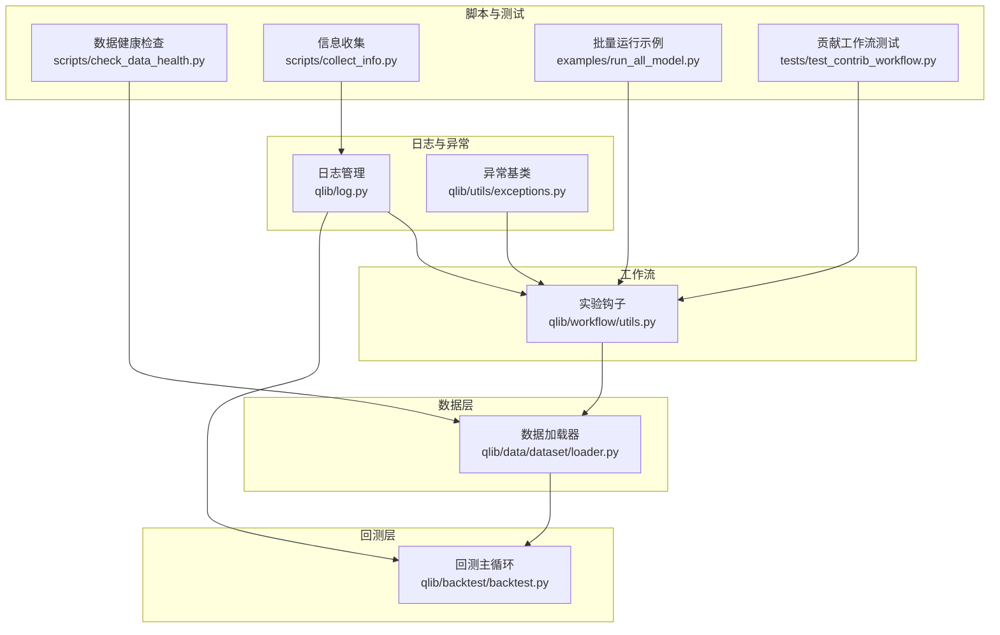
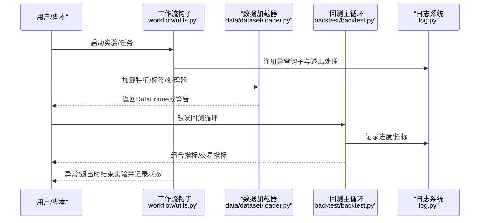
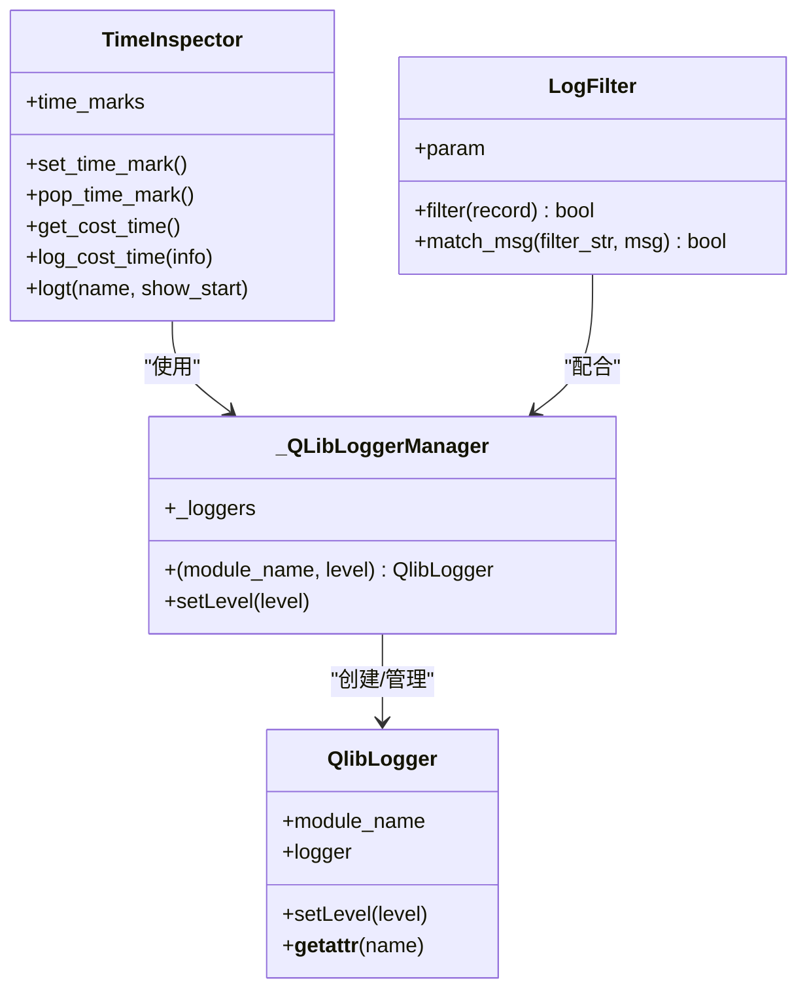
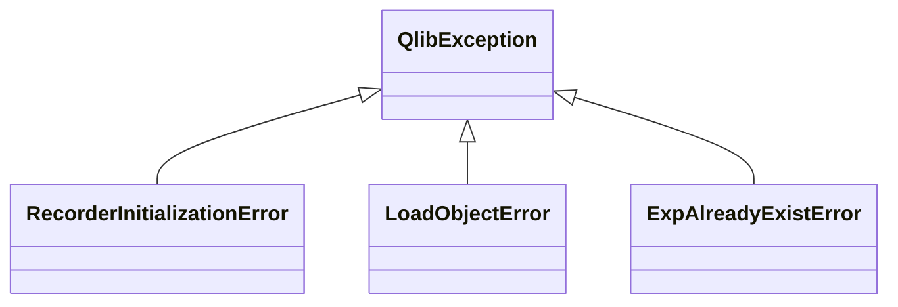
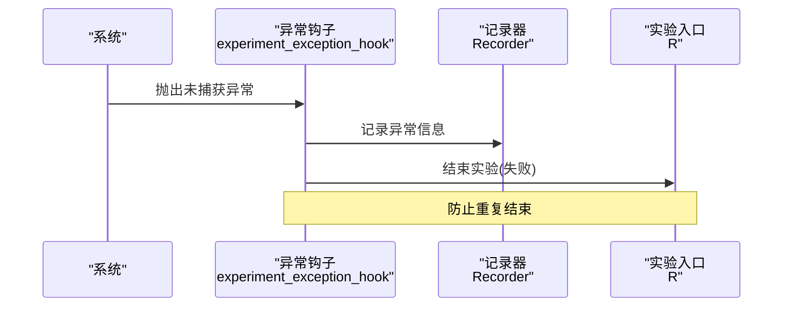
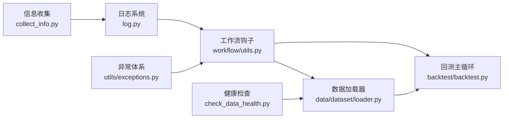
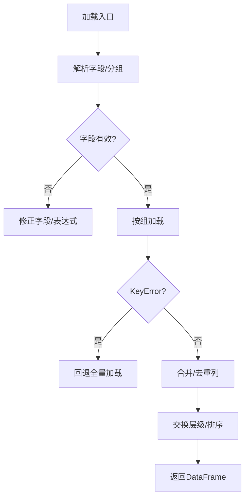

# 故障诊断

<cite>
**本文引用的文件**
- [qlib/log.py](file://qlib/log.py)
- [qlib/utils/exceptions.py](file://qlib/utils/exceptions.py)
- [qlib/workflow/utils.py](file://qlib/workflow/utils.py)
- [qlib/backtest/backtest.py](file://qlib/backtest/backtest.py)
- [qlib/data/dataset/loader.py](file://qlib/data/dataset/loader.py)
- [scripts/check_data_health.py](file://scripts/check_data_health.py)
- [scripts/collect_info.py](file://scripts/collect_info.py)
- [examples/run_all_model.py](file://examples/run_all_model.py)
- [tests/test_contrib_workflow.py](file://tests/test_contrib_workflow.py)
</cite>

## 目录
1. [简介](#简介)
2. [项目结构](#项目结构)
3. [核心组件](#核心组件)
4. [架构总览](#架构总览)
5. [详细组件分析](#详细组件分析)
6. [依赖分析](#依赖分析)
7. [性能考量](#性能考量)
8. [故障排查指南](#故障排查指南)
9. [结论](#结论)
10. [附录](#附录)

## 简介
本指南面向Qlib使用者与运维工程师，提供系统化的故障诊断方法论与实操步骤，覆盖问题分类、影响范围评估、根因分析、日志分析、调试工具使用、数据完整性与模型验证、系统健康检查以及故障预防与应急响应流程。文档以仓库中的日志体系、异常类型、工作流与回测框架、数据加载器等关键模块为依据，结合脚本工具与测试用例，帮助快速定位并解决问题。

## 项目结构
Qlib围绕“初始化—数据—模型—回测—记录”形成闭环。与诊断相关的关键路径包括：
- 日志与计时：统一日志管理、全局级别控制、时间成本统计
- 异常体系：基础异常类与工作流特定异常
- 工作流：实验生命周期钩子（退出与未捕获异常）
- 数据层：多形态数据加载器与合并策略
- 回测层：嵌套决策执行与指标产出
- 脚本与测试：健康检查、信息收集、批量运行与断言



图表来源
- [qlib/log.py:51-150](file://qlib/log.py#L51-L150)
- [qlib/utils/exceptions.py:6-20](file://qlib/utils/exceptions.py#L6-L20)
- [qlib/workflow/utils.py:17-47](file://qlib/workflow/utils.py#L17-L47)
- [qlib/data/dataset/loader.py:18-415](file://qlib/data/dataset/loader.py#L18-L415)
- [qlib/backtest/backtest.py:25-110](file://qlib/backtest/backtest.py#L25-L110)
- [scripts/check_data_health.py](file://scripts/check_data_health.py)
- [scripts/collect_info.py](file://scripts/collect_info.py)
- [examples/run_all_model.py:360-381](file://examples/run_all_model.py#L360-L381)
- [tests/test_contrib_workflow.py:46-85](file://tests/test_contrib_workflow.py#L46-L85)

章节来源
- [qlib/log.py:51-150](file://qlib/log.py#L51-L150)
- [qlib/utils/exceptions.py:6-20](file://qlib/utils/exceptions.py#L6-L20)
- [qlib/workflow/utils.py:17-47](file://qlib/workflow/utils.py#L17-L47)
- [qlib/data/dataset/loader.py:18-415](file://qlib/data/dataset/loader.py#L18-L415)
- [qlib/backtest/backtest.py:25-110](file://qlib/backtest/backtest.py#L25-L110)
- [scripts/check_data_health.py](file://scripts/check_data_health.py)
- [scripts/collect_info.py](file://scripts/collect_info.py)
- [examples/run_all_model.py:360-381](file://examples/run_all_model.py#L360-L381)
- [tests/test_contrib_workflow.py:46-85](file://tests/test_contrib_workflow.py#L46-L85)

## 核心组件
- 日志与计时：提供模块化日志获取、全局级别控制、时间成本标记与上下文管理器，便于在关键路径埋点与性能分析。
- 异常体系：定义基础异常类与工作流相关异常类型，用于区分不同阶段的失败原因。
- 工作流钩子：在程序异常或非正常退出时自动结束实验并记录状态，避免资源泄露与状态不一致。
- 数据加载器：支持静态文件、分组字段、嵌套合并、处理器链等多种模式，具备容错与警告提示。
- 回测主循环：通过生成器驱动策略与执行器交互，产出组合指标与交易指标，便于定位回测阶段问题。
- 健康检查与信息收集：提供数据健康度检查与环境信息收集脚本，辅助快速判断数据与运行环境问题。
- 批量运行与测试：示例脚本与测试用例展示如何在多轮迭代中收集错误并进行断言，有助于发现稳定性问题。

章节来源
- [qlib/log.py:51-150](file://qlib/log.py#L51-L150)
- [qlib/utils/exceptions.py:6-20](file://qlib/utils/exceptions.py#L6-L20)
- [qlib/workflow/utils.py:17-47](file://qlib/workflow/utils.py#L17-L47)
- [qlib/data/dataset/loader.py:18-415](file://qlib/data/dataset/loader.py#L18-L415)
- [qlib/backtest/backtest.py:25-110](file://qlib/backtest/backtest.py#L25-L110)
- [scripts/check_data_health.py](file://scripts/check_data_health.py)
- [scripts/collect_info.py](file://scripts/collect_info.py)
- [examples/run_all_model.py:360-381](file://examples/run_all_model.py#L360-L381)
- [tests/test_contrib_workflow.py:46-85](file://tests/test_contrib_workflow.py#L46-L85)

## 架构总览
下图展示从初始化到回测的关键调用链与诊断关注点：



图表来源
- [qlib/workflow/utils.py:17-47](file://qlib/workflow/utils.py#L17-L47)
- [qlib/data/dataset/loader.py:138-227](file://qlib/data/dataset/loader.py#L138-L227)
- [qlib/backtest/backtest.py:25-110](file://qlib/backtest/backtest.py#L25-L110)
- [qlib/log.py:86-150](file://qlib/log.py#L86-L150)

## 详细组件分析

### 日志与计时组件
- 模块化日志：通过管理器按模块名获取日志器，自动添加前缀并支持全局级别设置。
- 全局级别控制：提供上下文管理器临时调整日志级别，便于在诊断阶段提升日志粒度。
- 时间成本统计：提供时间戳入栈出栈与上下文管理器，用于关键路径耗时分析。
- 日志过滤：支持正则过滤消息，便于聚焦特定告警。



图表来源
- [qlib/log.py:24-83](file://qlib/log.py#L24-L83)
- [qlib/log.py:86-150](file://qlib/log.py#L86-L150)
- [qlib/log.py:161-183](file://qlib/log.py#L161-L183)

章节来源
- [qlib/log.py:51-150](file://qlib/log.py#L51-L150)

### 异常体系组件
- 基础异常：统一的业务异常基类，便于上层捕获与分类。
- 工作流异常：针对实验重入、对象加载失败、实验已存在等场景的专用异常类型，有助于快速定位问题来源。



图表来源
- [qlib/utils/exceptions.py:6-20](file://qlib/utils/exceptions.py#L6-L20)

章节来源
- [qlib/utils/exceptions.py:6-20](file://qlib/utils/exceptions.py#L6-L20)

### 工作流钩子组件
- 退出处理：在异常或非正常退出时，注册异常钩子并结束实验，确保状态一致性。
- 实验结束：根据是否异常决定记录“失败/完成”状态，避免资源悬挂。



图表来源
- [qlib/workflow/utils.py:31-47](file://qlib/workflow/utils.py#L31-L47)

章节来源
- [qlib/workflow/utils.py:17-47](file://qlib/workflow/utils.py#L17-L47)

### 数据加载器组件
- 多形态支持：静态文件、分组字段、嵌套合并、基于处理器的数据加载。
- 容错与提示：对KeyError等异常进行警告并回退策略；对空仪器集合给出提示。
- 性能与一致性：支持按时间切片与索引排序，避免重复拷贝与错位。

```mermaid
flowchart TD
Start(["开始"]) --> CheckCfg["解析配置/分组"]
CheckCfg --> LoadGroup["逐组加载<br/>load_group_df"]
LoadGroup --> Merge{"合并策略"}
Merge --> |成功| Swap["可选交换层级"]
Merge --> |异常(KeyError)| Fallback["回退至全量加载"]
Fallback --> Merge
Swap --> Return["返回DataFrame"]
Merge --> Return
```

图表来源
- [qlib/data/dataset/loader.py:138-227](file://qlib/data/dataset/loader.py#L138-L227)
- [qlib/data/dataset/loader.py:329-348](file://qlib/data/dataset/loader.py#L329-L348)

章节来源
- [qlib/data/dataset/loader.py:18-415](file://qlib/data/dataset/loader.py#L18-L415)

### 回测主循环组件
- 生成器驱动：通过生成器逐步推进策略与执行器，便于观察中间状态与异常位置。
- 指标产出：在循环结束后汇总组合指标与交易指标，便于定位收益归因与交易行为异常。

```mermaid
sequenceDiagram
participant Strat as "策略"
participant Exec as "执行器"
participant Loop as "回测循环"
participant Acc as "账户/指标"
Loop->>Exec : reset(时间窗)
Loop->>Strat : reset(基础设施)
loop 每个交易步
Strat->>Exec : 生成交易决策
Exec-->>Loop : 收集数据/执行结果
Strat->>Strat : post_exe_step
Loop->>Acc : 更新指标
end
Loop->>Acc : 生成组合/交易指标
```

图表来源
- [qlib/backtest/backtest.py:52-110](file://qlib/backtest/backtest.py#L52-L110)

章节来源
- [qlib/backtest/backtest.py:25-110](file://qlib/backtest/backtest.py#L25-L110)

## 依赖分析
- 日志依赖：工作流钩子依赖日志模块输出异常信息；回测与数据加载器在关键路径使用日志记录。
- 异常依赖：工作流钩子依赖异常类型以区分失败原因；数据加载器在遇到KeyError时发出警告，避免中断。
- 工具脚本：健康检查与信息收集脚本独立于核心模块，但可与日志与数据加载器配合使用。



图表来源
- [qlib/log.py:51-150](file://qlib/log.py#L51-L150)
- [qlib/utils/exceptions.py:6-20](file://qlib/utils/exceptions.py#L6-L20)
- [qlib/workflow/utils.py:17-47](file://qlib/workflow/utils.py#L17-L47)
- [qlib/data/dataset/loader.py:18-415](file://qlib/data/dataset/loader.py#L18-L415)
- [qlib/backtest/backtest.py:25-110](file://qlib/backtest/backtest.py#L25-L110)
- [scripts/check_data_health.py](file://scripts/check_data_health.py)
- [scripts/collect_info.py](file://scripts/collect_info.py)

章节来源
- [qlib/log.py:51-150](file://qlib/log.py#L51-L150)
- [qlib/utils/exceptions.py:6-20](file://qlib/utils/exceptions.py#L6-L20)
- [qlib/workflow/utils.py:17-47](file://qlib/workflow/utils.py#L17-L47)
- [qlib/data/dataset/loader.py:18-415](file://qlib/data/dataset/loader.py#L18-L415)
- [qlib/backtest/backtest.py:25-110](file://qlib/backtest/backtest.py#L25-L110)
- [scripts/check_data_health.py](file://scripts/check_data_health.py)
- [scripts/collect_info.py](file://scripts/collect_info.py)

## 性能考量
- 关键路径计时：在数据加载、回测循环、模型训练等长耗时环节使用时间成本统计，定位瓶颈。
- 日志级别控制：在诊断阶段临时降低日志级别，减少I/O开销；在生产环境提高级别以节省资源。
- 数据对齐与索引：避免不必要的DataFrame复制与错位，优先使用切片与排序后的索引访问。

章节来源
- [qlib/log.py:86-150](file://qlib/log.py#L86-L150)

## 故障排查指南

### 一、问题分类与影响范围评估
- 初始化与环境
  - 症状：无法启动实验、日志级别异常、模块导入失败
  - 影响：工作流无法进入，后续流程全部阻塞
  - 快速检查：确认日志级别设置、异常钩子注册、环境变量
- 数据加载
  - 症状：特征缺失、列名冲突、时间窗口为空、KeyError
  - 影响：模型训练/回测输入不完整，指标异常
  - 快速检查：确认仪器过滤、频率配置、字段解析、合并策略
- 模型训练
  - 症状：拟合失败、数值异常、收敛异常
  - 影响：模型不可用，回测无信号
  - 快速检查：检查特征维度、标签构造、训练参数
- 回测
  - 症状：收益异常、交易指标缺失、执行器报错
  - 影响：策略评估失真
  - 快速检查：交易时间窗、执行器配置、策略生成逻辑

章节来源
- [qlib/workflow/utils.py:17-47](file://qlib/workflow/utils.py#L17-L47)
- [qlib/data/dataset/loader.py:138-227](file://qlib/data/dataset/loader.py#L138-L227)
- [qlib/backtest/backtest.py:25-110](file://qlib/backtest/backtest.py#L25-L110)

### 二、典型场景诊断流程

#### 场景A：数据加载失败
- 步骤
  1) 检查日志：定位具体模块与时间点
  2) 校验配置：仪器过滤、字段表达式、频率与处理器映射
  3) 容错回退：捕获KeyError后尝试全量加载
  4) 对齐与排序：确认索引与时间切片正确
- 关键定位点
  - 字段解析与分组配置
  - 仪器过滤与处理器链
  - 合并策略与列冲突处理



图表来源
- [qlib/data/dataset/loader.py:138-227](file://qlib/data/dataset/loader.py#L138-L227)
- [qlib/data/dataset/loader.py:329-348](file://qlib/data/dataset/loader.py#L329-L348)

章节来源
- [qlib/data/dataset/loader.py:138-227](file://qlib/data/dataset/loader.py#L138-L227)
- [qlib/data/dataset/loader.py:329-348](file://qlib/data/dataset/loader.py#L329-L348)

#### 场景B：模型训练异常
- 步骤
  1) 检查日志：定位训练阶段与异常类型
  2) 校验输入：特征维度、标签形状、缺失值
  3) 参数校准：学习率、批次大小、正则项
  4) 断言与回归：在测试中加入断言，复现并缩小范围
- 参考用例
  - 贡献工作流测试展示了参数记录、fit与信号生成的标准流程

章节来源
- [tests/test_contrib_workflow.py:46-85](file://tests/test_contrib_workflow.py#L46-L85)

#### 场景C：回测错误
- 步骤
  1) 检查日志：确认回测循环与指标生成阶段
  2) 校验时间窗与执行器：交易日历、手续费、滑点
  3) 校验策略：决策生成与执行器交互是否符合预期
  4) 指标核对：组合指标与交易指标是否齐全
- 关键定位点
  - 生成器驱动的每步执行
  - 指标生成与账户状态

章节来源
- [qlib/backtest/backtest.py:52-110](file://qlib/backtest/backtest.py#L52-L110)

### 三、日志分析技巧
- 错误日志解读
  - 使用异常钩子输出异常类型与堆栈，快速定位模块
  - 结合全局日志级别控制，在诊断阶段提升日志粒度
- 堆栈跟踪分析
  - 在异常钩子中打印堆栈，结合模块日志定位调用链
- 性能日志审查
  - 使用时间成本统计在关键路径埋点，对比不同阶段耗时
  - 使用日志过滤聚焦高频告警

章节来源
- [qlib/workflow/utils.py:31-47](file://qlib/workflow/utils.py#L31-L47)
- [qlib/log.py:86-150](file://qlib/log.py#L86-L150)
- [qlib/log.py:161-183](file://qlib/log.py#L161-L183)

### 四、调试工具使用指南
- Python调试器
  - 在工作流钩子注册后，可在异常发生时进入交互调试
  - 在数据加载器与回测循环的关键节点插入断点
- 内存分析器
  - 在数据加载后对DataFrame进行内存占用检查，避免重复拷贝
- 性能分析器
  - 使用时间成本统计在数据加载与回测循环中打点，识别瓶颈

章节来源
- [qlib/workflow/utils.py:17-47](file://qlib/workflow/utils.py#L17-L47)
- [qlib/log.py:86-150](file://qlib/log.py#L86-L150)

### 五、数据完整性检查与模型验证
- 数据完整性检查
  - 使用健康检查脚本对数据源进行一致性与完整性扫描
  - 校验时间序列连续性、列名唯一性、缺失值分布
- 模型验证
  - 在测试中加入断言，验证输出指标与信号的合理性
  - 使用贡献工作流测试作为参考模板

章节来源
- [scripts/check_data_health.py](file://scripts/check_data_health.py)
- [tests/test_contrib_workflow.py:46-85](file://tests/test_contrib_workflow.py#L46-L85)

### 六、系统健康检查
- 环境信息收集
  - 使用信息收集脚本导出运行环境、依赖版本、配置摘要
- 运行状态监控
  - 通过日志级别与时间成本统计持续观测关键路径

章节来源
- [scripts/collect_info.py](file://scripts/collect_info.py)
- [qlib/log.py:185-263](file://qlib/log.py#L185-L263)

### 七、故障预防与应急响应
- 预防措施
  - 在关键路径埋点日志与计时，建立默认日志级别与过滤规则
  - 在工作流中注册异常钩子，确保异常状态被正确记录
- 应急响应
  - 发生未捕获异常时，自动结束实验并记录失败状态
  - 结合日志与堆栈快速定位模块与调用链
- 问题升级机制
  - 将异常类型与状态写入记录器，便于后续追踪与升级

章节来源
- [qlib/workflow/utils.py:17-47](file://qlib/workflow/utils.py#L17-L47)
- [qlib/utils/exceptions.py:6-20](file://qlib/utils/exceptions.py#L6-L20)

## 结论
通过统一的日志与计时体系、清晰的异常类型、可靠的工作流钩子、健壮的数据加载器与回测主循环，Qlib提供了完整的故障诊断基础。结合健康检查脚本、信息收集工具与测试用例，可以实现从问题发现、根因定位到恢复验证的闭环。建议在日常运维中持续埋点、规范日志、完善断言，并建立标准化的应急响应流程。

## 附录
- 批量运行与错误收集
  - 示例脚本展示了多轮迭代运行与错误聚合，便于发现稳定性问题
- 贡献工作流测试
  - 展示了标准的实验流程与参数记录，可作为诊断与回归的参考

章节来源
- [examples/run_all_model.py:360-381](file://examples/run_all_model.py#L360-L381)
- [tests/test_contrib_workflow.py:46-85](file://tests/test_contrib_workflow.py#L46-L85)