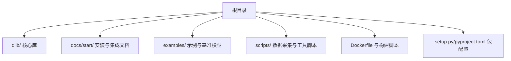
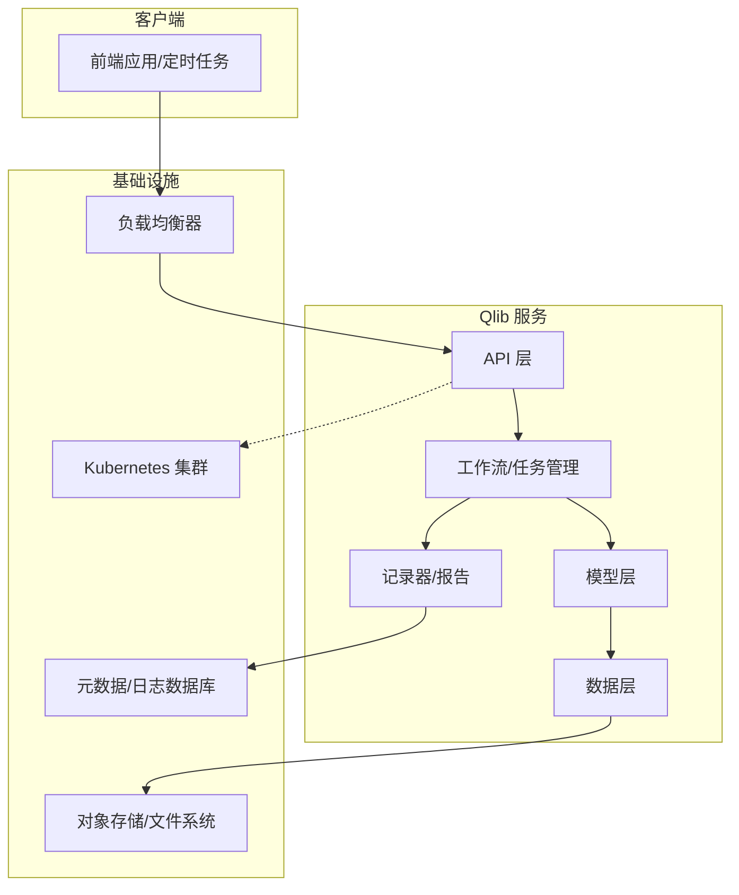
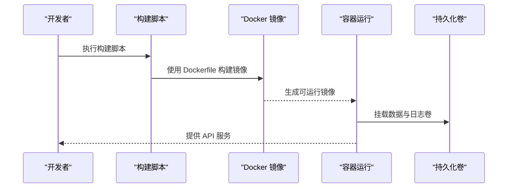
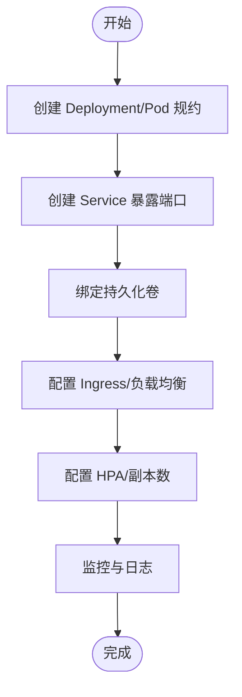
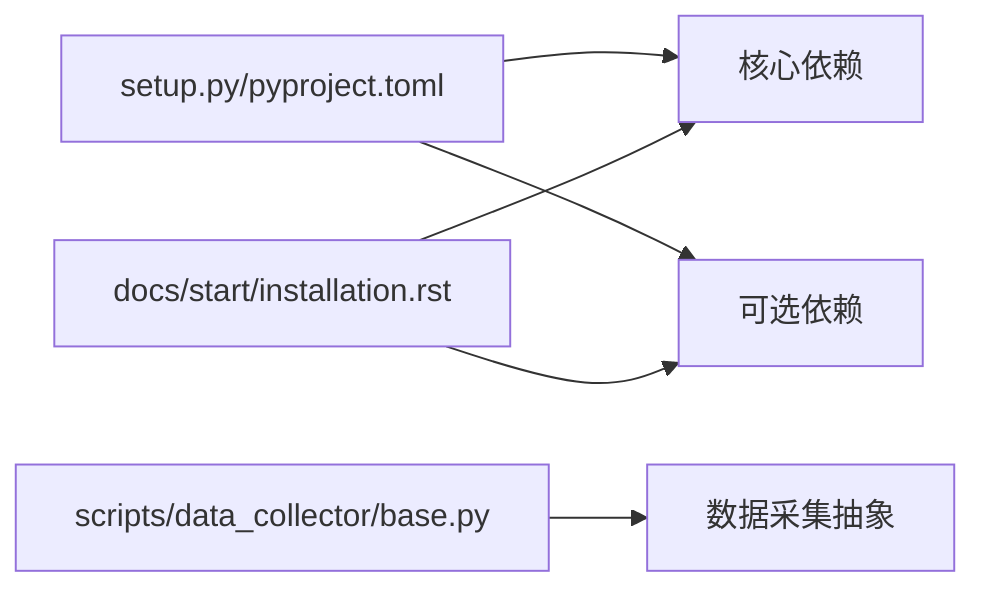

# 生产环境部署

<cite>
**本文档引用的文件**
- [README.md](file://README.md)
- [setup.py](file://setup.py)
- [Dockerfile](file://Dockerfile)
- [build_docker_image.sh](file://build_docker_image.sh)
- [pyproject.toml](file://pyproject.toml)
- [docs/start/installation.rst](file://docs/start/installation.rst)
- [docs/start/getdata.rst](file://docs/start/getdata.rst)
- [docs/start/initialization.rst](file://docs/start/initialization.rst)
- [docs/start/integration.rst](file://docs/start/integration.rst)
- [qlib/config.py](file://qlib/config.py)
- [qlib/__init__.py](file://qlib/__init__.py)
- [scripts/data_collector/base.py](file://scripts/data_collector/base.py)
</cite>

## 目录
1. [简介](#简介)
2. [项目结构](#项目结构)
3. [核心组件](#核心组件)
4. [架构总览](#架构总览)
5. [详细组件分析](#详细组件分析)
6. [依赖关系分析](#依赖关系分析)
7. [性能考虑](#性能考虑)
8. [故障排除指南](#故障排除指南)
9. [结论](#结论)
10. [附录](#附录)

## 简介
本指南面向在生产环境中部署 Qlib 的工程团队，提供从服务器硬件配置、操作系统兼容性、Python 环境搭建到依赖安装、环境变量配置、Docker 容器化与 Kubernetes 集群部署的完整方案。同时覆盖负载均衡、SSL 证书、安全加固等生产最佳实践，帮助您在高可用、可扩展、可维护的前提下稳定运行 Qlib。

## 项目结构
Qlib 是一个量化研究与回测框架，核心代码位于 qlib/ 目录，文档位于 docs/ 目录，示例与脚本位于 examples/ 和 scripts/ 目录。生产部署通常涉及以下关键目录与文件：
- 核心库：qlib/（模型、数据、回测、工作流等）
- 文档与安装指引：docs/start/（installation、getdata、initialization、integration）
- 容器化：Dockerfile、build_docker_image.sh
- 包管理：setup.py、pyproject.toml
- 示例与脚本：examples/、scripts/（数据采集、基准模型等）

**章节来源**
- [README.md](file://README.md)
- [setup.py](file://setup.py)
- [Dockerfile](file://Dockerfile)
- [build_docker_image.sh](file://build_docker_image.sh)
- [pyproject.toml](file://pyproject.toml)

## 核心组件
- 数据层：负责因子数据、行情数据的加载、缓存与存储，支持多种数据源与格式。
- 模型层：提供多种机器学习与深度学习模型接口，便于训练与预测。
- 回测层：实现交易执行、收益归因、报告生成等功能。
- 工作流层：统一调度实验、记录器、任务管理等。
- CLI 与服务：提供命令行入口与服务端能力（如文档中提到的 server 组件）。

**章节来源**
- [qlib/config.py](file://qlib/config.py)
- [qlib/__init__.py](file://qlib/__init__.py)

## 架构总览
下图展示了 Qlib 在生产环境中的典型部署架构：前端应用或定时任务通过 API 调用 Qlib 服务；服务内部通过数据层加载数据，调用模型进行推理或训练；结果通过记录器与报告模块输出，并持久化到存储系统。

[此图为概念性架构示意，不直接映射具体源码文件，因此不提供图表来源]

## 详细组件分析

### 服务器硬件配置要求
- CPU：建议至少 8 核，推荐 16 核以上，用于并行数据处理与模型训练。
- 内存：建议 32 GB，推荐 64 GB+，用于缓存大规模数据与多进程内存占用。
- 存储：SSD 至少 500 GB，建议 1 TB+；数据量大时需考虑分布式存储。
- 网络：千兆网卡，低延迟局域网，确保数据与模型文件传输效率。
- GPU（可选）：若使用深度学习模型，建议配备高性能 GPU 并安装相应驱动与 CUDA。

[本节为通用建议，不直接分析具体文件，故无章节来源]

### 操作系统兼容性
- Linux 发行版：推荐 CentOS 7+/Ubuntu 18.04+/Debian 10+。
- macOS：可用于开发与测试，但生产建议使用 Linux。
- Windows：不建议作为生产平台，除非通过 WSL 或虚拟机。

[本节为通用建议，不直接分析具体文件，故无章节来源]

### Python 环境搭建
- 版本：Python 3.8–3.10（以官方文档为准）。
- 建议使用虚拟环境（venv 或 conda）隔离依赖。
- 编译工具链：确保安装 gcc/g++、make、cmake 等编译工具。

**章节来源**
- [docs/start/installation.rst](file://docs/start/installation.rst)

### 依赖包安装流程
- 核心依赖：通过包管理器安装，确保与 Python 版本匹配。
- 可选依赖：根据是否启用特定功能（如可视化、深度学习框架）选择性安装。
- 版本兼容性检查：遵循官方文档中的版本矩阵，避免冲突。

**章节来源**
- [setup.py](file://setup.py)
- [pyproject.toml](file://pyproject.toml)
- [docs/start/installation.rst](file://docs/start/installation.rst)

### 环境变量配置
- 数据与缓存路径：设置数据根目录、缓存目录，确保服务账户有读写权限。
- 日志级别：通过环境变量控制日志详细程度，便于生产问题排查。
- 数据库连接：若使用外部数据库（如 MySQL、PostgreSQL），需配置连接字符串与凭据。
- 模型与回测参数：通过环境变量或配置文件注入，避免硬编码。

**章节来源**
- [qlib/config.py](file://qlib/config.py)
- [qlib/__init__.py](file://qlib/__init__.py)

### Docker 容器化部署
- 镜像构建：使用仓库提供的 Dockerfile 与构建脚本，确保构建上下文包含所有必要文件。
- 容器编排：建议使用 docker-compose 进行本地联调；生产使用 Kubernetes。
- 网络配置：暴露 API 端口，配置健康检查与资源限制。
- 存储挂载：将数据目录、日志目录映射到宿主机或持久化卷。

**图表来源**
- [Dockerfile](file://Dockerfile)
- [build_docker_image.sh](file://build_docker_image.sh)

**章节来源**
- [Dockerfile](file://Dockerfile)
- [build_docker_image.sh](file://build_docker_image.sh)

### Kubernetes 集群部署策略
- Pod 配置：定义资源请求与限制，启用健康检查与就绪探针。
- Service 暴露：使用 ClusterIP/NodePort/LoadBalancer，结合 Ingress 控制器对外暴露。
- 持久化存储：使用 PVC 绑定到数据目录与日志目录，确保数据持久化。
- 配置管理：使用 ConfigMap 管理非敏感配置，Secret 管理敏感信息。
- 横向扩展：通过副本数与 HPA 实现弹性伸缩。

[本图为概念性流程示意，不直接映射具体源码文件，因此不提供图表来源]

### 负载均衡与 SSL 证书
- 负载均衡：在 Kubernetes 中使用 Service 的 LoadBalancer 类型或外部负载均衡器；在裸机场景使用 Nginx/HAProxy。
- SSL 证书：通过 Ingress TLS 或反向代理配置 HTTPS；使用 Let’s Encrypt 自动续期。
- 安全加固：启用网络策略、只读根文件系统、最小权限 RBAC、禁用不必要的特权。

[本节为通用建议，不直接分析具体文件，故无章节来源]

## 依赖关系分析
- 包管理：setup.py 与 pyproject.toml 定义了核心依赖与可选依赖，确保生产镜像最小化且满足功能需求。
- 文档指引：installation.rst 与 integration.rst 提供安装与集成步骤，是部署前的参考依据。
- 数据采集：scripts/data_collector/base.py 提供数据采集抽象，生产中需配置数据源与存储路径。

**图表来源**
- [setup.py](file://setup.py)
- [pyproject.toml](file://pyproject.toml)
- [docs/start/installation.rst](file://docs/start/installation.rst)
- [scripts/data_collector/base.py](file://scripts/data_collector/base.py)

**章节来源**
- [setup.py](file://setup.py)
- [pyproject.toml](file://pyproject.toml)
- [docs/start/installation.rst](file://docs/start/installation.rst)
- [scripts/data_collector/base.py](file://scripts/data_collector/base.py)

## 性能考虑
- 数据预处理：批量加载与缓存策略，减少重复 IO。
- 模型推理：使用合适的批大小与并发度，避免内存峰值过高。
- 存储优化：SSD 优先，合理分片与压缩策略。
- 网络优化：内网高带宽，减少跨机房访问。
- 监控与告警：建立 CPU、内存、磁盘、网络与业务指标的监控体系。

[本节为通用建议，不直接分析具体文件，故无章节来源]

## 故障排除指南
- 安装失败：检查 Python 版本与依赖冲突，参考安装文档逐步排查。
- 数据加载异常：确认数据路径、权限与网络连通性。
- 模型训练/推理错误：检查 GPU 驱动与 CUDA 版本匹配，核对内存与批大小。
- 容器启动失败：查看日志与健康检查状态，确认资源限制与卷挂载。
- Kubernetes 异常：检查 Pod 状态、事件、网络策略与存储绑定。

**章节来源**
- [docs/start/installation.rst](file://docs/start/installation.rst)
- [qlib/config.py](file://qlib/config.py)

## 结论
通过合理的硬件与操作系统准备、严格的依赖管理、规范的环境变量配置以及容器化与 Kubernetes 部署策略，Qlib 可以在生产环境中实现高可用、高性能与易维护。配合负载均衡、SSL 证书与安全加固，可进一步提升系统的安全性与稳定性。

[本节为总结性内容，不直接分析具体文件，故无章节来源]

## 附录
- 快速检查清单
  - 服务器硬件与操作系统满足要求
  - Python 环境与依赖安装完成
  - 数据路径与权限配置正确
  - Docker 镜像构建成功并通过自检
  - Kubernetes 部署完成并通过健康检查
  - 负载均衡与 SSL 配置生效
  - 监控与日志体系已启用

[本节为通用建议，不直接分析具体文件，故无章节来源]