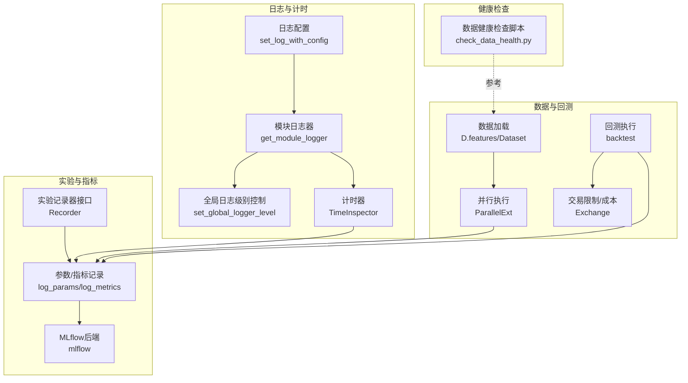
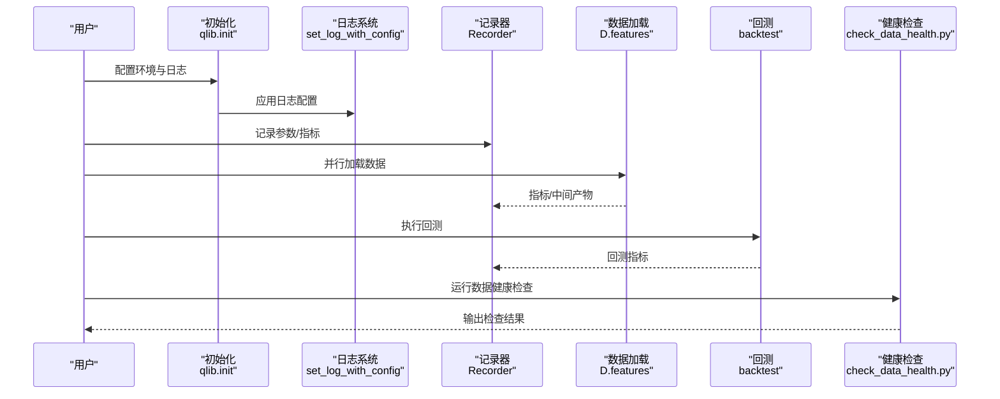
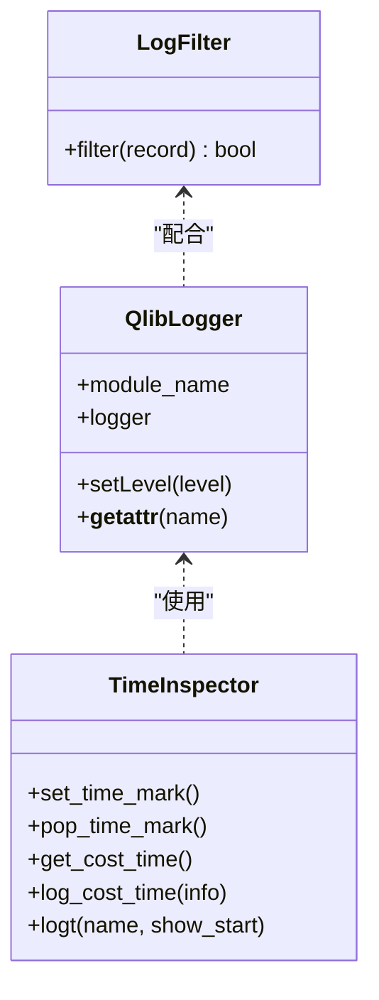
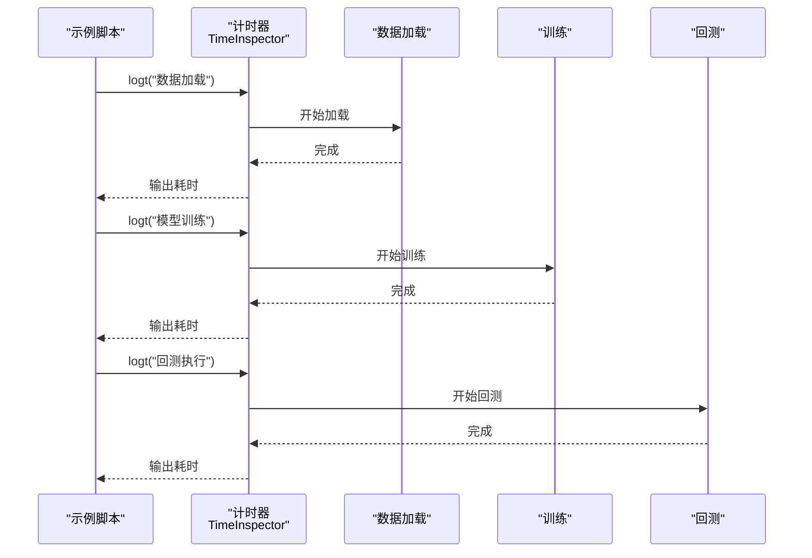
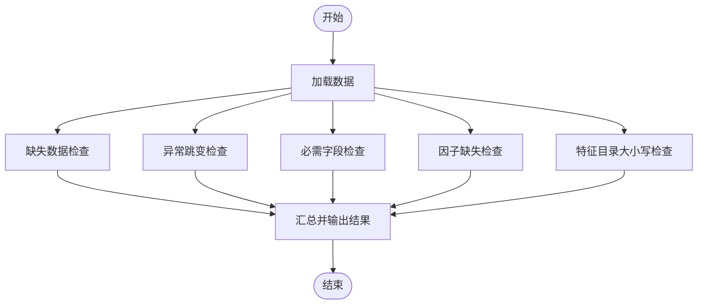
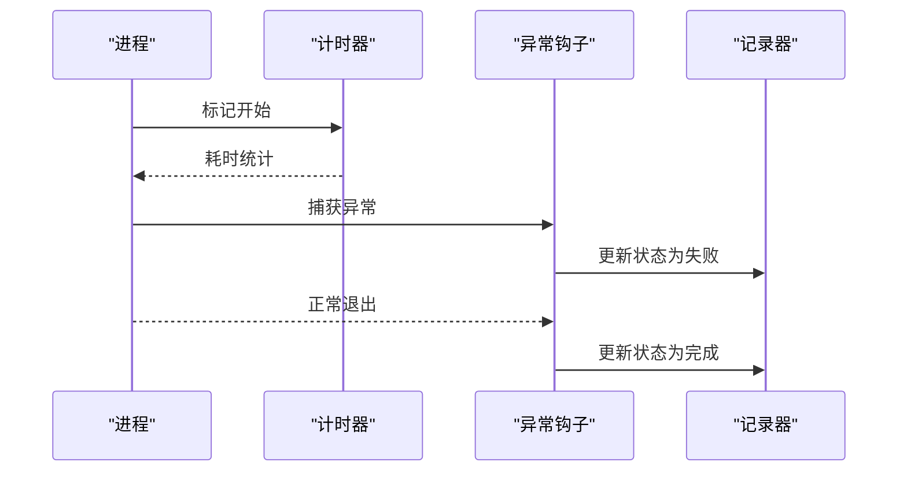
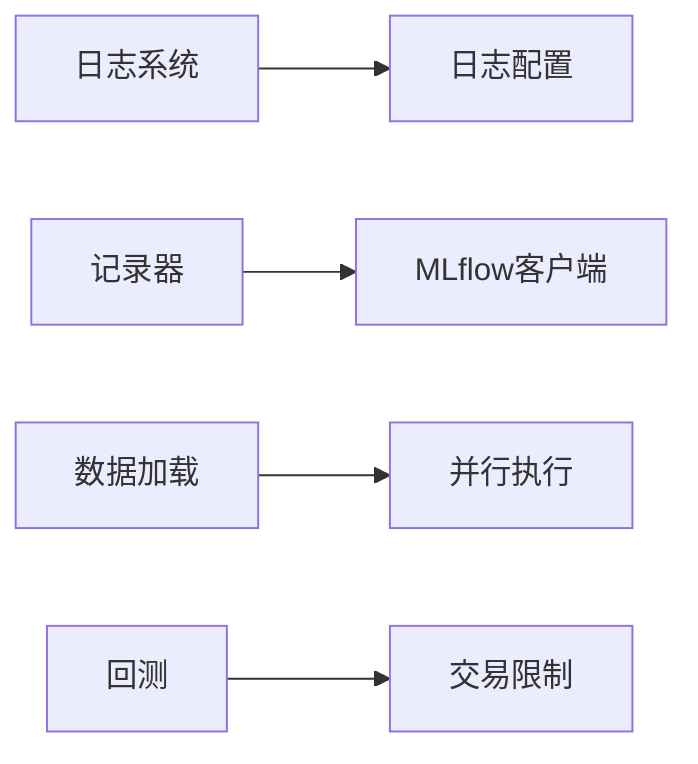

# 监控告警

<cite>
**本文引用的文件**
- [qlib/log.py](file://qlib/log.py)
- [qlib/config.py](file://qlib/config.py)
- [scripts/check_data_health.py](file://scripts/check_data_health.py)
- [qlib/workflow/recorder.py](file://qlib/workflow/recorder.py)
- [qlib/workflow/__init__.py](file://qlib/workflow/__init__.py)
- [qlib/workflow/utils.py](file://qlib/workflow/utils.py)
- [qlib/data/data.py](file://qlib/data/data.py)
- [qlib/backtest/exchange.py](file://qlib/backtest/exchange.py)
- [qlib/rl/contrib/backtest.py](file://qlib/rl/contrib/backtest.py)
- [qlib/workflow/record_temp.py](file://qlib/workflow/record_temp.py)
- [examples/data_demo/data_mem_resuse_demo.py](file://examples/data_demo/data_mem_resuse_demo.py)
</cite>

## 目录
1. [简介](#简介)
2. [项目结构](#项目结构)
3. [核心组件](#核心组件)
4. [架构总览](#架构总览)
5. [详细组件分析](#详细组件分析)
6. [依赖分析](#依赖分析)
7. [性能考量](#性能考量)
8. [故障排查指南](#故障排查指南)
9. [结论](#结论)
10. [附录](#附录)

## 简介
本指南面向Qlib监控告警系统的使用者与维护者，围绕“日志收集与分析、关键性能指标监控、系统健康状态监控、告警规则配置、监控工具集成、故障自动检测与智能降噪、告警处理流程”等方面，提供从架构到落地实践的完整说明。文档结合代码库中的日志框架、实验记录器、数据加载与回测模块等实现，帮助读者在生产环境中建立稳定可靠的监控与告警体系。

## 项目结构
Qlib的监控与告警能力主要由以下模块协同实现：
- 日志与计时：统一日志配置、模块化日志器、全局日志级别控制、结构化计时日志
- 实验与指标：实验记录器（Recorder）用于记录参数、指标、标签与制品
- 数据与回测：数据加载、并行执行、回测执行、交易限制与成本控制
- 健康检查：数据完整性与一致性校验脚本
- 工作流与异常处理：实验生命周期管理、异常钩子与退出处理

**图表来源**
- [qlib/log.py:152-262](file://qlib/log.py#L152-L262)
- [qlib/config.py:188-200](file://qlib/config.py#L188-L200)
- [qlib/workflow/recorder.py:122-142](file://qlib/workflow/recorder.py#L122-L142)
- [qlib/data/data.py:548-597](file://qlib/data/data.py#L548-L597)
- [qlib/rl/contrib/backtest.py:317-357](file://qlib/rl/contrib/backtest.py#L317-L357)
- [scripts/check_data_health.py:13-71](file://scripts/check_data_health.py#L13-L71)

**章节来源**
- [qlib/log.py:1-263](file://qlib/log.py#L1-L263)
- [qlib/config.py:135-200](file://qlib/config.py#L135-L200)
- [qlib/workflow/recorder.py:1-200](file://qlib/workflow/recorder.py#L1-L200)
- [qlib/data/data.py:548-597](file://qlib/data/data.py#L548-L597)
- [qlib/rl/contrib/backtest.py:317-357](file://qlib/rl/contrib/backtest.py#L317-L357)
- [scripts/check_data_health.py:13-71](file://scripts/check_data_health.py#L13-L71)

## 核心组件
- 日志与计时
  - 统一日志配置：通过字典配置初始化日志系统，支持格式化器与过滤器
  - 模块化日志器：按模块名获取日志器，自动添加前缀“qlib.”
  - 全局日志级别控制：可动态调整“qlib.*”处理器的日志级别，并支持上下文管理
  - 计时器：提供时间标记、弹栈、耗时统计与结构化日志输出
- 实验记录器
  - 参数与指标记录：支持批量记录参数与指标，指标可带步长
  - 标签与制品：支持设置标签与保存制品文件
  - 异步调用：对记录操作进行异步封装，提升吞吐
- 数据与回测
  - 数据加载：多进程并行加载特征数据，支持缓存与内存复用
  - 回测执行：并行回测，支持报告生成与结果持久化
  - 交易限制：基于涨跌停、成交量阈值等策略限制交易
- 健康检查
  - 缺失数据、异常跳变、必需字段缺失、因子缺失、大小写目录问题等检查

**章节来源**
- [qlib/log.py:152-262](file://qlib/log.py#L152-L262)
- [qlib/config.py:188-200](file://qlib/config.py#L188-L200)
- [qlib/workflow/recorder.py:446-476](file://qlib/workflow/recorder.py#L446-L476)
- [qlib/data/data.py:548-597](file://qlib/data/data.py#L548-L597)
- [qlib/rl/contrib/backtest.py:317-357](file://qlib/rl/contrib/backtest.py#L317-L357)
- [scripts/check_data_health.py:109-211](file://scripts/check_data_health.py#L109-L211)

## 架构总览
下图展示了监控告警在Qlib中的整体交互：日志与计时贯穿各模块；实验记录器集中记录指标；数据与回测模块产生关键性能指标；健康检查脚本作为外部工具辅助验证数据质量。

**图表来源**
- [qlib/config.py:446-450](file://qlib/config.py#L446-L450)
- [qlib/log.py:152-158](file://qlib/log.py#L152-L158)
- [qlib/workflow/recorder.py:446-476](file://qlib/workflow/recorder.py#L446-L476)
- [qlib/data/data.py:548-597](file://qlib/data/data.py#L548-L597)
- [qlib/rl/contrib/backtest.py:317-357](file://qlib/rl/contrib/backtest.py#L317-L357)
- [scripts/check_data_health.py:213-245](file://scripts/check_data_health.py#L213-L245)

## 详细组件分析

### 日志收集与分析
- 日志级别配置
  - 通过全局配置字典设置日志格式与过滤器，支持按模块前缀“qlib.”统一管理
  - 提供过滤器类，支持正则匹配过滤特定消息
- 日志轮转
  - 当前代码未直接实现轮转逻辑；建议结合外部日志系统（如RotatingFileHandler）或容器日志采集方案
- 结构化日志格式
  - 默认格式包含进程/线程、时间戳、级别、模块名、文件行号与消息体，便于检索与聚合
- 计时与耗时统计
  - 使用计时器在关键路径打点，输出“耗时+信息”的结构化日志，便于定位慢点

**图表来源**
- [qlib/log.py:24-83](file://qlib/log.py#L24-L83)
- [qlib/log.py:86-150](file://qlib/log.py#L86-L150)
- [qlib/log.py:161-183](file://qlib/log.py#L161-L183)

**章节来源**
- [qlib/log.py:152-262](file://qlib/log.py#L152-L262)
- [qlib/config.py:188-200](file://qlib/config.py#L188-L200)

### 关键性能指标监控
- 数据加载延迟
  - 数据加载采用并行执行，可通过计时器标注加载阶段耗时
  - 支持内存复用与缓存，减少重复加载开销
- 模型训练耗时
  - 训练过程可结合计时器标注关键阶段（准备、训练、评估），并将耗时作为指标记录
- 回测执行时间
  - 回测支持并行执行与报告生成，耗时可作为指标记录并持久化

**图表来源**
- [examples/data_demo/data_mem_resuse_demo.py:49-59](file://examples/data_demo/data_mem_resuse_demo.py#L49-L59)
- [qlib/data/data.py:548-597](file://qlib/data/data.py#L548-L597)
- [qlib/rl/contrib/backtest.py:317-357](file://qlib/rl/contrib/backtest.py#L317-L357)

**章节来源**
- [examples/data_demo/data_mem_resuse_demo.py:49-59](file://examples/data_demo/data_mem_resuse_demo.py#L49-L59)
- [qlib/data/data.py:548-597](file://qlib/data/data.py#L548-L597)
- [qlib/rl/contrib/backtest.py:317-357](file://qlib/rl/contrib/backtest.py#L317-L357)

### 系统健康状态监控
- 数据完整性与一致性
  - 缺失数据检查、异常跳变检查、必需字段检查、因子缺失检查、特征目录大小写检查
  - 健康检查脚本可作为定时任务运行，输出汇总结果并给出修复建议

**图表来源**
- [scripts/check_data_health.py:109-211](file://scripts/check_data_health.py#L109-L211)

**章节来源**
- [scripts/check_data_health.py:13-71](file://scripts/check_data_health.py#L13-L71)
- [scripts/check_data_health.py:109-211](file://scripts/check_data_health.py#L109-L211)

### 告警规则配置
- 阈值设定
  - 数据健康检查脚本提供阈值参数（价格/成交量跳变阈值、缺失数量阈值）
  - 计时器输出的耗时指标可用于设定阈值（如数据加载超时、回测耗时异常）
- 告警级别
  - 建议按“警告/严重/致命”分级，结合日志级别与外部监控系统实现
- 通知方式
  - 建议通过外部监控系统（如Prometheus Alertmanager、ELK告警）对接，本仓库未内置通知通道

**章节来源**
- [scripts/check_data_health.py:21-29](file://scripts/check_data_health.py#L21-L29)
- [qlib/log.py:152-158](file://qlib/log.py#L152-L158)

### 监控工具集成
- Prometheus/Grafana
  - 将实验记录器中的指标导出为Prometheus指标（需自定义适配器），在Grafana中可视化
- ELK Stack
  - 将结构化日志输出到ELK，利用Kibana进行检索与告警
- 外部健康检查
  - 将数据健康检查脚本纳入CI/CD或定时任务，失败即触发告警

**章节来源**
- [qlib/workflow/recorder.py:446-476](file://qlib/workflow/recorder.py#L446-L476)
- [qlib/log.py:152-158](file://qlib/log.py#L152-L158)

### 故障自动检测、智能告警降噪、告警处理流程
- 自动检测
  - 计时器输出异常耗时、健康检查脚本发现数据异常
- 智能降噪
  - 通过日志过滤器屏蔽噪声日志，降低误报
- 告警处理流程
  - 记录器在异常情况下更新实验状态，异常钩子与退出处理确保实验收尾

**图表来源**
- [qlib/workflow/utils.py:17-47](file://qlib/workflow/utils.py#L17-L47)
- [qlib/workflow/recorder.py:36-41](file://qlib/workflow/recorder.py#L36-L41)

**章节来源**
- [qlib/workflow/utils.py:17-47](file://qlib/workflow/utils.py#L17-L47)
- [qlib/workflow/recorder.py:36-41](file://qlib/workflow/recorder.py#L36-L41)

## 依赖分析
- 日志系统依赖于Python标准库logging与外部配置字典
- 实验记录器依赖MLflow客户端，支持参数、指标、标签与制品
- 数据加载依赖并行执行框架，受配置项影响（核数、后端、任务数）
- 回测模块依赖交易执行器与限制策略

**图表来源**
- [qlib/config.py:188-200](file://qlib/config.py#L188-L200)
- [qlib/workflow/recorder.py:20-26](file://qlib/workflow/recorder.py#L20-L26)
- [qlib/data/data.py:548-597](file://qlib/data/data.py#L548-L597)
- [qlib/backtest/exchange.py:65-110](file://qlib/backtest/exchange.py#L65-L110)

**章节来源**
- [qlib/config.py:188-200](file://qlib/config.py#L188-L200)
- [qlib/workflow/recorder.py:20-26](file://qlib/workflow/recorder.py#L20-L26)
- [qlib/data/data.py:548-597](file://qlib/data/data.py#L548-L597)
- [qlib/backtest/exchange.py:65-110](file://qlib/backtest/exchange.py#L65-L110)

## 性能考量
- 并行度与核数
  - 数据加载与回测均支持并行执行，核数与后端可配置，建议根据CPU与内存资源合理设置
- 内存与缓存
  - 支持内存缓存与磁盘缓存，避免重复计算与IO瓶颈
- 计时与观测
  - 在关键路径使用计时器标注，形成可追踪的性能基线

**章节来源**
- [qlib/data/data.py:548-597](file://qlib/data/data.py#L548-L597)
- [qlib/config.py:127-170](file://qlib/config.py#L127-L170)
- [examples/data_demo/data_mem_resuse_demo.py:49-59](file://examples/data_demo/data_mem_resuse_demo.py#L49-L59)

## 故障排查指南
- 日志级别与噪声过滤
  - 使用全局日志级别控制与过滤器，快速定位问题
- 实验状态与异常处理
  - 异常钩子会将实验状态置为失败，退出处理确保资源释放
- 数据健康检查
  - 运行健康检查脚本，依据输出修正缺失数据、异常跳变与目录命名问题

**章节来源**
- [qlib/log.py:185-262](file://qlib/log.py#L185-L262)
- [qlib/workflow/utils.py:17-47](file://qlib/workflow/utils.py#L17-L47)
- [scripts/check_data_health.py:213-245](file://scripts/check_data_health.py#L213-L245)

## 结论
Qlib提供了完善的日志与计时、实验记录与指标、数据加载与回测、以及数据健康检查能力，能够支撑构建一套覆盖“日志—指标—健康—告警—处理”的闭环监控体系。结合外部监控工具（Prometheus/Grafana/ELK），可进一步实现自动化告警与可视化运维。

## 附录
- 指标建议
  - 数据加载耗时、模型训练耗时、回测执行耗时、数据缺失比例、异常跳变次数、因子缺失比例
- 规则建议
  - 数据加载/回测耗时超过阈值触发告警；缺失比例/异常跳变次数超过阈值触发告警；健康检查失败立即告警