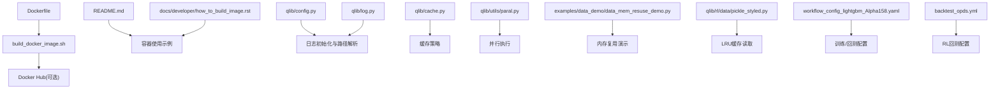
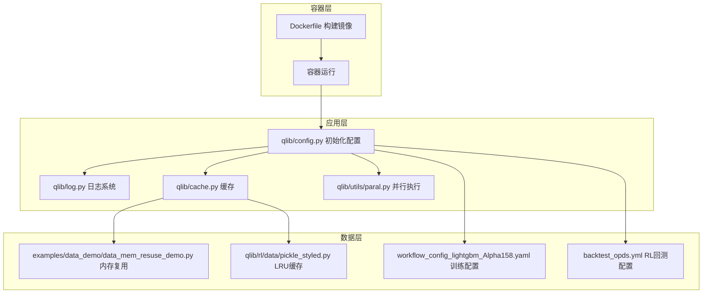
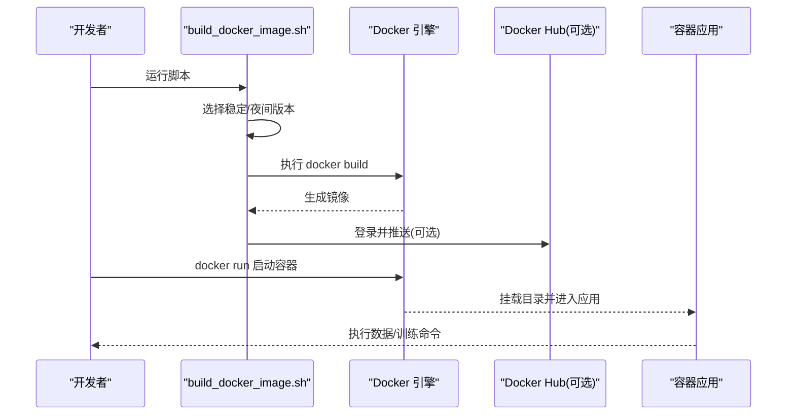
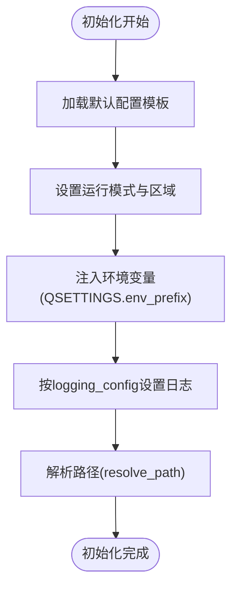
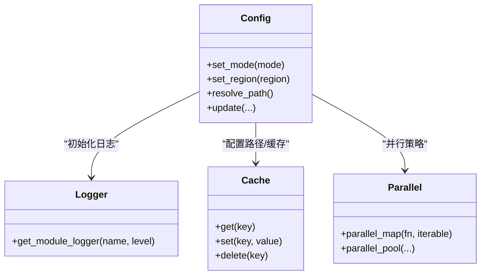
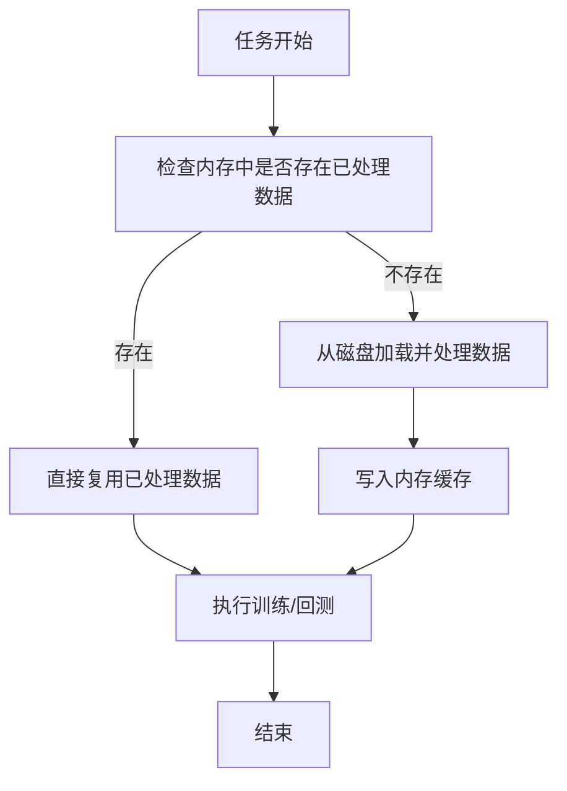
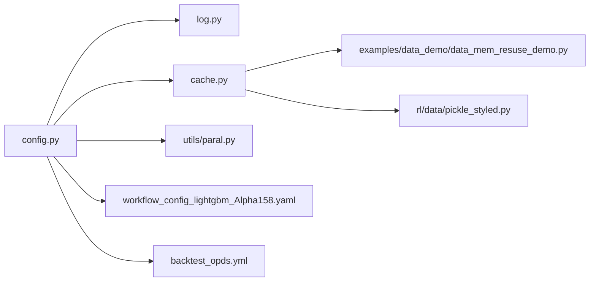

# 部署与运维

<cite>
**本文引用的文件**
- [Dockerfile](file://Dockerfile)
- [build_docker_image.sh](file://build_docker_image.sh)
- [README.md](file://README.md)
- [how_to_build_image.rst](file://docs/developer/how_to_build_image.rst)
- [config.py](file://qlib/config.py)
- [log.py](file://qlib/log.py)
- [cache.py](file://qlib/cache.py)
- [paral.py](file://qlib/utils/paral.py)
- [pickle_styled.py](file://qlib/rl/data/pickle_styled.py)
- [data_mem_resuse_demo.py](file://examples/data_demo/data_mem_resuse_demo.py)
- [.dockerignore](file://.dockerignore)
- [workflow_config_lightgbm_Alpha158.yaml](file://examples/benchmarks/LightGBM/workflow_config_lightgbm_Alpha158.yaml)
- [backtest_opds.yml](file://examples/rl_order_execution/exp_configs/backtest_opds.yml)
</cite>

## 目录
1. [简介](#简介)
2. [项目结构](#项目结构)
3. [核心组件](#核心组件)
4. [架构总览](#架构总览)
5. [详细组件分析](#详细组件分析)
6. [依赖关系分析](#依赖关系分析)
7. [性能考虑](#性能考虑)
8. [故障排查指南](#故障排查指南)
9. [结论](#结论)
10. [附录](#附录)

## 简介
本指南面向生产环境的Qlib部署与运维，覆盖服务器配置、依赖安装、环境变量、性能优化、监控告警、故障诊断、容器化（Docker/Kubernetes）与自动化运维、备份恢复与灾备策略，以及运维最佳实践与注意事项。内容基于仓库中的Docker镜像构建脚本、文档与核心代码模块整理而成，帮助读者在生产环境中稳定、高效地运行Qlib。

## 项目结构
- 容器化与镜像构建：根目录提供Dockerfile与自动构建脚本，支持稳定版与夜间版镜像构建，并可选择推送至Docker Hub。
- 文档与使用示例：docs/developer/how_to_build_image.rst与README.md提供镜像拉取、容器启动与基本使用流程。
- 核心配置与日志：qlib/config.py与qlib/log.py定义全局配置与日志初始化路径；qlib/cache.py提供缓存机制；qlib/utils/paral.py提供并行执行能力。
- 数据与缓存：examples/data_demo/data_mem_resuse_demo.py展示数据复用与内存缓存的性能收益；qlib/rl/data/pickle_styled.py提供LRU缓存读取策略。
- 工作流配置：examples/benchmarks/LightGBM/workflow_config_lightgbm_Alpha158.yaml与examples/rl_order_execution/exp_configs/backtest_opds.yml等YAML配置文件用于训练/回测任务参数化。

**图示来源**
- [Dockerfile](file://Dockerfile)
- [build_docker_image.sh](file://build_docker_image.sh)
- [README.md](file://README.md)
- [how_to_build_image.rst](file://docs/developer/how_to_build_image.rst)
- [config.py](file://qlib/config.py)
- [log.py](file://qlib/log.py)
- [cache.py](file://qlib/cache.py)
- [paral.py](file://qlib/utils/paral.py)
- [pickle_styled.py](file://qlib/rl/data/pickle_styled.py)
- [data_mem_resuse_demo.py](file://examples/data_demo/data_mem_resuse_demo.py)
- [workflow_config_lightgbm_Alpha158.yaml](file://examples/benchmarks/LightGBM/workflow_config_lightgbm_Alpha158.yaml)
- [backtest_opds.yml](file://examples/rl_order_execution/exp_configs/backtest_opds.yml)

**章节来源**
- [Dockerfile](file://Dockerfile)
- [build_docker_image.sh](file://build_docker_image.sh)
- [README.md](file://README.md)
- [how_to_build_image.rst](file://docs/developer/how_to_build_image.rst)

## 核心组件
- 镜像构建与分发
  - 支持稳定版与夜间版两种构建方式，通过Dockerfile与build_docker_image.sh实现自动化构建与可选上传。
  - 参考：[Dockerfile](file://Dockerfile)、[build_docker_image.sh](file://build_docker_image.sh)、[how_to_build_image.rst](file://docs/developer/how_to_build_image.rst)、[README.md](file://README.md)
- 全局配置与日志
  - 全局配置类与环境变量前缀、嵌套键解析、路径解析与日志初始化均在config.py中实现。
  - 日志模块提供统一日志入口，便于集中化采集与告警。
  - 参考：[config.py](file://qlib/config.py)、[log.py](file://qlib/log.py)
- 缓存与并行
  - 缓存模块提供通用缓存策略；并行工具提供多进程/线程执行能力，提升吞吐。
  - 参考：[cache.py](file://qlib/cache.py)、[paral.py](file://qlib/utils/paral.py)
- 数据缓存与内存复用
  - 示例展示如何在多次任务中复用已处理数据以减少IO与处理时间；RL数据模块提供LRU缓存读取。
  - 参考：[data_mem_resuse_demo.py](file://examples/data_demo/data_mem_resuse_demo.py)、[pickle_styled.py](file://qlib/rl/data/pickle_styled.py)

**章节来源**
- [config.py](file://qlib/config.py)
- [log.py](file://qlib/log.py)
- [cache.py](file://qlib/cache.py)
- [paral.py](file://qlib/utils/paral.py)
- [pickle_styled.py](file://qlib/rl/data/pickle_styled.py)
- [data_mem_resuse_demo.py](file://examples/data_demo/data_mem_resuse_demo.py)

## 架构总览
下图展示了从容器到应用、再到数据与缓存的关键交互路径，体现生产部署中的典型调用链与数据流。

**图示来源**
- [Dockerfile](file://Dockerfile)
- [config.py](file://qlib/config.py)
- [log.py](file://qlib/log.py)
- [cache.py](file://qlib/cache.py)
- [paral.py](file://qlib/utils/paral.py)
- [data_mem_resuse_demo.py](file://examples/data_demo/data_mem_resuse_demo.py)
- [pickle_styled.py](file://qlib/rl/data/pickle_styled.py)
- [workflow_config_lightgbm_Alpha158.yaml](file://examples/benchmarks/LightGBM/workflow_config_lightgbm_Alpha158.yaml)
- [backtest_opds.yml](file://examples/rl_order_execution/exp_configs/backtest_opds.yml)

## 详细组件分析

### 容器化与镜像构建
- 构建方式
  - 稳定版：通过pip安装pyqlib构建镜像，默认版本。
  - 夜间版：使用当前源码构建镜像，适合开发与快速迭代。
- 自动化脚本
  - 支持交互式选择版本与是否上传至Docker Hub；上传前需登录。
- 使用流程
  - 拉取镜像、启动容器、挂载本地目录、在容器内执行数据下载与训练脚本。
- 最佳实践
  - 生产建议使用稳定版镜像；夜间版仅用于测试或CI。
  - 建议固定镜像标签，避免latest漂移带来的不可重复性。

**图示来源**
- [build_docker_image.sh](file://build_docker_image.sh)
- [Dockerfile](file://Dockerfile)
- [README.md](file://README.md)
- [how_to_build_image.rst](file://docs/developer/how_to_build_image.rst)

**章节来源**
- [build_docker_image.sh](file://build_docker_image.sh)
- [Dockerfile](file://Dockerfile)
- [README.md](file://README.md)
- [how_to_build_image.rst](file://docs/developer/how_to_build_image.rst)

### 配置与环境变量
- 配置加载
  - 通过Config类加载默认模板，支持设置模式、区域与自定义键值；支持环境变量注入（前缀QLIB_，嵌套键使用下划线分隔）。
  - 初始化时会根据logging_config与logging_level设置日志系统。
- 路径解析
  - resolve_path负责将相对路径解析为绝对路径，确保配置一致性。
- 建议
  - 在容器中通过环境变量传递配置项，避免硬编码；对敏感信息使用密文管理。

**图示来源**
- [config.py](file://qlib/config.py)

**章节来源**
- [config.py](file://qlib/config.py)

### 日志与可观测性
- 日志模块
  - 提供统一日志入口，便于集中采集（如stdout/stderr重定向到日志系统）。
- 建议
  - 生产环境统一输出到标准流，结合日志收集系统（如Fluent Bit/Fluentd、Filebeat）与集中式存储（如ELK/Graylog/Loki+Promtail）。
  - 对关键阶段（初始化、数据加载、模型训练、回测）增加结构化日志字段，便于检索与告警。

**章节来源**
- [log.py](file://qlib/log.py)

### 缓存与并行
- 缓存策略
  - cache.py提供通用缓存接口；数据模块与RL模块分别采用内存复用与LRU缓存策略，降低重复计算与IO开销。
- 并行执行
  - paral.py提供并行工具，可用于加速数据处理、特征工程或批量任务。
- 建议
  - 结合业务场景选择合适的缓存粒度与失效策略；并行度应与CPU/IO资源匹配，避免过度竞争。

**图示来源**
- [config.py](file://qlib/config.py)
- [log.py](file://qlib/log.py)
- [cache.py](file://qlib/cache.py)
- [paral.py](file://qlib/utils/paral.py)

**章节来源**
- [cache.py](file://qlib/cache.py)
- [paral.py](file://qlib/utils/paral.py)

### 数据缓存与内存复用
- 内存复用
  - 通过复用已处理的数据处理器与数据集，显著减少重复加载与预处理时间。
- LRU缓存
  - RL数据模块对pickle文件进行LRU缓存读取，控制内存占用上限。
- 建议
  - 在长时间运行的任务中启用内存复用；合理设置LRU容量，平衡内存与命中率。

**图示来源**
- [data_mem_resuse_demo.py](file://examples/data_demo/data_mem_resuse_demo.py)
- [pickle_styled.py](file://qlib/rl/data/pickle_styled.py)

**章节来源**
- [data_mem_resuse_demo.py](file://examples/data_demo/data_mem_resuse_demo.py)
- [pickle_styled.py](file://qlib/rl/data/pickle_styled.py)

### 工作流与任务配置
- 训练/回测配置
  - 通过YAML配置文件指定数据集、处理器、模型与评估指标等参数，便于标准化与版本化管理。
- 建议
  - 将配置文件纳入版本控制；不同环境使用不同的配置片段或环境变量覆盖。

**章节来源**
- [workflow_config_lightgbm_Alpha158.yaml](file://examples/benchmarks/LightGBM/workflow_config_lightgbm_Alpha158.yaml)
- [backtest_opds.yml](file://examples/rl_order_execution/exp_configs/backtest_opds.yml)

## 依赖关系分析
- 组件耦合
  - 应用初始化依赖配置模块；日志模块依赖配置模块的日志配置；缓存与并行模块被上层任务调度使用。
- 外部依赖
  - Docker镜像构建依赖Python环境与包管理器；容器运行依赖挂载卷与网络访问权限。
- 建议
  - 明确各模块职责边界，避免循环依赖；对外部依赖进行版本锁定与安全扫描。

**图示来源**
- [config.py](file://qlib/config.py)
- [log.py](file://qlib/log.py)
- [cache.py](file://qlib/cache.py)
- [paral.py](file://qlib/utils/paral.py)
- [data_mem_resuse_demo.py](file://examples/data_demo/data_mem_resuse_demo.py)
- [pickle_styled.py](file://qlib/rl/data/pickle_styled.py)
- [workflow_config_lightgbm_Alpha158.yaml](file://examples/benchmarks/LightGBM/workflow_config_lightgbm_Alpha158.yaml)
- [backtest_opds.yml](file://examples/rl_order_execution/exp_configs/backtest_opds.yml)

## 性能考虑
- 内存管理
  - 使用内存复用与LRU缓存减少重复加载；控制缓存大小与失效策略，避免内存膨胀。
  - 参考：[data_mem_resuse_demo.py](file://examples/data_demo/data_mem_resuse_demo.py)、[pickle_styled.py](file://qlib/rl/data/pickle_styled.py)
- 并发处理
  - 利用并行工具提升数据与任务处理效率；根据CPU/IO特性调整并发度。
  - 参考：[paral.py](file://qlib/utils/paral.py)
- 缓存策略
  - 针对高频访问的数据与中间结果建立缓存；结合配置与环境变量动态调整缓存行为。
  - 参考：[cache.py](file://qlib/cache.py)、[config.py](file://qlib/config.py)
- I/O优化
  - 减少磁盘随机访问，优先顺序读写；合理组织数据分区与索引。
- 资源隔离
  - 在容器中限制CPU/内存配额，防止资源争抢；使用独立卷管理数据与日志。

[本节为通用性能指导，不直接分析具体文件，故无“章节来源”]

## 故障排查指南
- 日志分析
  - 通过统一日志入口定位错误发生阶段；结合结构化字段快速过滤。
  - 参考：[log.py](file://qlib/log.py)
- 配置问题
  - 检查环境变量前缀与嵌套键格式；确认路径解析后目标目录存在且有权限。
  - 参考：[config.py](file://qlib/config.py)
- 缓存异常
  - 若出现缓存命中率低或内存溢出，检查缓存容量与失效策略；必要时清理缓存或重启容器。
  - 参考：[cache.py](file://qlib/cache.py)、[pickle_styled.py](file://qlib/rl/data/pickle_styled.py)
- 并行问题
  - 并发度过高导致上下文切换频繁或死锁，适当降低并行度或拆分任务。
  - 参考：[paral.py](file://qlib/utils/paral.py)
- 容器问题
  - 挂载卷权限不足、网络不通、镜像版本不一致等；核对Dockerfile与构建脚本。
  - 参考：[Dockerfile](file://Dockerfile)、[build_docker_image.sh](file://build_docker_image.sh)、[README.md](file://README.md)

**章节来源**
- [log.py](file://qlib/log.py)
- [config.py](file://qlib/config.py)
- [cache.py](file://qlib/cache.py)
- [paral.py](file://qlib/utils/paral.py)
- [pickle_styled.py](file://qlib/rl/data/pickle_styled.py)
- [Dockerfile](file://Dockerfile)
- [build_docker_image.sh](file://build_docker_image.sh)
- [README.md](file://README.md)

## 结论
通过容器化、配置与日志标准化、缓存与并行优化，以及完善的故障排查流程，Qlib可在生产环境中实现稳定、高效与可维护的运行。建议在生产中固定镜像版本、严格管理配置与密钥、持续监控日志与性能指标，并定期演练备份与灾备流程。

[本节为总结性内容，不直接分析具体文件，故无“章节来源”]

## 附录

### A. 服务器与环境准备
- 操作系统：Linux（推荐Ubuntu/CentOS），内核版本满足容器运行要求。
- 容器运行时：Docker Engine（建议使用官方仓库安装，确保版本兼容）。
- 存储：为数据与日志划分独立卷，预留充足空间；对热数据使用SSD。
- 网络：允许访问外部数据源与Docker Hub；若内网部署，建议搭建私有镜像仓库。
- 安全：最小权限原则；对敏感配置使用密文管理与只读挂载。

[本节为通用准备事项，不直接分析具体文件，故无“章节来源”]

### B. 依赖安装与环境变量
- Python与包管理：使用Python 3.8+；通过pip安装依赖；建议使用虚拟环境隔离。
- 环境变量：通过QSETTINGS.env_prefix（QLIB_）注入配置键；嵌套键使用下划线分隔。
- 参考：[config.py](file://qlib/config.py)

**章节来源**
- [config.py](file://qlib/config.py)

### C. 监控与告警
- 日志采集：将容器标准输出接入日志系统；为关键阶段添加结构化字段。
- 指标采集：结合应用内部计数器与系统指标（CPU/内存/磁盘/网络）。
- 告警规则：针对启动失败、内存使用率过高、任务超时、缓存异常等设置阈值告警。
- 可视化：使用Prometheus/Grafana或ELK栈进行可视化与历史趋势分析。

[本节为通用监控建议，不直接分析具体文件，故无“章节来源”]

### D. 备份与灾备
- 备份范围：镜像快照、配置文件、数据卷、日志卷、模型产物。
- 策略：定期全量+增量备份；异地容灾；版本化管理。
- 恢复演练：制定RTO/RPO目标；定期演练恢复流程。

[本节为通用灾备建议，不直接分析具体文件，故无“章节来源”]

### E. 运维最佳实践
- 版本管理：固定镜像标签；配置文件纳入版本控制；变更走CI/CD。
- 安全加固：最小权限、只读根文件系统、非root用户运行、镜像漏洞扫描。
- 可靠性：健康检查与自愈；优雅退出与信号处理；资源配额与限流。
- 可观测性：统一日志、指标与追踪；关键路径埋点；告警分级与值班流程。

[本节为通用运维建议，不直接分析具体文件，故无“章节来源”]