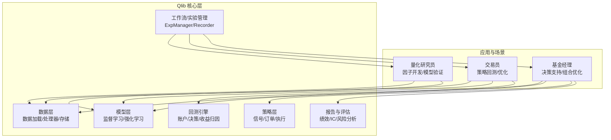
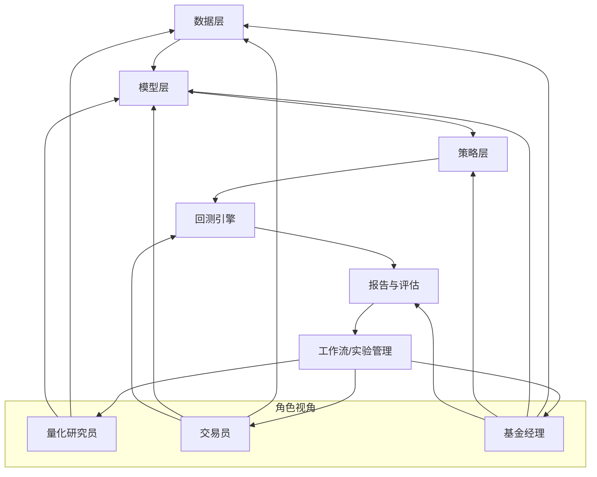
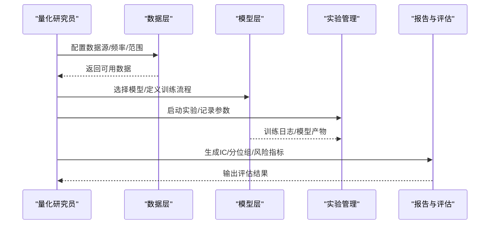
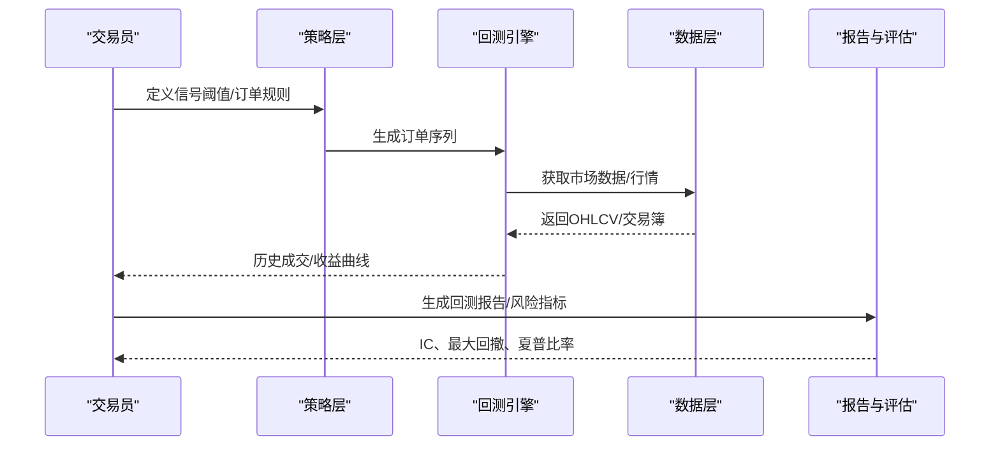
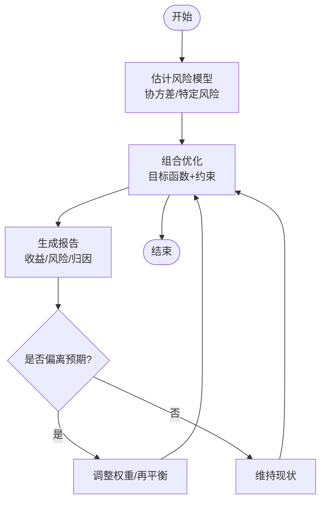
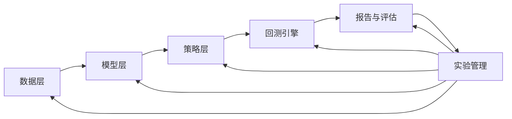

# 应用场景

<cite>
**本文引用的文件**
- [README.md](file://README.md)
- [introduction.rst](file://docs/introduction/introduction.rst)
- [backtest.py](file://qlib/backtest/backtest.py)
- [expm.py](file://qlib/workflow/expm.py)
- [__init__.py](file://qlib/workflow/__init__.py)
- [data.rst](file://docs/component/data.rst)
- [model.rst](file://docs/component/model.rst)
- [report.rst](file://docs/component/report.rst)
- [strategy.rst](file://docs/component/strategy.rst)
- [workflow.rst](file://docs/component/workflow.rst)
- [highfreq.rst](file://docs/component/highfreq.rst)
- [online.rst](file://docs/component/online.rst)
- [recorder.rst](file://docs/component/recorder.rst)
- [task_management.rst](file://docs/advanced/task_management.rst)
- [benchmarks/README.md](file://examples/benchmarks/README.md)
- [workflow_config_lightgbm_Alpha158.yaml](file://examples/benchmarks/LightGBM/workflow_config_lightgbm_Alpha158.yaml)
- [workflow_config_lightgbm_Alpha360.yaml](file://examples/benchmarks/LightGBM/workflow_config_lightgbm_Alpha360.yaml)
- [workflow_config_lstm_Alpha158.yaml](file://examples/benchmarks/LSTM/workflow_config_lstm_Alpha158.yaml)
- [workflow_config_lstm_Alpha360.yaml](file://examples/benchmarks/LSTM/workflow_config_lstm_Alpha360.yaml)
- [workflow_config_gru_Alpha158.yaml](file://examples/benchmarks/GRU/workflow_config_gru_Alpha158.yaml)
- [workflow_config_gru_Alpha360.yaml](file://examples/benchmarks/GRU/workflow_config_gru_Alpha360.yaml)
- [workflow_config_mlp_Alpha158.yaml](file://examples/benchmarks/MLP/workflow_config_mlp_Alpha158.yaml)
- [workflow_config_mlp_Alpha360.yaml](file://examples/benchmarks/MLP/workflow_config_mlp_Alpha360.yaml)
- [workflow_config_catboost_Alpha158.yaml](file://examples/benchmarks/CatBoost/workflow_config_catboost_Alpha158.yaml)
- [workflow_config_catboost_Alpha360.yaml](file://examples/benchmarks/CatBoost/workflow_config_catboost_Alpha360.yaml)
- [workflow_config_xgboost_Alpha158.yaml](file://examples/benchmarks/XGBoost/workflow_config_xgboost_Alpha158.yaml)
- [workflow_config_xgboost_Alpha360.yaml](file://examples/benchmarks/XGBoost/workflow_config_xgboost_Alpha360.yaml)
- [workflow_config_alstm_Alpha158.yaml](file://examples/benchmarks/ALSTM/workflow_config_alstm_Alpha158.yaml)
- [workflow_config_alstm_Alpha360.yaml](file://examples/benchmarks/ALSTM/workflow_config_alstm_Alpha360.yaml)
- [workflow_config_adarnn_Alpha360.yaml](file://examples/benchmarks/ADARNN/workflow_config_adarnn_Alpha360.yaml)
- [workflow_config_hist_Alpha360.yaml](file://examples/benchmarks/HIST/workflow_config_hist_Alpha360.yaml)
- [workflow_config_igmtf_Alpha360.yaml](file://examples/benchmarks/IGMTF/workflow_config_igmtf_Alpha360.yaml)
- [workflow_config_krnn_Alpha360.yaml](file://examples/benchmarks/KRNN/workflow_config_krnn_Alpha360.yaml)
- [workflow_config_localformer_Alpha158.yaml](file://examples/benchmarks/Localformer/workflow_config_localformer_Alpha158.yaml)
- [workflow_config_localformer_Alpha360.yaml](file://examples/benchmarks/Localformer/workflow_config_localformer_Alpha360.yaml)
- [workflow_config_sfm_Alpha360.yaml](file://examples/benchmarks/SFM/workflow_config_sfm_Alpha360.yaml)
- [workflow_config_sandwich_Alpha360.yaml](file://examples/benchmarks/Sandwich/workflow_config_sandwich_Alpha360.yaml)
- [workflow_config_tcn_Alpha158.yaml](file://examples/benchmarks/TCN/workflow_config_tcn_Alpha158.yaml)
- [workflow_config_tcn_Alpha360.yaml](file://examples/benchmarks/TCN/workflow_config_tcn_Alpha360.yaml)
- [workflow_config_tcts_Alpha360.yaml](file://examples/benchmarks/TCTS/workflow_config_tcts_Alpha360.yaml)
- [workflow_config_transformer_Alpha158.yaml](file://examples/benchmarks/Transformer/workflow_config_transformer_Alpha158.yaml)
- [workflow_config_transformer_Alpha360.yaml](file://examples/benchmarks/Transformer/workflow_config_transformer_Alpha360.yaml)
- [workflow_config_tra_Alpha158.yaml](file://examples/benchmarks/TRA/workflow_config_tra_Alpha158.yaml)
- [workflow_config_tra_Alpha360.yaml](file://examples/benchmarks/TRA/workflow_config_tra_Alpha360.yaml)
- [workflow_config_TabNet_Alpha158.yaml](file://examples/benchmarks/TabNet/workflow_config_TabNet_Alpha158.yaml)
- [workflow_config_TabNet_Alpha360.yaml](file://examples/benchmarks/TabNet/workflow_config_TabNet_Alpha360.yaml)
- [workflow_config_tft_Alpha158.yaml](file://examples/benchmarks/TFT/tft.py)
- [workflow_config_tft_Alpha158.yaml](file://examples/benchmarks/TFT/expt_settings/configs.py)
- [workflow_config_tft_Alpha158.yaml](file://examples/benchmarks/TFT/data_formatters/qlib_Alpha158.py)
- [workflow_config_tft_Alpha158.yaml](file://examples/benchmarks/TFT/libs/tft_model.py)
- [workflow_config_tft_Alpha158.yaml](file://examples/benchmarks/TFT/libs/utils.py)
- [workflow_config_tft_Alpha158.yaml](file://examples/benchmarks/TFT/README.md)
- [workflow_config_tft_Alpha158.yaml](file://examples/benchmarks/TFT/requirements.txt)
- [workflow_config_lightgbm_multi_freq.yaml](file://examples/benchmarks/LightGBM/workflow_config_lightgbm_multi_freq.yaml)
- [workflow_config_lightgbm_Alpha158_multi_pass_bt.yaml](file://examples/benchmarks/LightGBM/workflow_config_lightgbm_Alpha158_multi_pass_bt.yaml)
- [workflow_config_lightgbm_Alpha158_csi500.yaml](file://examples/benchmarks/LightGBM/workflow_config_lightgbm_Alpha158_csi500.yaml)
- [workflow_config_lightgbm_Alpha360_csi500.yaml](file://examples/benchmarks/LightGBM/workflow_config_lightgbm_Alpha360_csi500.yaml)
- [workflow_config_doubleensemble_Alpha158.yaml](file://examples/benchmarks/DoubleEnsemble/workflow_config_doubleensemble_Alpha158.yaml)
- [workflow_config_doubleensemble_Alpha360.yaml](file://examples/benchmarks/DoubleEnsemble/workflow_config_doubleensemble_Alpha360.yaml)
- [workflow_config_doubleensemble_Alpha158_csi500.yaml](file://examples/benchmarks/DoubleEnsemble/workflow_config_doubleensemble_Alpha158_csi500.yaml)
- [workflow_config_doubleensemble_Alpha360_csi500.yaml](file://examples/benchmarks/DoubleEnsemble/workflow_config_doubleensemble_Alpha360_csi500.yaml)
- [workflow_config_doubleensemble_early_stop_Alpha158.yaml](file://examples/benchmarks/DoubleEnsemble/workflow_config_doubleensemble_early_stop_Alpha158.yaml)
- [workflow_config_gats_Alpha158.yaml](file://examples/benchmarks/GATs/workflow_config_gats_Alpha158.yaml)
- [workflow_config_gats_Alpha360.yaml](file://examples/benchmarks/GATs/workflow_config_gats_Alpha360.yaml)
- [workflow_config_gru.yaml](file://examples/benchmarks/GeneralPtNN/workflow_config_gru.yaml)
- [workflow_config_gru2mlp.yaml](file://examples/benchmarks/GeneralPtNN/workflow_config_gru2mlp.yaml)
- [workflow_config_mlp.yaml](file://examples/benchmarks/GeneralPtNN/workflow_config_mlp.yaml)
- [workflow.py](file://examples/benchmarks/DDG-DA/Makefile)
- [rolling_benchmark.py](file://examples/benchmarks/baseline/rolling_benchmark.py)
- [workflow_config_lightgbm_Alpha158.yaml](file://examples/benchmarks/baseline/workflow_config_lightgbm_Alpha158.yaml)
- [workflow_config_linear_Alpha158.yaml](file://examples/benchmarks/baseline/workflow_config_linear_Alpha158.yaml)
- [README.md](file://examples/benchmarks/DDG-DA/README.md)
- [README.md](file://examples/benchmarks/DDG-DA/vis_data.py)
- [README.md](file://examples/benchmarks/DDG-DA/workflow.py)
- [README.md](file://examples/benchmarks/DDG-DA/requirements.txt)
- [README.md](file://examples/benchmarks/DDG-DA/Makefile)
- [README.md](file://examples/benchmarks/DDG-DA/vis_data.py)
- [README.md](file://examples/benchmarks/DDG-DA/workflow.py)
- [README.md](file://examples/benchmarks/DDG-DA/requirements.txt)
- [README.md](file://examples/benchmarks/DDG-DA/Makefile)
- [README.md](file://examples/benchmarks/DDG-DA/vis_data.py)
- [README.md](file://examples/benchmarks/DDG-DA/workflow.py)
- [README.md](file://examples/benchmarks/DDG-DA/requirements.txt)
- [README.md](file://examples/benchmarks/DDG-DA/Makefile)
- [README.md](file://examples/benchmarks/DDG-DA/vis_data.py)
- [README.md](file://examples/benchmarks/DDG-DA/workflow.py)
- [README.md](file://examples/benchmarks/DDG-DA/requirements.txt)
- [README.md](file://examples/benchmarks/DDG-DA/Makefile)
- [README.md](file://examples/benchmarks/DDG-DA/vis_data.py)
- [README.md](file://examples/benchmarks/DDG-DA/workflow.py)
- [README.md](file://examples/benchmarks/DDG-DA/requirements.txt)
- [README.md](file://examples/benchmarks/DDG-DA/Makefile)
- [README.md](file://examples/benchmarks/DDG-DA/vis_data.py)
- [README.md](file://examples/benchmarks/DDG-DA/workflow.py)
- [README.md](file://examples/benchmarks/DDG-DA/requirements.txt)
- [README.md](file://examples/benchmarks/DDG-DA/Makefile)
- [README.md](file://examples/benchmarks/DDG-DA/vis_data.py)
- [README.md](file://examples/benchmarks/DDG-DA/workflow.py)
- [README.md](file://examples/benchmarks/DDG-DA/requirements.txt)
- [README.md](file://examples/benchmarks/DDG-DA/Makefile)
- [README.md](file://examples/benchmarks/DDG-DA......)
</cite>

## 目录
1. [引言](#引言)
2. [项目结构](#项目结构)
3. [核心组件](#核心组件)
4. [架构总览](#架构总览)
5. [详细组件分析](#详细组件分析)
6. [依赖关系分析](#依赖关系分析)
7. [性能考量](#性能考量)
8. [故障排查指南](#故障排查指南)
9. [结论](#结论)
10. [附录](#附录)

## 引言
本文件面向量化研究与投资实践中的不同角色（量化研究员、交易员、基金经理），系统梳理Qlib在因子挖掘、模型训练与验证、策略回测与优化、投资决策支持等方面的典型应用场景，并结合仓库内的示例配置与文档，给出可操作的使用流程、最佳实践与注意事项。同时，我们总结Qlib在不同市场环境下的适用性与局限性，帮助读者判断是否适合采用Qlib开展量化投资研究。

## 项目结构
Qlib以“分层架构+工作流”的方式组织能力，覆盖数据、模型、回测、报告、在线运行、策略等多个模块，并通过统一的实验管理与记录器支撑实验的可复现与对比。下图展示与本文主题密切相关的高层结构与模块边界。

图表来源
- [introduction.rst:30-60](file://docs/introduction/introduction.rst#L30-L60)
- [data.rst](file://docs/component/data.rst)
- [model.rst](file://docs/component/model.rst)
- [strategy.rst](file://docs/component/strategy.rst)
- [report.rst](file://docs/component/report.rst)
- [workflow.rst](file://docs/component/workflow.rst)
- [backtest.py](file://qlib/backtest/backtest.py)
- [expm.py](file://qlib/workflow/expm.py)

章节来源
- [introduction.rst:30-60](file://docs/introduction/introduction.rst#L30-L60)

## 核心组件
- 数据层：负责多市场、多频率、多源数据的加载、清洗、缓存与存储，支撑因子工程与建模。
- 模型层：提供监督学习与强化学习框架，支持多种经典与深度学习模型，便于快速迭代与对比。
- 策略层：封装信号生成、订单生成、成本控制与执行器，形成从信号到交易的闭环。
- 回测引擎：提供账户、决策、成交、收益归因等能力，支持高频与低频回测。
- 报告与评估：提供IC、换手率、最大回撤、年化收益等指标，辅助模型与策略评估。
- 工作流/实验管理：统一实验生命周期管理，支持多实验对比、记录与追踪。

章节来源
- [data.rst](file://docs/component/data.rst)
- [model.rst](file://docs/component/model.rst)
- [strategy.rst](file://docs/component/strategy.rst)
- [report.rst](file://docs/component/report.rst)
- [workflow.rst](file://docs/component/workflow.rst)
- [backtest.py](file://qlib/backtest/backtest.py)
- [expm.py](file://qlib/workflow/expm.py)

## 架构总览
下图展示了从“数据-模型-策略-回测-报告”到“实验管理”的完整闭环，体现Qlib在不同角色场景下的协同关系。

图表来源
- [introduction.rst:30-60](file://docs/introduction/introduction.rst#L30-L60)
- [workflow.rst](file://docs/component/workflow.rst)
- [report.rst](file://docs/component/report.rst)
- [backtest.py](file://qlib/backtest/backtest.py)

## 详细组件分析

### 量化研究员：因子开发与模型验证
- 典型任务
  - 因子设计与筛选：基于数据层提供的多维特征，构建并评估候选因子。
  - 模型训练与对比：在模型层选择合适的监督或强化学习方法，进行训练与交叉验证。
  - 结果验证：通过回测与报告模块评估模型稳定性与收益能力。
- 使用流程
  - 数据准备：配置数据源、频率与范围，确保样本外验证。
  - 特征工程：利用处理器与数据集封装，完成标准化、缺失处理与合成因子。
  - 模型训练：选择算法（如LightGBM、LSTM、Transformer等），设置超参数与损失函数。
  - 实验管理：通过实验管理器启动实验，记录参数、指标与模型产物。
  - 结果评估：查看IC、分位组收益、最大回撤等指标，进行模型诊断与改进。
- 最佳实践
  - 严格区分训练/验证/测试区间，避免过拟合。
  - 多模型对比与A/B实验，结合业务逻辑解释模型差异。
  - 使用统一的实验记录器，便于复现实验与版本对比。

图表来源
- [expm.py:46-183](file://qlib/workflow/expm.py#L46-L183)
- [workflow.rst](file://docs/component/workflow.rst)
- [report.rst](file://docs/component/report.rst)

章节来源
- [expm.py:46-183](file://qlib/workflow/expm.py#L46-L183)
- [report.rst](file://docs/component/report.rst)

### 交易员：策略回测与优化
- 典型任务
  - 策略回测：将模型输出的信号转化为交易决策，进行历史回测与滚动检验。
  - 参数优化：在回测空间内搜索最优参数组合，提升策略稳健性。
  - 风险控制：引入滑点、手续费、流动性约束，评估策略在真实市场的表现。
- 使用流程
  - 信号生成：从模型层获取预测信号或打分。
  - 策略实现：在策略层定义订单生成规则（阈值、止盈止损、仓位控制）。
  - 执行与回测：通过回测引擎模拟成交过程，计算收益曲线与风险指标。
  - 优化与验证：在样本外区间验证策略鲁棒性，必要时调整信号阈值或风控参数。
- 最佳实践
  - 分阶段验证：先样本内拟合，再样本外检验；滚动窗口验证策略稳定性。
  - 多市场/多周期回测：跨市场与跨频率（日/分钟）验证策略一致性。
  - 成本与冲击：纳入滑点、买卖价差与换手限制，贴近真实交易。

图表来源
- [strategy.rst](file://docs/component/strategy.rst)
- [backtest.py](file://qlib/backtest/backtest.py)
- [report.rst](file://docs/component/report.rst)

章节来源
- [strategy.rst](file://docs/component/strategy.rst)
- [backtest.py](file://qlib/backtest/backtest.py)
- [report.rst](file://docs/component/report.rst)

### 基金经理：投资决策支持
- 典型任务
  - 组合优化：在满足流动性、集中度与风格约束的前提下，最大化收益或最小化风险。
  - 决策支持：基于模型信号与风险模型，生成资产配置建议与调仓计划。
  - 效果评估：对组合收益、跟踪误差、换手率等进行归因分析。
- 使用流程
  - 风险模型：估计协方差矩阵与特定风险，作为优化目标的一部分。
  - 优化器：在策略层选择合适的优化器（增强指数、均值-方差等），设定约束条件。
  - 报告与监控：通过报告模块输出组合表现与风险分解，持续监控偏离与偏差。
- 最佳实践
  - 明确约束：流动性、行业/风格暴露、换手率上限等应提前设定并严格执行。
  - 动态再平衡：根据信号变化与风险预算，定期调整权重。
  - 多情景压力测试：评估极端市场下的组合表现与尾部风险。

图表来源
- [strategy.rst](file://docs/component/strategy.rst)
- [report.rst](file://docs/component/report.rst)

章节来源
- [strategy.rst](file://docs/component/strategy.rst)
- [report.rst](file://docs/component/report.rst)

### 示例与配置参考
- 基准模型与配置
  - LightGBM、LSTM、GRU、MLP、CatBoost、XGBoost、ALSTM、ADARNN、HIST、IGMTF、KRNN、Localformer、SFM、Sandwich、TCN、TCTS、Transformer、TRA、TabNet、TFT 等均有对应示例配置文件，覆盖 Alpha158 与 Alpha360 等常用因子集，以及多市场（如CSI500）与多频率场景。
  - 参考路径：examples/benchmarks/*/workflow_config_*.yaml 或 workflow.py 等。
- 滚动基准与动态数据驱动
  - examples/benchmarks/baseline 提供滚动基准实验脚本。
  - examples/benchmarks/DDG-DA 提供动态数据驱动的实验流程与可视化脚本。

章节来源
- [benchmarks/README.md](file://examples/benchmarks/README.md)
- [workflow_config_lightgbm_Alpha158.yaml](file://examples/benchmarks/LightGBM/workflow_config_lightgbm_Alpha158.yaml)
- [workflow_config_lightgbm_Alpha360.yaml](file://examples/benchmarks/LightGBM/workflow_config_lightgbm_Alpha360.yaml)
- [workflow_config_lstm_Alpha158.yaml](file://examples/benchmarks/LSTM/workflow_config_lstm_Alpha158.yaml)
- [workflow_config_lstm_Alpha360.yaml](file://examples/benchmarks/LSTM/workflow_config_lstm_Alpha360.yaml)
- [workflow_config_gru_Alpha158.yaml](file://examples/benchmarks/GRU/workflow_config_gru_Alpha158.yaml)
- [workflow_config_gru_Alpha360.yaml](file://examples/benchmarks/GRU/workflow_config_gru_Alpha360.yaml)
- [workflow_config_mlp_Alpha158.yaml](file://examples/benchmarks/MLP/workflow_config_mlp_Alpha158.yaml)
- [workflow_config_mlp_Alpha360.yaml](file://examples/benchmarks/MLP/workflow_config_mlp_Alpha360.yaml)
- [workflow_config_catboost_Alpha158.yaml](file://examples/benchmarks/CatBoost/workflow_config_catboost_Alpha158.yaml)
- [workflow_config_catboost_Alpha360.yaml](file://examples/benchmarks/CatBoost/workflow_config_catboost_Alpha360.yaml)
- [workflow_config_xgboost_Alpha158.yaml](file://examples/benchmarks/XGBoost/workflow_config_xgboost_Alpha158.yaml)
- [workflow_config_xgboost_Alpha360.yaml](file://examples/benchmarks/XGBoost/workflow_config_xgboost_Alpha360.yaml)
- [workflow_config_alstm_Alpha158.yaml](file://examples/benchmarks/ALSTM/workflow_config_alstm_Alpha158.yaml)
- [workflow_config_alstm_Alpha360.yaml](file://examples/benchmarks/ALSTM/workflow_config_alstm_Alpha360.yaml)
- [workflow_config_adarnn_Alpha360.yaml](file://examples/benchmarks/ADARNN/workflow_config_adarnn_Alpha360.yaml)
- [workflow_config_hist_Alpha360.yaml](file://examples/benchmarks/HIST/workflow_config_hist_Alpha360.yaml)
- [workflow_config_igmtf_Alpha360.yaml](file://examples/benchmarks/IGMTF/workflow_config_igmtf_Alpha360.yaml)
- [workflow_config_krnn_Alpha360.yaml](file://examples/benchmarks/KRNN/workflow_config_krnn_Alpha360.yaml)
- [workflow_config_localformer_Alpha158.yaml](file://examples/benchmarks/Localformer/workflow_config_localformer_Alpha158.yaml)
- [workflow_config_localformer_Alpha360.yaml](file://examples/benchmarks/Localformer/workflow_config_localformer_Alpha360.yaml)
- [workflow_config_sfm_Alpha360.yaml](file://examples/benchmarks/SFM/workflow_config_sfm_Alpha360.yaml)
- [workflow_config_sandwich_Alpha360.yaml](file://examples/benchmarks/Sandwich/workflow_config_sandwich_Alpha360.yaml)
- [workflow_config_tcn_Alpha158.yaml](file://examples/benchmarks/TCN/workflow_config_tcn_Alpha158.yaml)
- [workflow_config_tcn_Alpha360.yaml](file://examples/benchmarks/TCN/workflow_config_tcn_Alpha360.yaml)
- [workflow_config_tcts_Alpha360.yaml](file://examples/benchmarks/TCTS/workflow_config_tcts_Alpha360.yaml)
- [workflow_config_transformer_Alpha158.yaml](file://examples/benchmarks/Transformer/workflow_config_transformer_Alpha158.yaml)
- [workflow_config_transformer_Alpha360.yaml](file://examples/benchmarks/Transformer/workflow_config_transformer_Alpha360.yaml)
- [workflow_config_tra_Alpha158.yaml](file://examples/benchmarks/TRA/workflow_config_tra_Alpha158.yaml)
- [workflow_config_tra_Alpha360.yaml](file://examples/benchmarks/TRA/workflow_config_tra_Alpha360.yaml)
- [workflow_config_TabNet_Alpha158.yaml](file://examples/benchmarks/TabNet/workflow_config_TabNet_Alpha158.yaml)
- [workflow_config_TabNet_Alpha360.yaml](file://examples/benchmarks/TabNet/workflow_config_TabNet_Alpha360.yaml)
- [workflow_config_tft_Alpha158.yaml](file://examples/benchmarks/TFT/tft.py)
- [workflow_config_tft_Alpha158.yaml](file://examples/benchmarks/TFT/expt_settings/configs.py)
- [workflow_config_tft_Alpha158.yaml](file://examples/benchmarks/TFT/data_formatters/qlib_Alpha158.py)
- [workflow_config_tft_Alpha158.yaml](file://examples/benchmarks/TFT/libs/tft_model.py)
- [workflow_config_tft_Alpha158.yaml](file://examples/benchmarks/TFT/libs/utils.py)
- [workflow_config_tft_Alpha158.yaml](file://examples/benchmarks/TFT/README.md)
- [workflow_config_tft_Alpha158.yaml](file://examples/benchmarks/TFT/requirements.txt)
- [workflow_config_lightgbm_multi_freq.yaml](file://examples/benchmarks/LightGBM/workflow_config_lightgbm_multi_freq.yaml)
- [workflow_config_lightgbm_Alpha158_multi_pass_bt.yaml](file://examples/benchmarks/LightGBM/workflow_config_lightgbm_Alpha158_multi_pass_bt.yaml)
- [workflow_config_lightgbm_Alpha158_csi500.yaml](file://examples/benchmarks/LightGBM/workflow_config_lightgbm_Alpha158_csi500.yaml)
- [workflow_config_lightgbm_Alpha360_csi500.yaml](file://examples/benchmarks/LightGBM/workflow_config_lightgbm_Alpha360_csi500.yaml)
- [workflow_config_doubleensemble_Alpha158.yaml](file://examples/benchmarks/DoubleEnsemble/workflow_config_doubleensemble_Alpha158.yaml)
- [workflow_config_doubleensemble_Alpha360.yaml](file://examples/benchmarks/DoubleEnsemble/workflow_config_doubleensemble_Alpha360.yaml)
- [workflow_config_doubleensemble_Alpha158_csi500.yaml](file://examples/benchmarks/DoubleEnsemble/workflow_config_doubleensemble_Alpha158_csi500.yaml)
- [workflow_config_doubleensemble_Alpha360_csi500.yaml](file://examples/benchmarks/DoubleEnsemble/workflow_config_doubleensemble_Alpha360_csi500.yaml)
- [workflow_config_doubleensemble_early_stop_Alpha158.yaml](file://examples/benchmarks/DoubleEnsemble/workflow_config_doubleensemble_early_stop_Alpha158.yaml)
- [workflow_config_gats_Alpha158.yaml](file://examples/benchmarks/GATs/workflow_config_gats_Alpha158.yaml)
- [workflow_config_gats_Alpha360.yaml](file://examples/benchmarks/GATs/workflow_config_gats_Alpha360.yaml)
- [workflow_config_gru.yaml](file://examples/benchmarks/GeneralPtNN/workflow_config_gru.yaml)
- [workflow_config_gru2mlp.yaml](file://examples/benchmarks/GeneralPtNN/workflow_config_gru2mlp.yaml)
- [workflow_config_mlp.yaml](file://examples/benchmarks/GeneralPtNN/workflow_config_mlp.yaml)
- [rolling_benchmark.py](file://examples/benchmarks/baseline/rolling_benchmark.py)
- [workflow.py](file://examples/benchmarks/DDG-DA/Makefile)
- [README.md](file://examples/benchmarks/DDG-DA/README.md)
- [README.md](file://examples/benchmarks/DDG-DA/vis_data.py)
- [README.md](file://examples/benchmarks/DDG-DA/workflow.py)
- [README.md](file://examples/benchmarks/DDG-DA/requirements.txt)
- [README.md](file://examples/benchmarks/DDG-DA/Makefile)

## 依赖关系分析
- 层级耦合
  - 数据层与模型层：数据层提供特征与标签，模型层消费数据并产出预测，二者通过数据集接口解耦。
  - 策略层与回测引擎：策略层生成订单，回测引擎模拟成交与收益，二者通过统一的决策与执行接口对接。
  - 报告模块与实验管理：报告模块依赖实验记录器输出指标，实验管理负责实验生命周期与元数据管理。
- 外部依赖
  - 实验管理依赖MLflow风格的记录与检索机制，支持多实验对比与恢复。
  - 高频场景依赖专门的高频处理器与执行器，保证回测精度与性能。
- 循环依赖与风险
  - 通过清晰的接口与单向数据流降低循环依赖风险；实验管理器作为全局单例需谨慎使用，避免并发冲突。

图表来源
- [introduction.rst:30-60](file://docs/introduction/introduction.rst#L30-L60)
- [expm.py:46-183](file://qlib/workflow/expm.py#L46-L183)

章节来源
- [expm.py:46-183](file://qlib/workflow/expm.py#L46-L183)

## 性能考量
- 数据与缓存
  - 利用数据层的缓存与存储机制，减少重复加载与预处理开销；在高频场景中优先使用二进制缓存与增量更新。
- 模型训练
  - 在模型层选择适合数据规模与特征维度的算法；对大规模数据采用分布式训练或分片策略。
- 回测效率
  - 回测引擎支持高性能数据结构与批处理，建议在订单生成与成交模拟阶段尽量向量化。
- 实验管理
  - 使用实验管理器统一记录与检索，避免重复实验；合理设置并发与锁策略，防止资源争用。

## 故障排查指南
- 实验启动失败
  - 检查实验URI与默认URI配置，确认无并发冲突；若存在已存在的实验，按需选择恢复或新建。
- 数据加载异常
  - 核对数据源配置、时间范围与市场过滤条件；检查缓存是否损坏，必要时清理缓存后重试。
- 回测结果异常
  - 检查订单生成规则与滑点/手续费设置；核对交易成本与流动性约束是否合理。
- 报告指标异常
  - 确认评估期划分与样本外验证区间；检查IC计算与分位组收益的分组逻辑。

章节来源
- [expm.py:46-183](file://qlib/workflow/expm.py#L46-L183)

## 结论
Qlib通过清晰的分层架构与完善的工作流体系，为量化研究员、交易员与基金经理提供了从数据到模型再到策略与报告的全链路支撑。依托丰富的基准模型与示例配置，用户可以快速搭建因子开发、模型验证、策略回测与组合优化的流水线。在实践中，建议严格区分样本内外、引入多市场/多频率验证，并结合成本与风险约束，持续迭代与优化。

## 附录
- 快速上手与安装
  - 参考安装与初始化文档，完成环境准备与数据获取。
- 高频与在线运行
  - 高频回测与在线推理具备独立文档与示例，适合需要实时或近实时场景的团队。
- 在线服务与记录器
  - 在线服务与记录器文档提供部署与集成指引，便于将模型与策略接入生产环境。

章节来源
- [README.md](file://README.md)
- [highfreq.rst](file://docs/component/highfreq.rst)
- [online.rst](file://docs/component/online.rst)
- [recorder.rst](file://docs/component/recorder.rst)
- [task_management.rst](file://docs/advanced/task_management.rst)