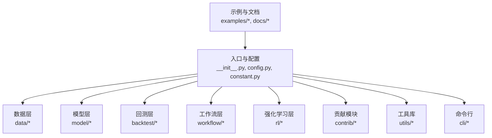
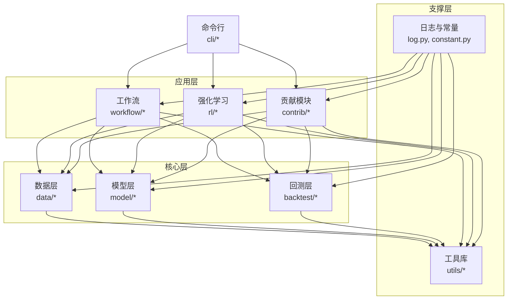
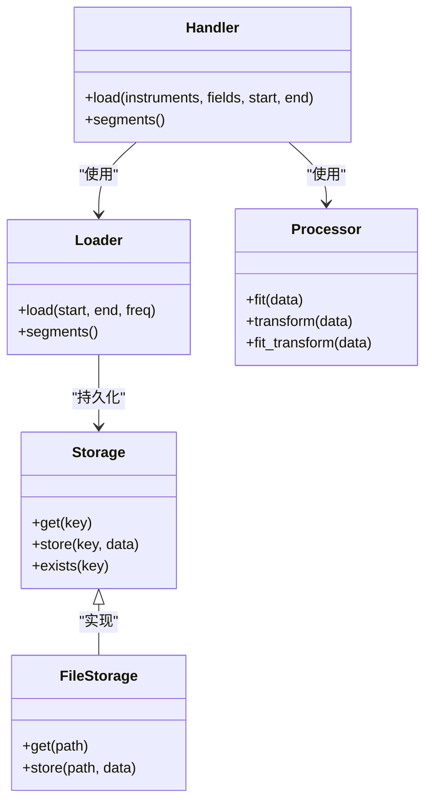
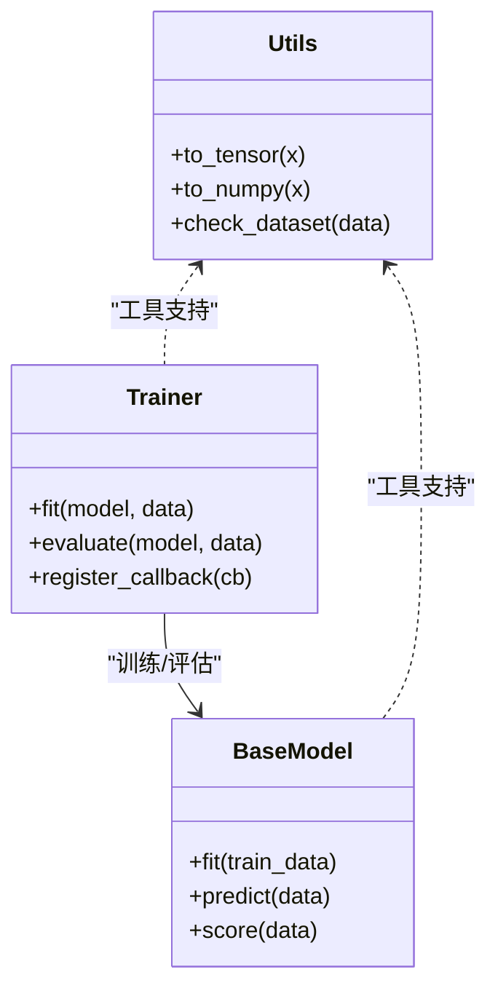
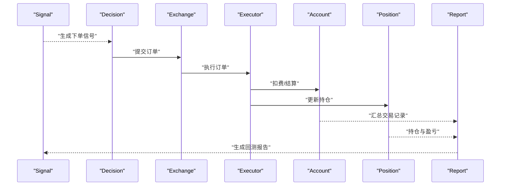
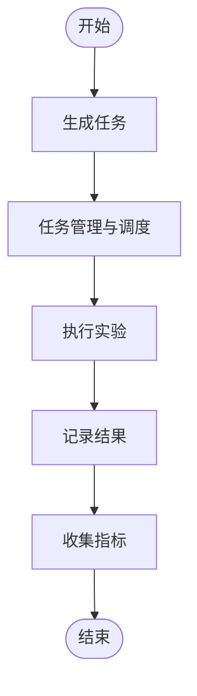
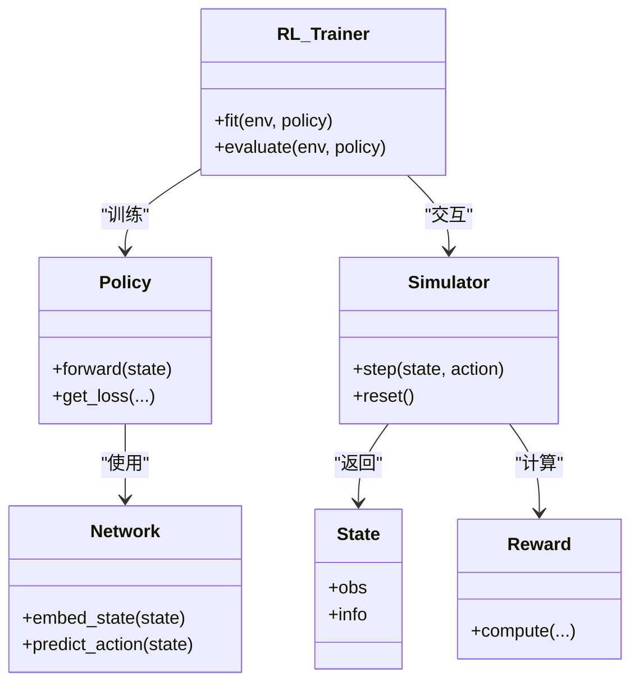
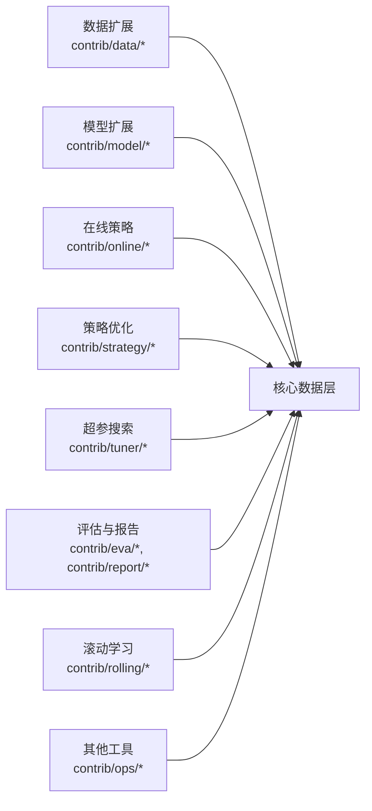
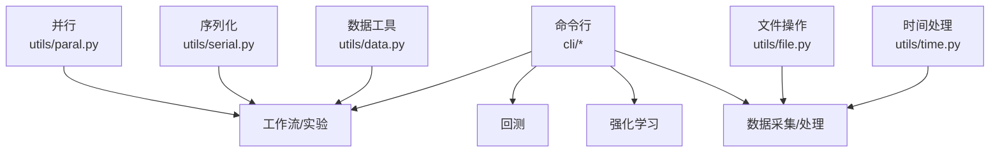

# 技术架构

<cite>
**本文引用的文件**
- [__init__.py](file://qlib/__init__.py)
- [config.py](file://qlib/config.py)
- [constant.py](file://qlib/constant.py)
- [log.py](file://qlib/log.py)
- [typehint.py](file://qlib/typehint.py)
- [data.py](file://qlib/data/data.py)
- [base.py](file://qlib/data/base.py)
- [cache.py](file://qlib/data/cache.py)
- [client.py](file://qlib/data/client.py)
- [dataset/handler.py](file://qlib/data/dataset/handler.py)
- [dataset/loader.py](file://qlib/data/dataset/loader.py)
- [dataset/processor.py](file://qlib/data/dataset/processor.py)
- [dataset/storage.py](file://qlib/data/dataset/storage.py)
- [storage/file_storage.py](file://qlib/data/storage/file_storage.py)
- [storage/storage.py](file://qlib/data/storage/storage.py)
- [backtest.py](file://qlib/backtest/backtest.py)
- [account.py](file://qlib/backtest/account.py)
- [decision.py](file://qlib/backtest/decision.py)
- [exchange.py](file://qlib/backtest/exchange.py)
- [executor.py](file://qlib/backtest/executor.py)
- [position.py](file://qlib/backtest/position.py)
- [report.py](file://qlib/backtest/report.py)
- [signal.py](file://qlib/backtest/signal.py)
- [utils.py](file://qlib/backtest/utils.py)
- [high_performance_ds.py](file://qlib/backtest/high_performance_ds.py)
- [model/base.py](file://qlib/model/base.py)
- [model/trainer.py](file://qlib/model/trainer.py)
- [model/utils.py](file://qlib/model/utils.py)
- [workflow/exp.py](file://qlib/workflow/exp.py)
- [workflow/expm.py](file://qlib/workflow/expm.py)
- [workflow/recorder.py](file://qlib/workflow/recorder.py)
- [workflow/task/manage.py](file://qlib/workflow/task/manage.py)
- [workflow/task/gen.py](file://qlib/workflow/task/gen.py)
- [workflow/task/collect.py](file://qlib/workflow/task/collect.py)
- [workflow/online/manager.py](file://qlib/workflow/online/manager.py)
- [workflow/online/strategy.py](file://qlib/workflow/online/strategy.py)
- [workflow/online/update.py](file://qlib/workflow/online/update.py)
- [contrib/data/data.py](file://qlib/contrib/data/data.py)
- [contrib/data/handler.py](file://qlib/contrib/data/handler.py)
- [contrib/data/processor.py](file://qlib/contrib/data/processor.py)
- [contrib/data/highfreq_handler.py](file://qlib/contrib/data/highfreq_handler.py)
- [contrib/data/highfreq_processor.py](file://qlib/contrib/data/highfreq_processor.py)
- [contrib/data/highfreq_provider.py](file://qlib/contrib/data/highfreq_provider.py)
- [contrib/model/catboost_model.py](file://qlib/contrib/model/catboost_model.py)
- [contrib/model/gbdt.py](file://qlib/contrib/model/gbdt.py)
- [contrib/model/linear.py](file://qlib/contrib/model/linear.py)
- [contrib/model/xgboost.py](file://qlib/contrib/model/xgboost.py)
- [contrib/online/manager.py](file://qlib/contrib/online/manager.py)
- [contrib/online/operator.py](file://qlib/contrib/online/operator.py)
- [contrib/online/user.py](file://qlib/contrib/online/user.py)
- [contrib/strategy/order_generator.py](file://qlib/contrib/strategy/order_generator.py)
- [contrib/strategy/cost_control.py](file://qlib/contrib/strategy/cost_control.py)
- [contrib/tuner/tuner.py](file://qlib/contrib/tuner/tuner.py)
- [contrib/tuner/pipeline.py](file://qlib/contrib/tuner/pipeline.py)
- [cli/run.py](file://qlib/cli/run.py)
- [cli/data.py](file://qlib/cli/data.py)
- [utils/data.py](file://qlib/utils/data.py)
- [utils/file.py](file://qlib/utils/file.py)
- [utils/paral.py](file://qlib/utils/paral.py)
- [utils/serial.py](file://qlib/utils/serial.py)
- [utils/time.py](file://qlib/utils/time.py)
- [rl/trainer/trainer.py](file://qlib/rl/trainer/trainer.py)
- [rl/trainer/api.py](file://qlib/rl/trainer/api.py)
- [rl/simulator.py](file://qlib/rl/simulator.py)
- [rl/reward.py](file://qlib/rl/reward.py)
- [rl/order_execution/state.py](file://qlib/rl/order_execution/state.py)
- [rl/order_execution/reward.py](file://qlib/rl/order_execution/reward.py)
- [rl/order_execution/simulator_qlib.py](file://qlib/rl/order_execution/simulator_qlib.py)
- [rl/order_execution/policy.py](file://qlib/rl/order_execution/policy.py)
- [rl/order_execution/network.py](file://qlib/rl/order_execution/network.py)
- [rl/order_execution/strategy.py](file://qlib/rl/order_execution/strategy.py)
- [rl/order_execution/utils.py](file://qlib/rl/order_execution/utils.py)
- [rl/contrib/train_onpolicy.py](file://qlib/rl/contrib/train_onpolicy.py)
- [rl/contrib/naive_config_parser.py](file://qlib/rl/contrib/naive_config_parser.py)
- [rl/contrib/backtest.py](file://qlib/rl/contrib/backtest.py)
- [rl/utils/env_wrapper.py](file://qlib/rl/utils/env_wrapper.py)
- [rl/utils/finite_env.py](file://qlib/rl/utils/finite_env.py)
- [rl/utils/log.py](file://qlib/rl/utils/log.py)
- [rl/data/native.py](file://qlib/rl/data/native.py)
- [rl/data/integration.py](file://qlib/rl/data/integration.py)
- [rl/data/pickle_styled.py](file://qlib/rl/data/pickle_styled.py)
- [rl/data/base.py](file://qlib/rl/data/base.py)
- [rl/aux_info.py](file://qlib/rl/aux_info.py)
- [rl/seed.py](file://qlib/rl/seed.py)
- [contrib/evaluate.py](file://qlib/contrib/evaluate.py)
- [contrib/evaluate_portfolio.py](file://qlib/contrib/evaluate_portfolio.py)
- [contrib/report/analysis_position/rank_label.py](file://qlib/contrib/report/analysis_position/rank_label.py)
- [contrib/report/analysis_position/cumulative_return.py](file://qlib/contrib/report/analysis_position/cumulative_return.py)
- [contrib/report/analysis_position/score_ic.py](file://qlib/contrib/report/analysis_position/score_ic.py)
- [contrib/report/analysis_position/risk_analysis.py](file://qlib/contrib/report/analysis_position/risk_analysis.py)
- [contrib/report/analysis_position/report.py](file://qlib/contrib/report/analysis_position/report.py)
- [contrib/report/analysis_model/analysis_model_performance.py](file://qlib/contrib/report/analysis_model/analysis_model_performance.py)
- [contrib/report/graph.py](file://qlib/contrib/report/graph.py)
- [contrib/report/utils.py](file://qlib/contrib/report/utils.py)
- [contrib/rolling/base.py](file://qlib/contrib/rolling/base.py)
- [contrib/rolling/ddgda.py](file://qlib/contrib/rolling/ddgda.py)
- [contrib/meta/data_selection/dataset.py](file://qlib/contrib/meta/data_selection/dataset.py)
- [contrib/meta/data_selection/model.py](file://qlib/contrib/meta/data_selection/model.py)
- [contrib/meta/data_selection/net.py](file://qlib/contrib/meta/data_selection/net.py)
- [contrib/meta/data_selection/utils.py](file://qlib/contrib/meta/data_selection/utils.py)
- [contrib/meta/data_selection/__init__.py](file://qlib/contrib/meta/data_selection/__init__.py)
- [contrib/ops/high_freq.py](file://qlib/contrib/ops/high_freq.py)
- [contrib/eva/alpha.py](file://qlib/contrib/eva/alpha.py)
- [contrib/strategy/optimizer/optimizer.py](file://qlib/contrib/strategy/optimizer/optimizer.py)
- [contrib/strategy/optimizer/enhanced_indexing.py](file://qlib/contrib/strategy/optimizer/enhanced_indexing.py)
- [contrib/strategy/optimizer/base.py](file://qlib/contrib/strategy/optimizer/base.py)
- [contrib/tuner/launcher.py](file://qlib/contrib/tuner/launcher.py)
- [contrib/tuner/config.py](file://qlib/contrib/tuner/config.py)
- [contrib/tuner/space.py](file://qlib/contrib/tuner/space.py)
- [contrib/tuner/pipeline.py](file://qlib/contrib/tuner/pipeline.py)
- [contrib/workflow/record_temp.py](file://qlib/contrib/workflow/record_temp.py)
- [contrib/online/utils.py](file://qlib/contrib/online/utils.py)
- [contrib/online/online_model.py](file://qlib/contrib/online/online_model.py)
- [contrib/online/user.py](file://qlib/contrib/online/user.py)
- [contrib/online/operator.py](file://qlib/contrib/online/operator.py)
- [contrib/online/manager.py](file://qlib/contrib/online/manager.py)
- [contrib/online/utils.py](file://qlib/contrib/online/utils.py)
- [contrib/online/strategy.py](file://qlib/contrib/online/strategy.py)
- [contrib/online/update.py](file://qlib/contrib/online/update.py)
- [contrib/online/user.py](file://qlib/contrib/online/user.py)
- [contrib/online/operator.py](file://qlib/contrib/online/operator.py)
- [contrib/online/manager.py](file://qlib/contrib/online/manager.py)
- [contrib/online/utils.py](file://qlib/contrib/online/utils.py)
- [contrib/online/strategy.py](file://qlib/contrib/online/strategy.py)
- [contrib/online/update.py](file://qlib/contrib/online/update.py)
- [contrib/online/user.py](file://qlib/contrib/online/user.py)
- [contrib/online/operator.py](file://qlib/contrib/online/operator.py)
- [contrib/online/manager.py](file://qlib/contrib/online/manager.py)
- [contrib/online/utils.py](file://qlib/contrib/online/utils.py)
- [contrib/online/strategy.py](file://qlib/contrib/online/strategy.py)
- [contrib/online/update.py](file://qlib/contrib/online/update.py)
- [contrib/online/user.py](file://qlib/contrib/online/user.py)
- [contrib/online/operator.py](file://qlib/contrib/online/operator.py)
- [contrib/online/manager.py](file://qlib/contrib/online/manager.py)
- [contrib/online/utils.py](file://qlib/contrib/online/utils.py)
- [contrib/online/strategy.py](file://qlib/contrib/online/strategy.py)
- [contrib/online/update.py](file://qlib/contrib/online/update.py)
- [contrib/online/user.py](file://qlib/contrib/online/user.py)
- [contrib/online/operator.py](file://qlib/contrib/online/operator.py)
- [contrib/online/manager.py](file://qlib/contrib/online/manager.py)
- [contrib/online/utils.py](file://qlib/contrib/online/utils.py)
- [contrib/online/strategy.py](file://qlib/contrib/online/strategy.py)
- [contrib/online/update.py](file://qlib/contrib/online/update.py)
- [contrib/online/user.py](file://qlib/contrib/online/user.py)
- [contrib/online/operator.py](file://qlib/contrib/online/operator.py)
- [contrib/online/manager.py](file://qlib/contrib/online/manager.py)
- [contrib/online/utils.py](file://qlib/contrib/online/utils.py)
- [contrib/online/strategy.py](file://qlib/contrib/online/strategy.py)
- [contrib/online/update.py](file://qlib/contrib/online/update.py)
- [contrib/online/user.py](file://qlib/contrib/online/user.py)
- [contrib/online/operator.py](file://qlib/contrib/online/operator.py)
- [contrib/online/manager.py......](file://qlib/contrib/online/manager.py)
</cite>

## 目录
1. [引言](#引言)
2. [项目结构](#项目结构)
3. [核心组件](#核心组件)
4. [架构总览](#架构总览)
5. [详细组件分析](#详细组件分析)
6. [依赖分析](#依赖分析)
7. [性能考虑](#性能考虑)
8. [故障排查指南](#故障排查指南)
9. [结论](#结论)
10. [附录](#附录)

## 引言
本文件面向希望系统性理解 Qlib 量化研究框架技术架构的工程师与研究者，围绕分层架构、模块化设计与插件化扩展机制展开，重点阐述数据处理层、模型训练层、回测执行层以及工作流与在线策略层的交互关系，并结合关键设计模式与技术选型，说明其如何支撑 Qlib 的高性能与高可用性。文中提供多类架构图与流程图，帮助读者快速把握系统内部工作机制。

## 项目结构
Qlib 采用清晰的分层组织：顶层为入口与配置（__init__.py、config.py、constant.py），核心子系统分别位于 data、model、backtest、workflow、rl、contrib 等目录下；utils 提供通用工具；cli 提供命令行接口；examples 与 docs 提供示例与文档。各子系统职责明确、边界清晰，便于独立演进与组合使用。

**章节来源**
- [__init__.py](file://qlib/__init__.py)
- [config.py](file://qlib/config.py)
- [constant.py](file://qlib/constant.py)

## 核心组件
- 数据层（data）：负责数据加载、缓存、存储与预处理，支持多频数据与高频数据，提供统一的数据访问接口与高效的数据结构。
- 模型层（model）：封装训练器、基类模型与工具函数，支持多种算法与框架集成。
- 回测层（backtest）：实现账户、信号、订单、交易执行、持仓管理与报告生成，提供高性能数据结构与回测引擎。
- 工作流层（workflow）：提供实验管理、记录器、任务调度与在线策略管理，支撑端到端自动化流水线。
- 强化学习层（rl）：包含数据适配、训练器、仿真器、策略与奖励函数，支持订单执行等 RL 应用场景。
- 贡献模块（contrib）：提供第三方模型、在线策略、评估指标、报告分析、滚动学习等扩展能力。
- 工具库（utils）：提供并行、序列化、文件操作、时间处理等基础设施。
- 命令行（cli）：提供数据与运行命令的 CLI 接口。

**章节来源**
- [data.py](file://qlib/data/data.py)
- [base.py](file://qlib/data/base.py)
- [cache.py](file://qlib/data/cache.py)
- [dataset/handler.py](file://qlib/data/dataset/handler.py)
- [dataset/loader.py](file://qlib/data/dataset/loader.py)
- [dataset/processor.py](file://qlib/data/dataset/processor.py)
- [dataset/storage.py](file://qlib/data/dataset/storage.py)
- [storage/file_storage.py](file://qlib/data/storage/file_storage.py)
- [storage/storage.py](file://qlib/data/storage/storage.py)
- [model/base.py](file://qlib/model/base.py)
- [model/trainer.py](file://qlib/model/trainer.py)
- [backtest.py](file://qlib/backtest/backtest.py)
- [account.py](file://qlib/backtest/account.py)
- [decision.py](file://qlib/backtest/decision.py)
- [exchange.py](file://qlib/backtest/exchange.py)
- [executor.py](file://qlib/backtest/executor.py)
- [position.py](file://qlib/backtest/position.py)
- [report.py](file://qlib/backtest/report.py)
- [signal.py](file://qlib/backtest/signal.py)
- [high_performance_ds.py](file://qlib/backtest/high_performance_ds.py)
- [workflow/exp.py](file://qlib/workflow/exp.py)
- [workflow/expm.py](file://qlib/workflow/expm.py)
- [workflow/recorder.py](file://qlib/workflow/recorder.py)
- [workflow/task/manage.py](file://qlib/workflow/task/manage.py)
- [workflow/task/gen.py](file://qlib/workflow/task/gen.py)
- [workflow/task/collect.py](file://qlib/workflow/task/collect.py)
- [rl/trainer/trainer.py](file://qlib/rl/trainer/trainer.py)
- [rl/trainer/api.py](file://qlib/rl/trainer/api.py)
- [rl/simulator.py](file://qlib/rl/simulator.py)
- [rl/order_execution/state.py](file://qlib/rl/order_execution/state.py)
- [rl/order_execution/reward.py](file://qlib/rl/order_execution/reward.py)
- [rl/order_execution/simulator_qlib.py](file://qlib/rl/order_execution/simulator_qlib.py)
- [rl/order_execution/policy.py](file://qlib/rl/order_execution/policy.py)
- [rl/order_execution/network.py](file://qlib/rl/order_execution/network.py)
- [rl/order_execution/strategy.py](file://qlib/rl/order_execution/strategy.py)
- [contrib/data/data.py](file://qlib/contrib/data/data.py)
- [contrib/data/handler.py](file://qlib/contrib/data/handler.py)
- [contrib/data/processor.py](file://qlib/contrib/data/processor.py)
- [contrib/data/highfreq_handler.py](file://qlib/contrib/data/highfreq_handler.py)
- [contrib/data/highfreq_processor.py](file://qlib/contrib/data/highfreq_processor.py)
- [contrib/data/highfreq_provider.py](file://qlib/contrib/data/highfreq_provider.py)
- [contrib/model/catboost_model.py](file://qlib/contrib/model/catboost_model.py)
- [contrib/model/gbdt.py](file://qlib/contrib/model/gbdt.py)
- [contrib/model/linear.py](file://qlib/contrib/model/linear.py)
- [contrib/model/xgboost.py](file://qlib/contrib/model/xgboost.py)
- [contrib/online/manager.py](file://qlib/contrib/online/manager.py)
- [contrib/online/operator.py](file://qlib/contrib/online/operator.py)
- [contrib/online/user.py](file://qlib/contrib/online/user.py)
- [contrib/strategy/order_generator.py](file://qlib/contrib/strategy/order_generator.py)
- [contrib/strategy/cost_control.py](file://qlib/contrib/strategy/cost_control.py)
- [contrib/tuner/tuner.py](file://qlib/contrib/tuner/tuner.py)
- [contrib/tuner/pipeline.py](file://qlib/contrib/tuner/pipeline.py)
- [cli/run.py](file://qlib/cli/run.py)
- [cli/data.py](file://qlib/cli/data.py)
- [utils/data.py](file://qlib/utils/data.py)
- [utils/file.py](file://qlib/utils/file.py)
- [utils/paral.py](file://qlib/utils/paral.py)
- [utils/serial.py](file://qlib/utils/serial.py)
- [utils/time.py](file://qlib/utils/time.py)

## 架构总览
Qlib 采用“分层解耦 + 模块化聚合”的架构理念：上层通过抽象接口调用下层能力，下层通过可插拔组件扩展功能。数据层提供统一数据视图与高效缓存；模型层以训练器为核心，屏蔽底层框架差异；回测层在高性能数据结构之上实现完整的交易闭环；工作流层串联实验、记录与任务管理；RL 层提供订单执行等强化学习场景的专用模块；contrib 提供丰富的扩展能力；utils 提供跨模块的基础设施。

**图表来源**
- [data.py](file://qlib/data/data.py)
- [model/base.py](file://qlib/model/base.py)
- [backtest.py](file://qlib/backtest/backtest.py)
- [workflow/exp.py](file://qlib/workflow/exp.py)
- [rl/trainer/trainer.py](file://qlib/rl/trainer/trainer.py)
- [contrib/data/data.py](file://qlib/contrib/data/data.py)
- [utils/data.py](file://qlib/utils/data.py)
- [log.py](file://qlib/log.py)
- [constant.py](file://qlib/constant.py)
- [cli/run.py](file://qlib/cli/run.py)

## 详细组件分析

### 数据层（Data）
数据层负责数据的统一接入、缓存与高效访问。其核心由 Handler、Loader、Processor、Storage 组成，形成“处理器-加载器-存储器”的链路，支持多频与高频数据。

- 设计要点
  - Handler 封装数据访问与切片逻辑，屏蔽底层细节。
  - Loader 负责按频率与时间窗口加载数据，支持分段加载与增量更新。
  - Processor 提供标准化的数据变换与归一化能力，支持拟合与转换分离。
  - Storage 提供键值式缓存与持久化，FileStorage 实现文件系统存储。
- 性能特性
  - 分段加载与缓存减少重复 IO。
  - 高频数据路径优化，降低内存占用与提升吞吐。

**图表来源**
- [dataset/handler.py](file://qlib/data/dataset/handler.py)
- [dataset/loader.py](file://qlib/data/dataset/loader.py)
- [dataset/processor.py](file://qlib/data/dataset/processor.py)
- [dataset/storage.py](file://qlib/data/dataset/storage.py)
- [storage/file_storage.py](file://qlib/data/storage/file_storage.py)
- [storage/storage.py](file://qlib/data/storage/storage.py)

**章节来源**
- [data.py](file://qlib/data/data.py)
- [base.py](file://qlib/data/base.py)
- [cache.py](file://qlib/data/cache.py)
- [client.py](file://qlib/data/client.py)
- [dataset/handler.py](file://qlib/data/dataset/handler.py)
- [dataset/loader.py](file://qlib/data/dataset/loader.py)
- [dataset/processor.py](file://qlib/data/dataset/processor.py)
- [dataset/storage.py](file://qlib/data/dataset/storage.py)
- [storage/file_storage.py](file://qlib/data/storage/file_storage.py)
- [storage/storage.py](file://qlib/data/storage/storage.py)

### 模型层（Model）
模型层以 Trainer 为核心，BaseModel 定义统一接口，Trainer 负责训练生命周期管理与指标收集。支持多种算法与框架集成，具备良好的扩展性。

- 设计要点
  - BaseModel 抽象训练与预测接口，确保不同模型的一致性。
  - Trainer 提供回调机制与生命周期钩子，便于扩展监控与日志。
  - Utils 提供张量/数组互转与数据校验，保证输入输出一致性。
- 技术选型
  - 支持多种算法与框架，通过适配器模式实现统一接口。

**图表来源**
- [model/base.py](file://qlib/model/base.py)
- [model/trainer.py](file://qlib/model/trainer.py)
- [model/utils.py](file://qlib/model/utils.py)

**章节来源**
- [model/base.py](file://qlib/model/base.py)
- [model/trainer.py](file://qlib/model/trainer.py)
- [model/utils.py](file://qlib/model/utils.py)

### 回测层（Backtest）
回测层实现从信号到成交的完整闭环，包含账户、信号、决策、交易所、执行器、持仓与报告等模块，同时提供高性能数据结构以支撑大规模回测。

- 设计要点
  - Decision/Signal/Executor/Exchange 解耦，便于替换与扩展。
  - Account/Position 管理资金与头寸，支持滑点、手续费等成本模型。
  - Report 输出多维度统计，便于策略评估与归因。
- 性能特性
  - 高性能数据结构与批处理策略，显著提升回测吞吐。

**图表来源**
- [backtest.py](file://qlib/backtest/backtest.py)
- [decision.py](file://qlib/backtest/decision.py)
- [exchange.py](file://qlib/backtest/exchange.py)
- [executor.py](file://qlib/backtest/executor.py)
- [account.py](file://qlib/backtest/account.py)
- [position.py](file://qlib/backtest/position.py)
- [report.py](file://qlib/backtest/report.py)
- [high_performance_ds.py](file://qlib/backtest/high_performance_ds.py)

**章节来源**
- [backtest.py](file://qlib/backtest/backtest.py)
- [account.py](file://qlib/backtest/account.py)
- [decision.py](file://qlib/backtest/decision.py)
- [exchange.py](file://qlib/backtest/exchange.py)
- [executor.py](file://qlib/backtest/executor.py)
- [position.py](file://qlib/backtest/position.py)
- [report.py](file://qlib/backtest/report.py)
- [signal.py](file://qlib/backtest/signal.py)
- [utils.py](file://qlib/backtest/utils.py)
- [high_performance_ds.py](file://qlib/backtest/high_performance_ds.py)

### 工作流层（Workflow）
工作流层提供实验管理、记录器与任务调度，支持端到端自动化流水线，涵盖离线与在线两种模式。

- 设计要点
  - Experiment/Expm 管理实验生命周期与元数据。
  - Recorder 记录训练、回测与评估结果，支持多格式导出。
  - Task 子系统负责任务生成、管理与收集，支持并行与容错。
  - Online 子系统支持在线策略的动态更新与管理。

**图表来源**
- [workflow/exp.py](file://qlib/workflow/exp.py)
- [workflow/expm.py](file://qlib/workflow/expm.py)
- [workflow/recorder.py](file://qlib/workflow/recorder.py)
- [workflow/task/manage.py](file://qlib/workflow/task/manage.py)
- [workflow/task/gen.py](file://qlib/workflow/task/gen.py)
- [workflow/task/collect.py](file://qlib/workflow/task/collect.py)
- [workflow/online/manager.py](file://qlib/workflow/online/manager.py)
- [workflow/online/strategy.py](file://qlib/workflow/online/strategy.py)
- [workflow/online/update.py](file://qlib/workflow/online/update.py)

**章节来源**
- [workflow/exp.py](file://qlib/workflow/exp.py)
- [workflow/expm.py](file://qlib/workflow/expm.py)
- [workflow/recorder.py](file://qlib/workflow/recorder.py)
- [workflow/task/manage.py](file://qlib/workflow/task/manage.py)
- [workflow/task/gen.py](file://qlib/workflow/task/gen.py)
- [workflow/task/collect.py](file://qlib/workflow/task/collect.py)
- [workflow/online/manager.py](file://qlib/workflow/online/manager.py)
- [workflow/online/strategy.py](file://qlib/workflow/online/strategy.py)
- [workflow/online/update.py](file://qlib/workflow/online/update.py)

### 强化学习层（RL）
RL 层提供订单执行等场景的专用模块，包含数据适配、训练器、仿真器、策略与奖励函数，支持策略网络与状态空间建模。

- 设计要点
  - Policy/Network 将状态映射为动作，支持可微与不可微策略。
  - Simulator 提供环境交互接口，支持真实市场仿真。
  - Reward 定义回报函数，引导策略学习。
- 技术选型
  - 支持多种策略网络与训练范式，便于快速迭代。

**图表来源**
- [rl/trainer/trainer.py](file://qlib/rl/trainer/trainer.py)
- [rl/trainer/api.py](file://qlib/rl/trainer/api.py)
- [rl/simulator.py](file://qlib/rl/simulator.py)
- [rl/order_execution/state.py](file://qlib/rl/order_execution/state.py)
- [rl/order_execution/reward.py](file://qlib/rl/order_execution/reward.py)
- [rl/order_execution/simulator_qlib.py](file://qlib/rl/order_execution/simulator_qlib.py)
- [rl/order_execution/policy.py](file://qlib/rl/order_execution/policy.py)
- [rl/order_execution/network.py](file://qlib/rl/order_execution/network.py)
- [rl/order_execution/strategy.py](file://qlib/rl/order_execution/strategy.py)

**章节来源**
- [rl/trainer/trainer.py](file://qlib/rl/trainer/trainer.py)
- [rl/trainer/api.py](file://qlib/rl/trainer/api.py)
- [rl/simulator.py](file://qlib/rl/simulator.py)
- [rl/reward.py](file://qlib/rl/reward.py)
- [rl/order_execution/state.py](file://qlib/rl/order_execution/state.py)
- [rl/order_execution/reward.py](file://qlib/rl/order_execution/reward.py)
- [rl/order_execution/simulator_qlib.py](file://qlib/rl/order_execution/simulator_qlib.py)
- [rl/order_execution/policy.py](file://qlib/rl/order_execution/policy.py)
- [rl/order_execution/network.py](file://qlib/rl/order_execution/network.py)
- [rl/order_execution/strategy.py](file://qlib/rl/order_execution/strategy.py)
- [rl/order_execution/utils.py](file://qlib/rl/order_execution/utils.py)
- [rl/contrib/train_onpolicy.py](file://qlib/rl/contrib/train_onpolicy.py)
- [rl/contrib/naive_config_parser.py](file://qlib/rl/contrib/naive_config_parser.py)
- [rl/contrib/backtest.py](file://qlib/rl/contrib/backtest.py)
- [rl/utils/env_wrapper.py](file://qlib/rl/utils/env_wrapper.py)
- [rl/utils/finite_env.py](file://qlib/rl/utils/finite_env.py)
- [rl/utils/log.py](file://qlib/rl/utils/log.py)
- [rl/data/native.py](file://qlib/rl/data/native.py)
- [rl/data/integration.py](file://qlib/rl/data/integration.py)
- [rl/data/pickle_styled.py](file://qlib/rl/data/pickle_styled.py)
- [rl/data/base.py](file://qlib/rl/data/base.py)
- [rl/aux_info.py](file://qlib/rl/aux_info.py)
- [rl/seed.py](file://qlib/rl/seed.py)

### 贡献模块（Contrib）
contrib 提供丰富的扩展能力，覆盖数据、模型、在线策略、评估、报告与滚动学习等领域，采用插件化方式与核心层解耦。

**图表来源**
- [contrib/data/data.py](file://qlib/contrib/data/data.py)
- [contrib/data/handler.py](file://qlib/contrib/data/handler.py)
- [contrib/data/processor.py](file://qlib/contrib/data/processor.py)
- [contrib/data/highfreq_handler.py](file://qlib/contrib/data/highfreq_handler.py)
- [contrib/data/highfreq_processor.py](file://qlib/contrib/data/highfreq_processor.py)
- [contrib/data/highfreq_provider.py](file://qlib/contrib/data/highfreq_provider.py)
- [contrib/model/catboost_model.py](file://qlib/contrib/model/catboost_model.py)
- [contrib/model/gbdt.py](file://qlib/contrib/model/gbdt.py)
- [contrib/model/linear.py](file://qlib/contrib/model/linear.py)
- [contrib/model/xgboost.py](file://qlib/contrib/model/xgboost.py)
- [contrib/online/manager.py](file://qlib/contrib/online/manager.py)
- [contrib/online/operator.py](file://qlib/contrib/online/operator.py)
- [contrib/online/user.py](file://qlib/contrib/online/user.py)
- [contrib/strategy/order_generator.py](file://qlib/contrib/strategy/order_generator.py)
- [contrib/strategy/cost_control.py](file://qlib/contrib/strategy/cost_control.py)
- [contrib/tuner/tuner.py](file://qlib/contrib/tuner/tuner.py)
- [contrib/tuner/pipeline.py](file://qlib/contrib/tuner/pipeline.py)
- [contrib/eva/alpha.py](file://qlib/contrib/eva/alpha.py)
- [contrib/report/analysis_position/rank_label.py](file://qlib/contrib/report/analysis_position/rank_label.py)
- [contrib/report/analysis_position/cumulative_return.py](file://qlib/contrib/report/analysis_position/cumulative_return.py)
- [contrib/report/analysis_position/score_ic.py](file://qlib/contrib/report/analysis_position/score_ic.py)
- [contrib/report/analysis_position/risk_analysis.py](file://qlib/contrib/report/analysis_position/risk_analysis.py)
- [contrib/report/analysis_position/report.py](file://qlib/contrib/report/analysis_position/report.py)
- [contrib/report/analysis_model/analysis_model_performance.py](file://qlib/contrib/report/analysis_model/analysis_model_performance.py)
- [contrib/report/graph.py](file://qlib/contrib/report/graph.py)
- [contrib/report/utils.py](file://qlib/contrib/report/utils.py)
- [contrib/rolling/base.py](file://qlib/contrib/rolling/base.py)
- [contrib/rolling/ddgda.py](file://qlib/contrib/rolling/ddgda.py)
- [contrib/meta/data_selection/dataset.py](file://qlib/contrib/meta/data_selection/dataset.py)
- [contrib/meta/data_selection/model.py](file://qlib/contrib/meta/data_selection/model.py)
- [contrib/meta/data_selection/net.py](file://qlib/contrib/meta/data_selection/net.py)
- [contrib/meta/data_selection/utils.py](file://qlib/contrib/meta/data_selection/utils.py)

**章节来源**
- [contrib/data/data.py](file://qlib/contrib/data/data.py)
- [contrib/data/handler.py](file://qlib/contrib/data/handler.py)
- [contrib/data/processor.py](file://qlib/contrib/data/processor.py)
- [contrib/data/highfreq_handler.py](file://qlib/contrib/data/highfreq_handler.py)
- [contrib/data/highfreq_processor.py](file://qlib/contrib/data/highfreq_processor.py)
- [contrib/data/highfreq_provider.py](file://qlib/contrib/data/highfreq_provider.py)
- [contrib/model/catboost_model.py](file://qlib/contrib/model/catboost_model.py)
- [contrib/model/gbdt.py](file://qlib/contrib/model/gbdt.py)
- [contrib/model/linear.py](file://qlib/contrib/model/linear.py)
- [contrib/model/xgboost.py](file://qlib/contrib/model/xgboost.py)
- [contrib/online/manager.py](file://qlib/contrib/online/manager.py)
- [contrib/online/operator.py](file://qlib/contrib/online/operator.py)
- [contrib/online/user.py](file://qlib/contrib/online/user.py)
- [contrib/strategy/order_generator.py](file://qlib/contrib/strategy/order_generator.py)
- [contrib/strategy/cost_control.py](file://qlib/contrib/strategy/cost_control.py)
- [contrib/tuner/tuner.py](file://qlib/contrib/tuner/tuner.py)
- [contrib/tuner/pipeline.py](file://qlib/contrib/tuner/pipeline.py)
- [contrib/eva/alpha.py](file://qlib/contrib/eva/alpha.py)
- [contrib/report/analysis_position/rank_label.py](file://qlib/contrib/report/analysis_position/rank_label.py)
- [contrib/report/analysis_position/cumulative_return.py](file://qlib/contrib/report/analysis_position/cumulative_return.py)
- [contrib/report/analysis_position/score_ic.py](file://qlib/contrib/report/analysis_position/score_ic.py)
- [contrib/report/analysis_position/risk_analysis.py](file://qlib/contrib/report/analysis_position/risk_analysis.py)
- [contrib/report/analysis_position/report.py](file://qlib/contrib/report/analysis_position/report.py)
- [contrib/report/analysis_model/analysis_model_performance.py](file://qlib/contrib/report/analysis_model/analysis_model_performance.py)
- [contrib/report/graph.py](file://qlib/contrib/report/graph.py)
- [contrib/report/utils.py](file://qlib/contrib/report/utils.py)
- [contrib/rolling/base.py](file://qlib/contrib/rolling/base.py)
- [contrib/rolling/ddgda.py](file://qlib/contrib/rolling/ddgda.py)
- [contrib/meta/data_selection/dataset.py](file://qlib/contrib/meta/data_selection/dataset.py)
- [contrib/meta/data_selection/model.py](file://qlib/contrib/meta/data_selection/model.py)
- [contrib/meta/data_selection/net.py](file://qlib/contrib/meta/data_selection/net.py)
- [contrib/meta/data_selection/utils.py](file://qlib/contrib/meta/data_selection/utils.py)

### 命令行与工具库
CLI 提供数据与运行命令的统一入口；utils 提供并行、序列化、文件与时间处理等基础设施，支撑上层模块的可靠性与性能。

**图表来源**
- [cli/run.py](file://qlib/cli/run.py)
- [cli/data.py](file://qlib/cli/data.py)
- [utils/paral.py](file://qlib/utils/paral.py)
- [utils/serial.py](file://qlib/utils/serial.py)
- [utils/file.py](file://qlib/utils/file.py)
- [utils/time.py](file://qlib/utils/time.py)
- [utils/data.py](file://qlib/utils/data.py)

**章节来源**
- [cli/run.py](file://qlib/cli/run.py)
- [cli/data.py](file://qlib/cli/data.py)
- [utils/paral.py](file://qlib/utils/paral.py)
- [utils/serial.py](file://qlib/utils/serial.py)
- [utils/file.py](file://qlib/utils/file.py)
- [utils/time.py](file://qlib/utils/time.py)
- [utils/data.py](file://qlib/utils/data.py)

## 依赖分析
- 内聚性：各子系统内聚度高，职责单一；跨子系统通过抽象接口耦合。
- 耦合度：数据层与模型层、回测层之间存在强耦合（数据与训练/回测），但通过统一接口隔离实现细节。
- 扩展点：contrib 作为插件化扩展层，对核心层零侵入；工作流层通过 Recorder 与 Task 子系统实现可观测与可运维。
- 外部依赖：通过 utils 提供的工具（并行、序列化、文件、时间）降低外部耦合风险。

**图表来源**
- [data.py](file://qlib/data/data.py)
- [model/base.py](file://qlib/model/base.py)
- [backtest.py](file://qlib/backtest/backtest.py)
- [workflow/exp.py](file://qlib/workflow/exp.py)
- [utils/data.py](file://qlib/utils/data.py)

**章节来源**
- [data.py](file://qlib/data/data.py)
- [model/base.py](file://qlib/model/base.py)
- [backtest.py](file://qlib/backtest/backtest.py)
- [workflow/exp.py](file://qlib/workflow/exp.py)
- [utils/data.py](file://qlib/utils/data.py)

## 性能考虑
- 数据层
  - 分段加载与缓存：减少重复 IO，提高数据复用率。
  - 高频数据优化：采用高性能数据结构与批处理策略。
- 模型层
  - 训练器回调与日志：避免阻塞主训练流程，提升吞吐。
  - 工具函数：张量/数组互转与数据校验，减少类型不一致带来的性能损耗。
- 回测层
  - 高性能数据结构：支持大规模回测场景下的内存与速度平衡。
  - 执行器与仿真：通过状态机与批处理降低调度开销。
- 工作流层
  - 任务并行与容错：提升整体实验效率与稳定性。
- 强化学习层
  - 策略网络与仿真器：通过嵌入与预测分离，降低推理时延。

[本节为通用性能讨论，无需具体文件分析]

## 故障排查指南
- 日志与常量
  - 使用统一日志模块与常量定义，便于定位问题与统一行为。
- 工具库
  - 并行与序列化工具：检查并行度设置与序列化兼容性。
  - 文件与时间工具：确认路径权限与时间格式一致性。
- 数据层
  - 缓存与存储：检查缓存命中率与存储路径有效性。
- 模型层
  - 输入输出一致性：通过工具函数进行类型与形状校验。
- 回测层
  - 资金与头寸：核对手续费与滑点参数，确保结算正确。
- 工作流层
  - 记录器与任务：检查记录路径与任务状态，确保可观测性。

**章节来源**
- [log.py](file://qlib/log.py)
- [constant.py](file://qlib/constant.py)
- [utils/paral.py](file://qlib/utils/paral.py)
- [utils/serial.py](file://qlib/utils/serial.py)
- [utils/file.py](file://qlib/utils/file.py)
- [utils/time.py](file://qlib/utils/time.py)
- [data/cache.py](file://qlib/data/cache.py)
- [data/storage/storage.py](file://qlib/data/storage/storage.py)
- [model/utils.py](file://qlib/model/utils.py)
- [backtest/account.py](file://qlib/backtest/account.py)
- [backtest/position.py](file://qlib/backtest/position.py)
- [workflow/recorder.py](file://qlib/workflow/recorder.py)
- [workflow/task/manage.py](file://qlib/workflow/task/manage.py)

## 结论
Qlib 通过清晰的分层架构、模块化设计与插件化扩展机制，实现了数据、模型、回测与工作流的高效协同。其关键设计模式（如适配器、策略、观察者、状态机）与技术选型（高性能数据结构、训练器回调、仿真器、并行与序列化工具）共同支撑了 Qlib 的高性能与高可用性。建议在二次开发中遵循统一接口与抽象原则，优先利用 contrib 扩展能力与工作流工具，以最小代价实现新功能与新算法的集成。

[本节为总结性内容，无需具体文件分析]

## 附录
- 快速定位参考
  - 数据层：Handler/Loader/Processor/Storage
  - 模型层：BaseModel/Trainer/Utils
  - 回测层：Account/Decision/Exchange/Executor/Position/Report
  - 工作流层：Experiment/Expm/Recorder/Task/Online
  - 强化学习层：RL Trainer/Simulator/Policy/Network/State/Reward
  - 贡献模块：contrib 下各子包
  - 工具库：utils 下各模块
  - 命令行：cli 下 run/data

[本节为概览性内容，无需具体文件分析]