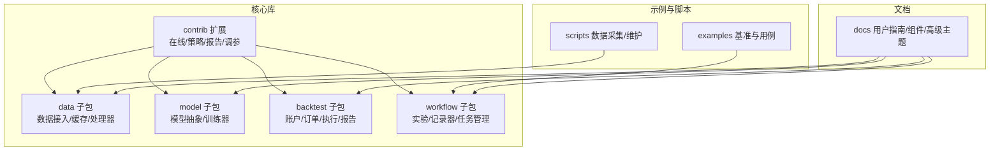
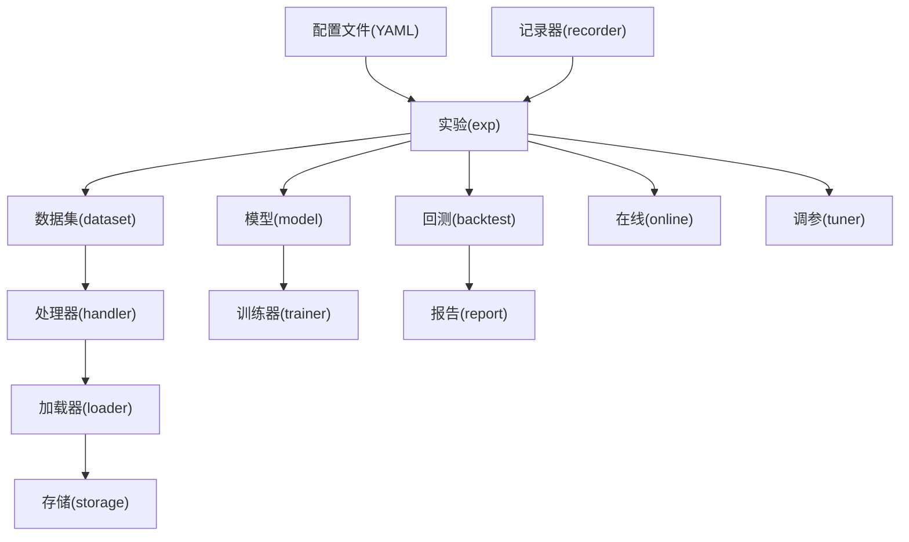
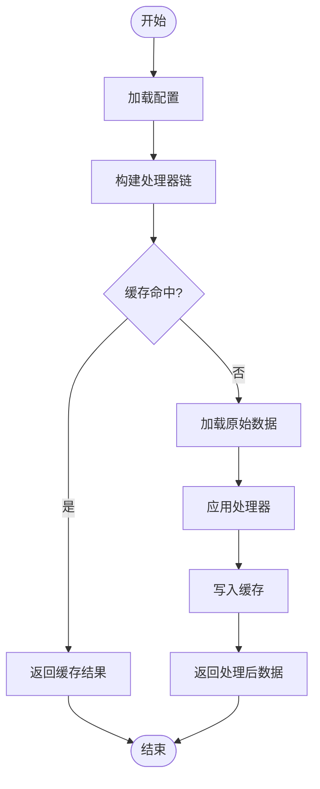
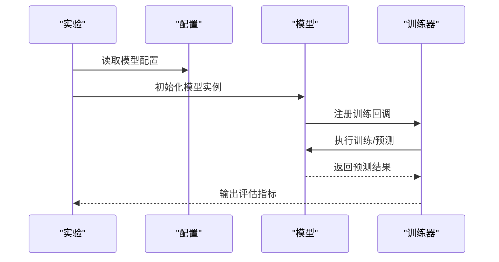
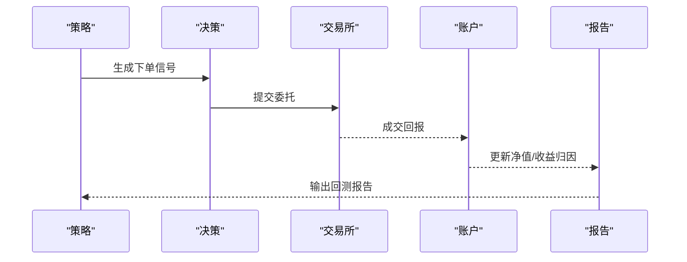
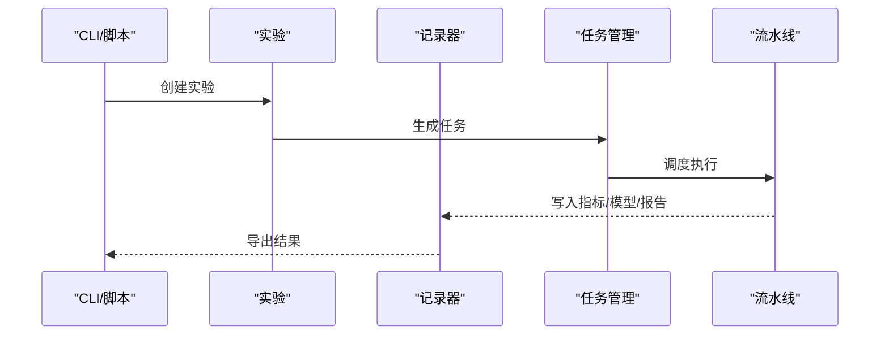
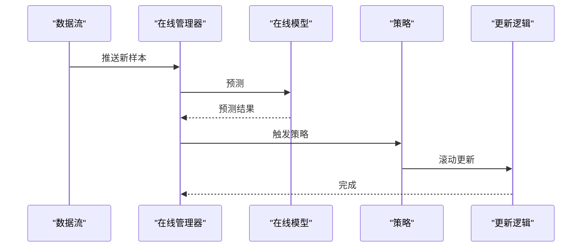
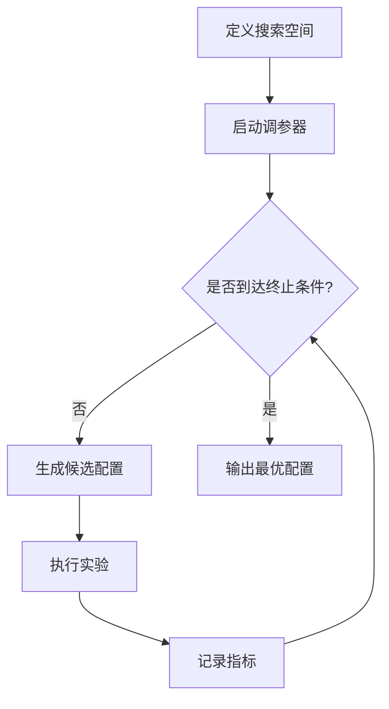
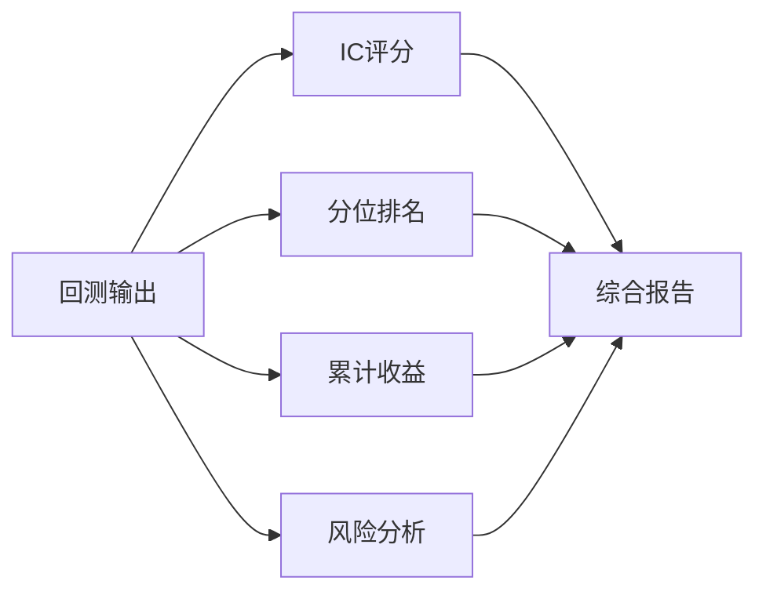
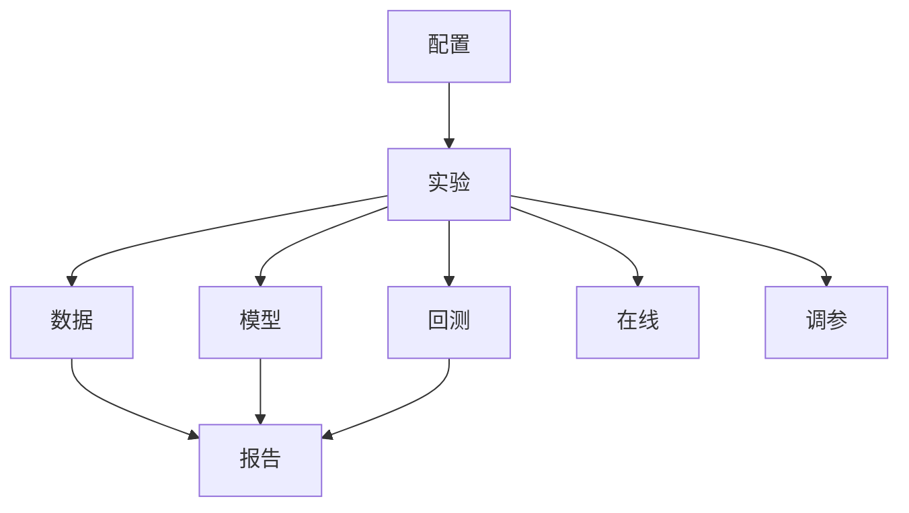

# 核心特性

<cite>
**本文引用的文件**
- [qlib/__init__.py](file://qlib/__init__.py)
- [qlib/config.py](file://qlib/config.py)
- [qlib/data/__init__.py](file://qlib/data/__init__.py)
- [qlib/model/__init__.py](file://qlib/model/__init__.py)
- [qlib/backtest/__init__.py](file://qlib/backtest/__init__.py)
- [qlib/workflow/exp.py](file://qlib/workflow/exp.py)
- [qlib/workflow/recorder.py](file://qlib/workflow/recorder.py)
- [qlib/contrib/online/manager.py](file://qlib/contrib/online/manager.py)
- [qlib/contrib/strategy/order_generator.py](file://qlib/contrib/strategy/order_generator.py)
- [qlib/contrib/report/analysis_position/rank_label.py](file://qlib/contrib/report/analysis_position/rank_label.py)
- [qlib/contrib/report/analysis_position/score_ic.py](file://qlib/contrib/report/analysis_position/score_ic.py)
- [qlib/contrib/report/analysis_position/risk_analysis.py](file://qlib/contrib/report/analysis_position/risk_analysis.py)
- [qlib/contrib/report/analysis_position/cumulative_return.py](file://qlib/contrib/report/analysis_position/cumulative_return.py)
- [qlib/contrib/report/analysis_position/report.py](file://qlib/contrib/report/analysis_position/report.py)
- [qlib/contrib/evaluate.py](file://qlib/contrib/evaluate.py)
- [qlib/contrib/evaluate_portfolio.py](file://qlib/contrib/evaluate_portfolio.py)
- [qlib/contrib/tuner/pipeline.py](file://qlib/contrib/tuner/pipeline.py)
- [qlib/contrib/tuner/tuner.py](file://qlib/contrib/tuner/tuner.py)
- [examples/benchmarks/LightGBM/workflow_config_lightgbm_Alpha158.yaml](file://examples/benchmarks/LightGBM/workflow_config_lightgbm_Alpha158.yaml)
- [examples/benchmarks/LightGBM/workflow_config_lightgbm_multi_freq.yaml](file://examples/benchmarks/LightGBM/workflow_config_lightgbm_multi_freq.yaml)
- [examples/highfreq/workflow.py](file://examples/highfreq/workflow.py)
- [examples/portfolio/config_enhanced_indexing.yaml](file://examples/portfolio/config_enhanced_indexing.yaml)
- [scripts/get_data.py](file://scripts/get_data.py)
- [scripts/dump_bin.py](file://scripts/dump_bin.py)
- [scripts/check_data_health.py](file://scripts/check_data_health.py)
- [docs/introduction/introduction.rst](file://docs/introduction/introduction.rst)
- [docs/start/installation.rst](file://docs/start/installation.rst)
- [docs/start/getdata.rst](file://docs/start/getdata.rst)
- [docs/component/data.rst](file://docs/component/data.rst)
- [docs/component/model.rst](file://docs/component/model.rst)
- [docs/component/strategy.rst](file://docs/component/strategy.rst)
- [docs/component/workflow.rst](file://docs/component/workflow.rst)
- [docs/component/recorder.rst](file://docs/component/recorder.rst)
- [docs/component/online.rst](file://docs/component/online.rst)
- [docs/component/meta.rst](file://docs/component/meta.rst)
- [docs/advanced/task_management.rst](file://docs/advanced/task_management.rst)
</cite>

## 目录
1. [引言](#引言)
2. [项目结构](#项目结构)
3. [核心组件](#核心组件)
4. [架构总览](#架构总览)
5. [详细组件分析](#详细组件分析)
6. [依赖关系分析](#依赖关系分析)
7. [性能考量](#性能考量)
8. [故障排查指南](#故障排查指南)
9. [结论](#结论)
10. [附录](#附录)

## 引言
本节概述Qlib量化研究框架的目标与定位：以模块化、可组合为核心设计理念，提供从数据接入、特征工程、模型训练到回测评估与实验管理的一体化能力；支持多市场、多频度数据处理，集成主流机器学习模型，构建可复现实验流水线，并提供在线推理与优化工具链，服务于因子挖掘、策略回测、风险管理等典型量化研究场景。

## 项目结构
Qlib采用分层与按功能域划分相结合的组织方式：
- 核心子包：data（数据）、model（模型）、backtest（回测）、workflow（实验工作流）、contrib（扩展能力）
- 示例与脚本：examples（基准模型与用例）、scripts（数据采集与维护）
- 文档：docs（用户指南、组件说明、高级主题）

图示来源
- [qlib/data/__init__.py](file://qlib/data/__init__.py)
- [qlib/model/__init__.py](file://qlib/model/__init__.py)
- [qlib/backtest/__init__.py](file://qlib/backtest/__init__.py)
- [qlib/workflow/exp.py](file://qlib/workflow/exp.py)
- [qlib/contrib/online/manager.py](file://qlib/contrib/online/manager.py)

章节来源
- [qlib/__init__.py](file://qlib/__init__.py)
- [qlib/config.py](file://qlib/config.py)
- [docs/introduction/introduction.rst](file://docs/introduction/introduction.rst)

## 核心组件
- 多市场多频度数据处理：统一的数据接口、缓存与存储、处理器与加载器，支持分钟级高频与日线等多频度数据，具备数据健康检查与二进制持久化能力。
- 机器学习模型集成：提供模型抽象与通用训练器，内置多种经典与深度学习模型实现，支持多任务与元学习场景。
- 回测执行系统：账户、委托、交易所模拟、信号与收益归因，输出多维度报告，支撑策略验证与风险分析。
- 实验管理框架：基于配置的实验流水线、记录器与任务管理，支持可复现的因子挖掘与模型训练流程。
- 在线推理与优化：在线策略管理、滚动更新、超参搜索与管道化调参，满足生产化部署与持续优化需求。

章节来源
- [qlib/data/__init__.py](file://qlib/data/__init__.py)
- [qlib/model/__init__.py](file://qlib/model/__init__.py)
- [qlib/backtest/__init__.py](file://qlib/backtest/__init__.py)
- [qlib/workflow/exp.py](file://qlib/workflow/exp.py)
- [qlib/workflow/recorder.py](file://qlib/workflow/recorder.py)
- [qlib/contrib/online/manager.py](file://qlib/contrib/online/manager.py)
- [qlib/contrib/tuner/pipeline.py](file://qlib/contrib/tuner/pipeline.py)
- [qlib/contrib/tuner/tuner.py](file://qlib/contrib/tuner/tuner.py)

## 架构总览
Qlib通过“配置驱动 + 模块化组件”的架构实现松耦合与高内聚：
- 配置层：YAML定义数据集、处理器、模型、回测参数与实验流程
- 组件层：数据、模型、回测、报告、在线、调参等子系统相互独立，可通过组合形成完整流水线
- 工具层：脚本与CLI辅助数据采集、持久化与实验运行

图示来源
- [qlib/workflow/exp.py](file://qlib/workflow/exp.py)
- [qlib/workflow/recorder.py](file://qlib/workflow/recorder.py)
- [qlib/data/dataset/loader.py](file://qlib/data/dataset/loader.py)
- [qlib/data/dataset/handler.py](file://qlib/data/dataset/handler.py)
- [qlib/model/trainer.py](file://qlib/model/trainer.py)
- [qlib/backtest/backtest.py](file://qlib/backtest/backtest.py)
- [qlib/contrib/online/manager.py](file://qlib/contrib/online/manager.py)
- [qlib/contrib/tuner/pipeline.py](file://qlib/contrib/tuner/pipeline.py)

## 详细组件分析

### 数据处理子系统
- 设计要点：数据接口抽象、处理器链式变换、缓存与存储分离、多频度适配
- 关键流程：配置解析 → 处理器装配 → 加载器读取 → 缓存命中/回源 → 结果输出
- 典型用法：高频与日线数据的统一接入、因子计算前置处理、数据健康检查与二进制落盘

图示来源
- [qlib/data/dataset/handler.py](file://qlib/data/dataset/handler.py)
- [qlib/data/dataset/loader.py](file://qlib/data/dataset/loader.py)
- [qlib/data/cache.py](file://qlib/data/cache.py)
- [scripts/check_data_health.py](file://scripts/check_data_health.py)
- [scripts/dump_bin.py](file://scripts/dump_bin.py)

章节来源
- [qlib/data/__init__.py](file://qlib/data/__init__.py)
- [qlib/data/dataset/handler.py](file://qlib/data/dataset/handler.py)
- [qlib/data/dataset/loader.py](file://qlib/data/dataset/loader.py)
- [qlib/data/cache.py](file://qlib/data/cache.py)
- [scripts/get_data.py](file://scripts/get_data.py)
- [scripts/check_data_health.py](file://scripts/check_data_health.py)
- [scripts/dump_bin.py](file://scripts/dump_bin.py)

### 机器学习模型子系统
- 设计要点：模型抽象接口、通用训练器、多模型实现、元任务与多任务支持
- 关键流程：配置模型参数 → 训练器调度 → 训练/预测 → 结果记录
- 典型用法：LightGBM、XGBoost、LSTM、Transformer 等模型的统一接入与对比实验

图示来源
- [qlib/model/__init__.py](file://qlib/model/__init__.py)
- [qlib/model/base.py](file://qlib/model/base.py)
- [qlib/model/trainer.py](file://qlib/model/trainer.py)
- [examples/benchmarks/LightGBM/workflow_config_lightgbm_Alpha158.yaml](file://examples/benchmarks/LightGBM/workflow_config_lightgbm_Alpha158.yaml)

章节来源
- [qlib/model/__init__.py](file://qlib/model/__init__.py)
- [qlib/model/base.py](file://qlib/model/base.py)
- [qlib/model/trainer.py](file://qlib/model/trainer.py)
- [examples/benchmarks/LightGBM/workflow_config_lightgbm_Alpha158.yaml](file://examples/benchmarks/LightGBM/workflow_config_lightgbm_Alpha158.yaml)

### 回测执行子系统
- 设计要点：账户与头寸管理、订单生成与执行、交易所模拟、收益归因与报告
- 关键流程：信号生成 → 决策 → 委托 → 成交 → 账户更新 → 报告生成
- 典型用法：多市场、多频度回测，支持滑点、手续费与流动性约束

图示来源
- [qlib/backtest/backtest.py](file://qlib/backtest/backtest.py)
- [qlib/backtest/decision.py](file://qlib/backtest/decision.py)
- [qlib/backtest/executor.py](file://qlib/backtest/executor.py)
- [qlib/backtest/exchange.py](file://qlib/backtest/exchange.py)
- [qlib/backtest/account.py](file://qlib/backtest/account.py)
- [qlib/backtest/report.py](file://qlib/backtest/report.py)

章节来源
- [qlib/backtest/__init__.py](file://qlib/backtest/__init__.py)
- [qlib/backtest/backtest.py](file://qlib/backtest/backtest.py)
- [qlib/backtest/decision.py](file://qlib/backtest/decision.py)
- [qlib/backtest/executor.py](file://qlib/backtest/executor.py)
- [qlib/backtest/exchange.py](file://qlib/backtest/exchange.py)
- [qlib/backtest/account.py](file://qlib/backtest/account.py)
- [qlib/backtest/report.py](file://qlib/backtest/report.py)

### 实验管理与记录子系统
- 设计要点：实验对象封装、记录器持久化、任务生成与收集、可复现实验流水线
- 关键流程：实验初始化 → 任务生成 → 执行与监控 → 结果记录 → 可视化与比较
- 典型用法：因子挖掘与模型训练的标准化流程，支持多实验对比与版本追踪

图示来源
- [qlib/workflow/exp.py](file://qlib/workflow/exp.py)
- [qlib/workflow/recorder.py](file://qlib/workflow/recorder.py)
- [qlib/workflow/task/manage.py](file://qlib/workflow/task/manage.py)
- [qlib/workflow/task/gen.py](file://qlib/workflow/task/gen.py)

章节来源
- [qlib/workflow/exp.py](file://qlib/workflow/exp.py)
- [qlib/workflow/recorder.py](file://qlib/workflow/recorder.py)
- [qlib/workflow/task/manage.py](file://qlib/workflow/task/manage.py)
- [qlib/workflow/task/gen.py](file://qlib/workflow/task/gen.py)

### 在线推理与滚动更新
- 设计要点：在线策略管理、预测更新、滚动策略与增强索引
- 关键流程：实时数据接入 → 在线模型预测 → 策略决策 → 滚动更新
- 典型用法：增强型指数跟踪、在线交易与风控

图示来源
- [qlib/contrib/online/manager.py](file://qlib/contrib/online/manager.py)
- [examples/portfolio/config_enhanced_indexing.yaml](file://examples/portfolio/config_enhanced_indexing.yaml)

章节来源
- [qlib/contrib/online/manager.py](file://qlib/contrib/online/manager.py)
- [examples/portfolio/config_enhanced_indexing.yaml](file://examples/portfolio/config_enhanced_indexing.yaml)

### 超参搜索与调优
- 设计要点：搜索空间定义、管道化调参、自动执行与结果记录
- 关键流程：定义搜索空间 → 启动调参器 → 迭代搜索 → 记录最优配置
- 典型用法：LightGBM/XGBoost等模型的超参优化

图示来源
- [qlib/contrib/tuner/tuner.py](file://qlib/contrib/tuner/tuner.py)
- [qlib/contrib/tuner/pipeline.py](file://qlib/contrib/tuner/pipeline.py)

章节来源
- [qlib/contrib/tuner/tuner.py](file://qlib/contrib/tuner/tuner.py)
- [qlib/contrib/tuner/pipeline.py](file://qlib/contrib/tuner/pipeline.py)

### 报告与评估子系统
- 设计要点：多维度报告、IC评分、分位排名、累计收益与风险分析
- 关键流程：回测输出 → 报告生成 → 分析指标 → 可视化
- 典型用法：因子质量评估、策略稳定性检验、风险归因分析

图示来源
- [qlib/contrib/report/analysis_position/score_ic.py](file://qlib/contrib/report/analysis_position/score_ic.py)
- [qlib/contrib/report/analysis_position/rank_label.py](file://qlib/contrib/report/analysis_position/rank_label.py)
- [qlib/contrib/report/analysis_position/cumulative_return.py](file://qlib/contrib/report/analysis_position/cumulative_return.py)
- [qlib/contrib/report/analysis_position/risk_analysis.py](file://qlib/contrib/report/analysis_position/risk_analysis.py)
- [qlib/contrib/report/analysis_position/report.py](file://qlib/contrib/report/analysis_position/report.py)
- [qlib/contrib/evaluate.py](file://qlib/contrib/evaluate.py)
- [qlib/contrib/evaluate_portfolio.py](file://qlib/contrib/evaluate_portfolio.py)

章节来源
- [qlib/contrib/report/analysis_position/score_ic.py](file://qlib/contrib/report/analysis_position/score_ic.py)
- [qlib/contrib/report/analysis_position/rank_label.py](file://qlib/contrib/report/analysis_position/rank_label.py)
- [qlib/contrib/report/analysis_position/cumulative_return.py](file://qlib/contrib/report/analysis_position/cumulative_return.py)
- [qlib/contrib/report/analysis_position/risk_analysis.py](file://qlib/contrib/report/analysis_position/risk_analysis.py)
- [qlib/contrib/report/analysis_position/report.py](file://qlib/contrib/report/analysis_position/report.py)
- [qlib/contrib/evaluate.py](file://qlib/contrib/evaluate.py)
- [qlib/contrib/evaluate_portfolio.py](file://qlib/contrib/evaluate_portfolio.py)

## 依赖关系分析
- 松耦合体现在：各子系统通过配置与接口交互，避免强绑定；数据与模型解耦，回测与策略解耦
- 关键依赖链：配置 → 实验 → 数据/模型 → 回测 → 报告；在线与调参作为独立扩展模块插入主流程
- 外部依赖：YAML配置、时间序列与数值计算库、可视化与存储后端

图示来源
- [qlib/workflow/exp.py](file://qlib/workflow/exp.py)
- [qlib/data/dataset/loader.py](file://qlib/data/dataset/loader.py)
- [qlib/model/trainer.py](file://qlib/model/trainer.py)
- [qlib/backtest/backtest.py](file://qlib/backtest/backtest.py)
- [qlib/contrib/online/manager.py](file://qlib/contrib/online/manager.py)
- [qlib/contrib/tuner/pipeline.py](file://qlib/contrib/tuner/pipeline.py)

章节来源
- [qlib/workflow/exp.py](file://qlib/workflow/exp.py)
- [qlib/data/dataset/loader.py](file://qlib/data/dataset/loader.py)
- [qlib/model/trainer.py](file://qlib/model/trainer.py)
- [qlib/backtest/backtest.py](file://qlib/backtest/backtest.py)
- [qlib/contrib/online/manager.py](file://qlib/contrib/online/manager.py)
- [qlib/contrib/tuner/pipeline.py](file://qlib/contrib/tuner/pipeline.py)

## 性能考量
- 数据层：缓存命中率直接影响吞吐；建议合理设置缓存大小与失效策略；对高频数据采用二进制落盘与增量更新
- 模型层：批量化训练与预测、GPU加速、模型压缩与蒸馏可显著提升效率
- 回测层：高性能数据结构与向量化操作、并行化回测、延迟摊销
- 实验层：任务并行与资源调度、结果去重与增量记录

## 故障排查指南
- 数据健康检查：使用数据健康检查脚本定位缺失或异常数据，确保配置正确
- 数据持久化：二进制落盘失败时检查路径权限与磁盘空间
- 实验执行：查看记录器输出与日志，确认配置项与依赖环境
- 回测异常：核对信号生成与订单执行逻辑，检查滑点与手续费设置

章节来源
- [scripts/check_data_health.py](file://scripts/check_data_health.py)
- [scripts/dump_bin.py](file://scripts/dump_bin.py)
- [qlib/log.py](file://qlib/log.py)

## 结论
Qlib以模块化与配置驱动为核心，实现了从数据到模型再到回测与实验管理的全链路能力。其松耦合架构允许用户按需组合组件，快速搭建因子挖掘、策略回测与风险管理等场景的解决方案，并通过在线推理与调参工具链支撑生产化落地。

## 附录
- 快速上手与安装参考：[安装指南](file://docs/start/installation.rst)
- 数据获取与准备参考：[数据获取指南](file://docs/start/getdata.rst)
- 组件使用参考：[数据组件](file://docs/component/data.rst)、[模型组件](file://docs/component/model.rst)、[策略组件](file://docs/component/strategy.rst)、[工作流组件](file://docs/component/workflow.rst)、[记录器组件](file://docs/component/recorder.rst)、[在线组件](file://docs/component/online.rst)、[元学习组件](file://docs/component/meta.rst)
- 高频回测示例：[高频工作流](file://examples/highfreq/workflow.py)
- 多频度回测示例：[多频度配置](file://examples/benchmarks/LightGBM/workflow_config_lightgbm_multi_freq.yaml)
- 增强型指数跟踪示例：[增强指数配置](file://examples/portfolio/config_enhanced_indexing.yaml)