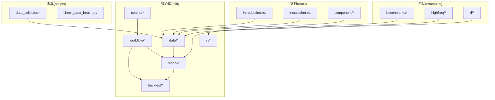
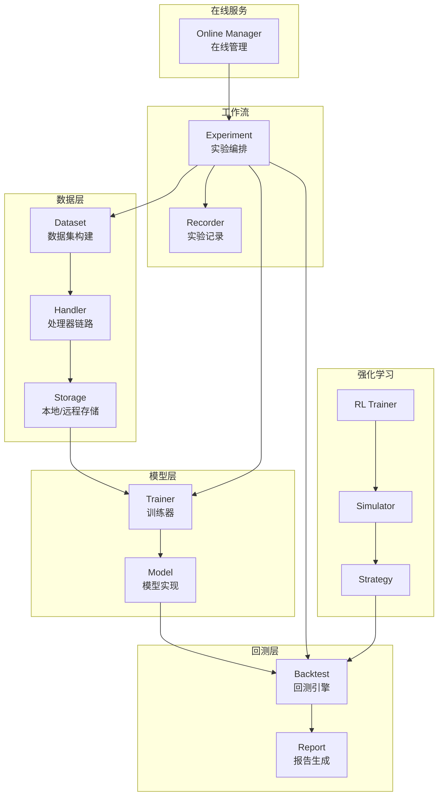
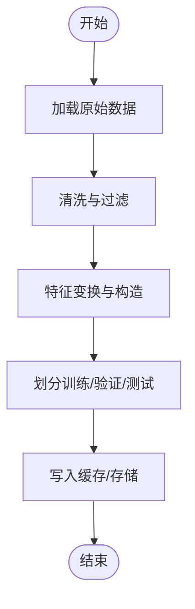
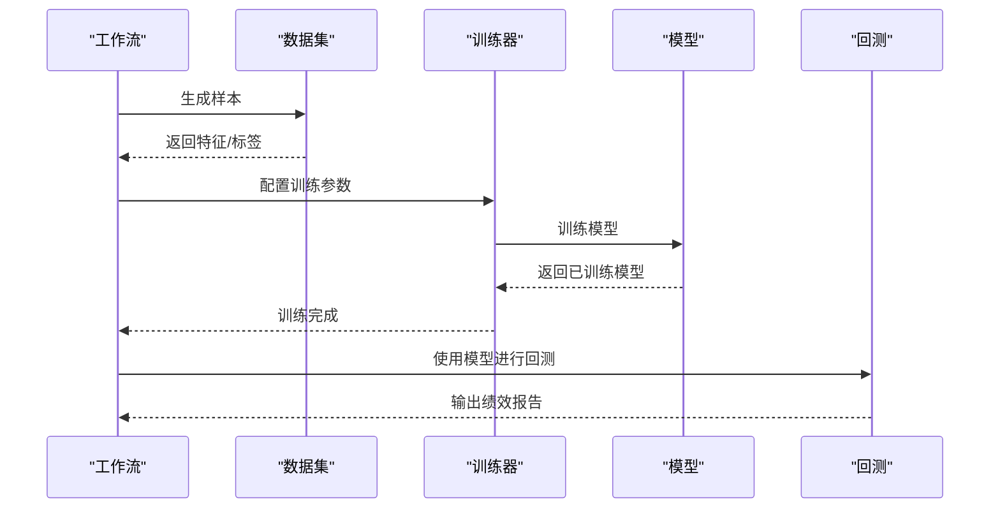
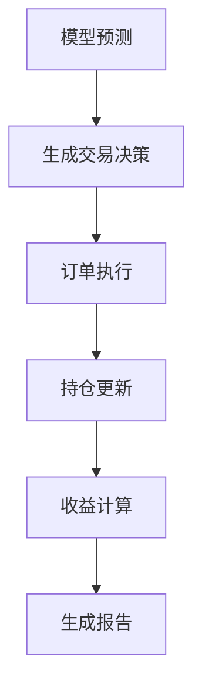
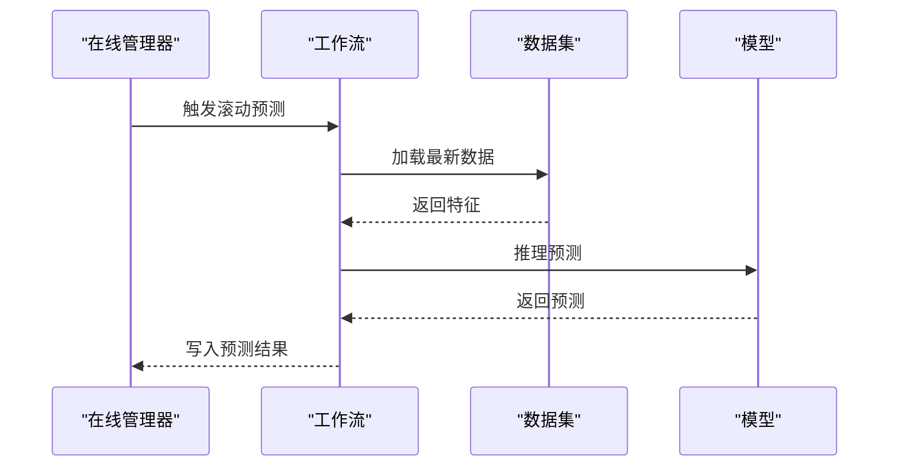
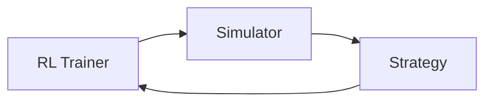
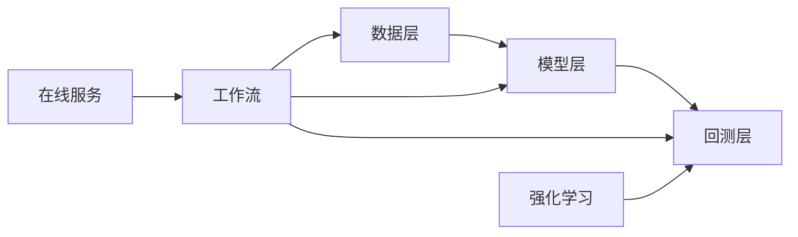

# 项目概述

<cite>
**本文引用的文件**
- [README.md](file://README.md)
- [introduction.rst](file://docs/introduction/introduction.rst)
- [installation.rst](file://docs/start/installation.rst)
- [workflow.rst](file://docs/component/workflow.rst)
- [data.rst](file://docs/component/data.rst)
- [model.rst](file://docs/component/model.rst)
- [backtest.rst](file://qlib/backtest/backtest.py)
- [dataset.py](file://qlib/data/dataset/dataset.py)
- [handler.py](file://qlib/data/dataset/handler.py)
- [storage.py](file://qlib/data/storage/storage.py)
- [trainer.py](file://qlib/model/trainer.py)
- [exp.py](file://qlib/workflow/exp.py)
- [recorder.py](file://qlib/workflow/recorder.py)
- [online_manager.py](file://qlib/contrib/online/manager.py)
- [rl_framework.rst](file://docs/component/rl/framework.rst)
- [rl_overall.rst](file://docs/component/rl/overall.rst)
</cite>

## 目录
1. [引言](#引言)
2. [项目结构](#项目结构)
3. [核心组件](#核心组件)
4. [架构总览](#架构总览)
5. [详细组件分析](#详细组件分析)
6. [依赖关系分析](#依赖关系分析)
7. [性能考量](#性能考量)
8. [故障排查指南](#故障排查指南)
9. [结论](#结论)
10. [附录](#附录)

## 引言
Qlib是一个面向量化投资的人工智能平台，旨在通过标准化的数据处理、模型训练与回测验证流程，降低从“想法探索”到“生产实现”的门槛。它服务于数据科学家、量化研究员、交易员等群体，提供可复用、可扩展且易于集成的模块化能力，覆盖监督学习、市场动态建模以及强化学习等多种机器学习范式。

本项目强调“松耦合、模块化”的设计理念：数据层、模型层、策略层、回测层相互独立，既可单独使用，也可组合成完整的端到端工作流。通过统一的配置与记录机制，Qlib帮助团队在实验、部署与运维之间建立高效闭环。

## 项目结构
仓库采用按功能域划分的层次化组织方式：
- 文档(docs): 提供入门、组件说明、高级主题与参考手册
- 示例(examples): 包含基准模型、高频数据处理、在线服务、强化学习等样例
- 核心库(qlib): 数据、模型、回测、策略、工作流、在线服务等子系统
- 脚本(scripts): 数据采集、健康检查、二进制导出等辅助工具
- 测试(tests): 单元测试与集成测试

图表来源
- [introduction.rst](file://docs/introduction/introduction.rst)
- [installation.rst](file://docs/start/installation.rst)
- [data.rst](file://docs/component/data.rst)
- [model.rst](file://docs/component/model.rst)

章节来源
- [README.md](file://README.md)
- [introduction.rst](file://docs/introduction/introduction.rst)

## 核心组件
- 数据层(data): 提供多频、多市场的统一数据抽象，支持缓存、存储与处理器链路，支撑特征工程与样本生成
- 模型层(model): 封装训练器与通用模型接口，兼容多种算法并提供评估与解释能力
- 回测层(backtest): 实现账户、订单执行、收益归因与报告生成，确保实验结果可复现
- 工作流(workflow): 以实验(exp)为中心，串联数据、模型、回测与记录器(recorder)，形成可配置的流水线
- 在线服务(contrib.online): 支持滚动预测与在线管理，满足生产环境的低延迟需求
- 强化学习(rl): 提供训练器、数据适配、仿真器与策略模块，支持订单执行等RL场景

章节来源
- [data.rst](file://docs/component/data.rst)
- [model.rst](file://docs/component/model.rst)
- [workflow.rst](file://docs/component/workflow.rst)

## 架构总览
Qlib的整体架构围绕“数据-模型-回测-记录”闭环展开，强调模块解耦与可插拔性。下图展示了核心模块之间的交互关系：

图表来源
- [dataset.py](file://qlib/data/dataset/dataset.py)
- [handler.py](file://qlib/data/dataset/handler.py)
- [storage.py](file://qlib/data/storage/storage.py)
- [trainer.py](file://qlib/model/trainer.py)
- [backtest.rst](file://qlib/backtest/backtest.py)
- [exp.py](file://qlib/workflow/exp.py)
- [recorder.py](file://qlib/workflow/recorder.py)
- [online_manager.py](file://qlib/contrib/online/manager.py)
- [rl_framework.rst](file://docs/component/rl/framework.rst)

## 详细组件分析

### 数据处理流水线
数据处理是整个ML流水线的起点，负责从原始市场数据中抽取特征并生成训练/回测样本。典型流程如下：
- Handler对输入数据进行清洗、变换与特征构造
- Dataset根据时间窗口与采样策略生成样本
- Storage负责缓存与持久化，提升重复实验效率
- Workflow通过配置驱动上述步骤，形成可复现的数据制品

图表来源
- [handler.py](file://qlib/data/dataset/handler.py)
- [dataset.py](file://qlib/data/dataset/dataset.py)
- [storage.py](file://qlib/data/storage/storage.py)

章节来源
- [data.rst](file://docs/component/data.rst)

### 模型训练与评估
模型训练通过统一的训练器接口对接不同算法，支持超参搜索、早停与评估指标输出。训练完成后，模型进入回测阶段进行策略验证。

图表来源
- [trainer.py](file://qlib/model/trainer.py)
- [exp.py](file://qlib/workflow/exp.py)
- [backtest.rst](file://qlib/backtest/backtest.py)

章节来源
- [model.rst](file://docs/component/model.rst)

### 回测与报告
回测模块模拟交易执行过程，计算收益、风险与归因指标，并生成可视化报告。该阶段是验证模型泛化能力的关键环节。

图表来源
- [backtest.rst](file://qlib/backtest/backtest.py)

章节来源
- [backtest.rst](file://qlib/backtest/backtest.py)

### 在线服务与滚动预测
在线服务支持将训练好的模型接入实时预测，结合滚动更新策略，实现从离线实验到在线生产的平滑过渡。

图表来源
- [online_manager.py](file://qlib/contrib/online/manager.py)
- [exp.py](file://qlib/workflow/exp.py)

章节来源
- [online_manager.py](file://qlib/contrib/online/manager.py)

### 强化学习框架
Qlib提供强化学习专用模块，包含训练器、仿真器与策略组件，适用于订单执行等序列决策任务。

图表来源
- [rl_framework.rst](file://docs/component/rl/framework.rst)
- [rl_overall.rst](file://docs/component/rl/overall.rst)

章节来源
- [rl_framework.rst](file://docs/component/rl/framework.rst)
- [rl_overall.rst](file://docs/component/rl/overall.rst)

## 依赖关系分析
- 组件内聚与解耦：数据、模型、回测、工作流各自职责清晰，通过接口与配置衔接
- 外部依赖：文档与示例依赖核心库；脚本工具依赖数据层；在线服务依赖工作流
- 可能的循环依赖：当前结构以单向依赖为主，建议在新增模块时保持“自上而下”的依赖方向

图表来源
- [dataset.py](file://qlib/data/dataset/dataset.py)
- [trainer.py](file://qlib/model/trainer.py)
- [backtest.rst](file://qlib/backtest/backtest.py)
- [exp.py](file://qlib/workflow/exp.py)
- [online_manager.py](file://qlib/contrib/online/manager.py)

章节来源
- [workflow.rst](file://docs/component/workflow.rst)

## 性能考量
- 缓存与存储：利用本地/远程存储减少重复I/O，提高数据访问速度
- 并行化：工作流与数据处理支持并行调度，缩短实验周期
- 滚动更新：在线服务采用滚动预测与增量更新，降低在线延迟
- 资源隔离：回测与训练分离，避免资源争用影响实验稳定性

## 故障排查指南
- 数据问题：检查数据加载路径、缓存一致性与存储权限
- 训练异常：核对训练配置、样本质量与评估指标趋势
- 回测偏差：确认交易成本、滑点设置与订单执行逻辑
- 在线预测：验证滚动策略触发条件与预测写入流程
- 强化学习：检查仿真环境状态空间与奖励函数设计

章节来源
- [installation.rst](file://docs/start/installation.rst)
- [data.rst](file://docs/component/data.rst)
- [model.rst](file://docs/component/model.rst)

## 结论
Qlib通过模块化与可配置的设计，将量化研究中的关键环节标准化、自动化，显著降低了从想法到落地的成本。依托统一的数据与回测基础设施，团队可以专注于模型创新与策略优化，同时借助在线服务实现持续交付与监控。

## 附录
- 快速开始：参考安装与初始化文档，完成环境搭建与基础示例运行
- 组件参考：按需查阅数据、模型、回测与工作流的组件说明
- 示例导航：从基准模型到高频/在线/强化学习样例，逐步深入

章节来源
- [installation.rst](file://docs/start/installation.rst)
- [workflow.rst](file://docs/component/workflow.rst)
- [data.rst](file://docs/component/data.rst)
- [model.rst](file://docs/component/model.rst)