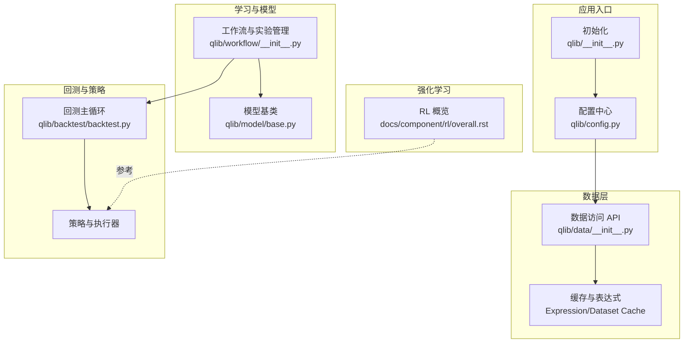
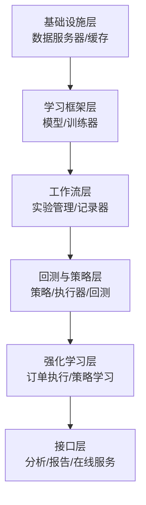
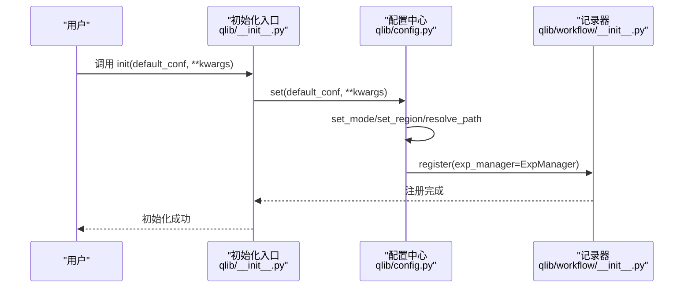
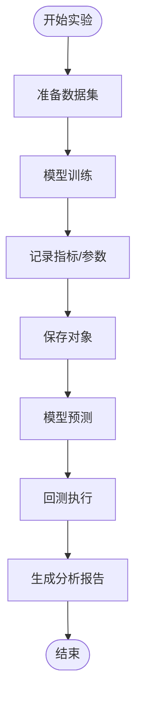
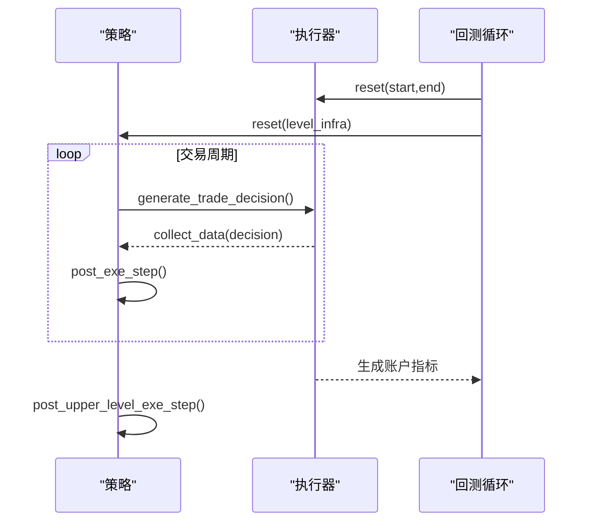
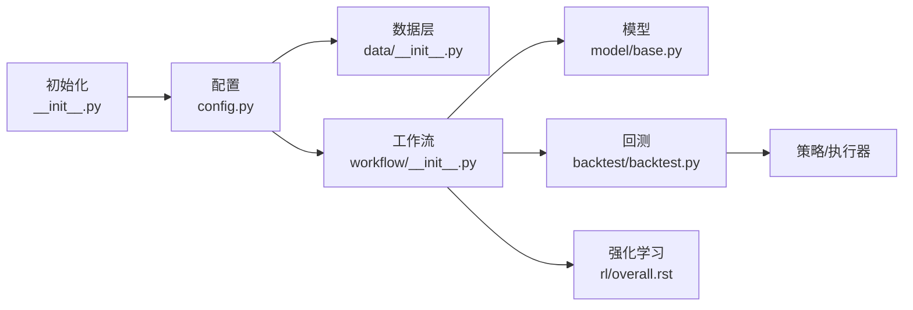

# 项目简介

<cite>
**本文引用的文件**
- [README.md](file://README.md)
- [introduction.rst](file://docs/introduction/introduction.rst)
- [__init__.py](file://qlib/__init__.py)
- [config.py](file://qlib/config.py)
- [workflow/__init__.py](file://qlib/workflow/__init__.py)
- [data/__init__.py](file://qlib/data/__init__.py)
- [backtest.py](file://qlib/backtest/backtest.py)
- [base.py](file://qlib/model/base.py)
- [rl/overall.rst](file://docs/component/rl/overall.rst)
- [examples/benchmarks/README.md](file://examples/benchmarks/README.md)
- [examples/nested_decision_execution/README.md](file://examples/nested_decision_execution/README.md)
</cite>

## 目录
1. [引言](#引言)
2. [项目结构](#项目结构)
3. [核心组件](#核心组件)
4. [架构总览](#架构总览)
5. [详细组件分析](#详细组件分析)
6. [依赖关系分析](#依赖关系分析)
7. [性能考量](#性能考量)
8. [故障排查指南](#故障排查指南)
9. [结论](#结论)
10. [附录](#附录)

## 引言
Qlib 是一个面向量化投资的 AI 驱动平台，旨在释放人工智能在量化投资中的潜力、赋能研究并创造价值。它覆盖从“想法探索”到“生产实现”的完整机器学习流水线，支持多种机器学习范式（监督学习、市场动态建模、强化学习），并提供数据处理、模型训练、回测验证与策略执行的全链路能力。项目强调模块化与可扩展性，既可作为一体化平台使用，也可按需拆分模块独立部署。

- 平台定位与使命
  - 以 AI 为核心驱动力，构建可复用、可扩展、可落地的量化研究基础设施。
  - 支持多范式机器学习，覆盖信号挖掘、风险建模、组合优化与订单执行。
  - 提供从数据准备、实验管理、回测分析到在线服务的端到端能力。

- 核心价值与创新
  - 模块解耦：基础设施、学习框架、工作流与接口层清晰分离，便于独立演进与替换。
  - 数据高效：针对金融场景优化的数据存储与查询，显著降低数据加载与转换开销。
  - 研究即工程：通过实验记录器与工作流模板，将研究过程标准化、可追踪、可复现。

**章节来源**
- [README.md:81-86](file://README.md#L81-L86)
- [introduction.rst:11-13](file://docs/introduction/introduction.rst#L11-L13)

## 项目结构
Qlib 的代码组织遵循“功能域 + 层次化”的设计：核心子系统包括数据层、模型与学习框架、工作流与实验管理、回测与策略、强化学习、在线服务等。顶层入口负责初始化配置与挂载数据路径；数据层提供统一的数据访问抽象与缓存；工作流层串联训练、回测与分析；回测层实现多频度、嵌套决策的交易闭环；强化学习模块提供订单执行等场景的策略学习能力。

**图表来源**
- [__init__.py:25-85](file://qlib/__init__.py#L25-L85)
- [config.py:424-464](file://qlib/config.py#L424-L464)
- [data/__init__.py:8-27](file://qlib/data/__init__.py#L8-L27)
- [model/base.py:10-20](file://qlib/model/base.py#L10-L20)
- [workflow/__init__.py:26-96](file://qlib/workflow/__init__.py#L26-L96)
- [backtest/backtest.py:25-49](file://qlib/backtest/backtest.py#L25-L49)
- [rl/overall.rst:1-23](file://docs/component/rl/overall.rst#L1-L23)

**章节来源**
- [README.md:143-156](file://README.md#L143-L156)
- [introduction.rst:15-69](file://docs/introduction/introduction.rst#L15-L69)

## 核心组件
- 初始化与配置
  - 初始化入口负责解析用户配置、挂载数据路径、注册全局记录器，并根据模式（客户端/服务器）设置默认参数。
  - 配置中心提供数据提供者、缓存策略、日志级别、实验管理后端等全局设置。

- 数据与缓存
  - 数据层提供统一的 Provider 抽象，支持本地/远程数据源、表达式与数据集缓存，加速重复查询与计算。

- 模型与学习框架
  - 模型基类定义通用的训练与预测接口；工作流层提供实验记录器，支持参数、指标、对象的持久化与检索。

- 回测与策略
  - 回测主循环协调策略与执行器，支持多频度、嵌套决策的交易流程；策略层封装组合优化、订单生成与成本控制。

- 强化学习
  - 提供 RL 场景的框架说明与示例，支持订单执行等连续决策任务。

**章节来源**
- [__init__.py:25-85](file://qlib/__init__.py#L25-L85)
- [config.py:424-464](file://qlib/config.py#L424-L464)
- [data/__init__.py:8-27](file://qlib/data/__init__.py#L8-L27)
- [model/base.py:10-20](file://qlib/model/base.py#L10-L20)
- [workflow/__init__.py:26-96](file://qlib/workflow/__init__.py#L26-L96)
- [backtest/backtest.py:25-49](file://qlib/backtest/backtest.py#L25-L49)
- [rl/overall.rst:1-23](file://docs/component/rl/overall.rst#L1-L23)

## 架构总览
下图展示了 Qlib 的高层架构与模块边界：自下而上分别为基础设施（数据与缓存）、学习框架（模型与工作流）、工作流（实验与记录）、回测与策略、以及强化学习与在线服务。模块间松耦合，可通过配置切换实现不同部署形态（离线/在线）。

**图表来源**
- [introduction.rst:30-65](file://docs/introduction/introduction.rst#L30-L65)
- [README.md:143-156](file://README.md#L143-L156)

## 详细组件分析

### 组件一：初始化与配置（Init & Config）
- 职责
  - 解析用户传入的配置，设置数据提供者、缓存策略、日志级别与实验管理后端。
  - 根据模式（client/server）注入默认行为；支持自动挂载 NFS/本地路径。
  - 注册全局记录器，确保实验与结果可追踪。

- 关键流程
  - 设置模式与区域 → 合并用户参数 → 解析路径 → 校验缓存可用性 → 注册记录器。

**图表来源**
- [__init__.py:25-85](file://qlib/__init__.py#L25-L85)
- [config.py:424-464](file://qlib/config.py#L424-L464)
- [workflow/__init__.py:26-96](file://qlib/workflow/__init__.py#L26-L96)

**章节来源**
- [__init__.py:25-85](file://qlib/__init__.py#L25-L85)
- [config.py:424-464](file://qlib/config.py#L424-L464)
- [workflow/__init__.py:26-96](file://qlib/workflow/__init__.py#L26-L96)

### 组件二：数据层（Provider 与缓存）
- 职责
  - 提供统一的数据访问接口，屏蔽底层存储差异。
  - 支持表达式缓存与数据集缓存，提升重复查询效率。

- 关键点
  - Provider 抽象：日历、标的、特征、表达式、数据集、PIT 等。
  - 缓存策略：磁盘缓存、简单缓存、内存缓存与 Redis 依赖。

**章节来源**
- [data/__init__.py:8-27](file://qlib/data/__init__.py#L8-L27)
- [config.py:155-184](file://qlib/config.py#L155-L184)

### 组件三：模型与工作流（Model 与 Recorder）
- 职责
  - 模型基类定义 fit/predict 接口，支持可序列化与细粒度重加权。
  - 实验记录器提供参数、指标、对象的持久化与检索，支持实验与记录器的生命周期管理。

- 关键流程
  - 训练阶段：fit 准备数据 → 训练迭代 → 日志指标与参数 → 保存对象。
  - 回测阶段：读取预测 → 策略生成决策 → 执行器执行 → 生成报告。

**图表来源**
- [model/base.py:22-78](file://qlib/model/base.py#L22-L78)
- [workflow/__init__.py:542-591](file://qlib/workflow/__init__.py#L542-L591)

**章节来源**
- [model/base.py:22-78](file://qlib/model/base.py#L22-L78)
- [workflow/__init__.py:542-591](file://qlib/workflow/__init__.py#L542-L591)

### 组件四：回测与策略（Backtest Loop）
- 职责
  - 在外层策略与执行器之间进行交互，驱动交易循环。
  - 支持多频度、嵌套决策（如周组合生成、日订单执行、分钟级订单执行）。

- 关键流程
  - 初始化执行器与策略 → 迭代交易日历 → 策略生成决策 → 执行器收集数据 → 更新账户与指标 → 汇总报告。

**图表来源**
- [backtest/backtest.py:25-49](file://qlib/backtest/backtest.py#L25-L49)
- [backtest/backtest.py:52-110](file://qlib/backtest/backtest.py#L52-L110)

**章节来源**
- [backtest/backtest.py:25-49](file://qlib/backtest/backtest.py#L25-L49)
- [backtest/backtest.py:52-110](file://qlib/backtest/backtest.py#L52-L110)
- [examples/nested_decision_execution/README.md:1-30](file://examples/nested_decision_execution/README.md#L1-L30)

### 组件五：强化学习（RL）
- 职责
  - 提供强化学习框架，支持订单执行等连续决策场景，策略可直接输出动作并从环境反馈中学习。

- 关键点
  - RL 框架由工作流层提供环境与执行器支持，可与嵌套执行器协同优化多层级策略。

**章节来源**
- [rl/overall.rst:1-23](file://docs/component/rl/overall.rst#L1-L23)

## 依赖关系分析
- 模块内聚与耦合
  - 初始化与配置：集中于 config 与 __init__，对其他模块仅暴露只读配置。
  - 数据层：通过 Provider 抽象与缓存策略与上层解耦。
  - 工作流层：通过 Recorder 与实验管理后端解耦，支持多种跟踪后端。
  - 回测层：与策略/执行器通过接口解耦，支持多频度与嵌套执行。

- 外部依赖与集成
  - 缓存依赖 Redis（可选）；日志系统可配置；实验管理默认对接 MLflow。
  - 数据提供者支持本地与 NFS；高频率数据场景建议启用表达式缓存。

**图表来源**
- [__init__.py:25-85](file://qlib/__init__.py#L25-L85)
- [config.py:424-464](file://qlib/config.py#L424-L464)
- [data/__init__.py:8-27](file://qlib/data/__init__.py#L8-L27)
- [workflow/__init__.py:26-96](file://qlib/workflow/__init__.py#L26-L96)
- [model/base.py:10-20](file://qlib/model/base.py#L10-L20)
- [backtest/backtest.py:25-49](file://qlib/backtest/backtest.py#L25-L49)
- [rl/overall.rst:1-23](file://docs/component/rl/overall.rst#L1-L23)

**章节来源**
- [config.py:466-482](file://qlib/config.py#L466-L482)
- [workflow/__init__.py:26-96](file://qlib/workflow/__init__.py#L26-L96)

## 性能考量
- 数据访问性能
  - 通过表达式缓存与数据集缓存减少重复计算与 IO；Redis 可提升缓存命中率。
  - 针对高频数据，建议启用表达式缓存并合理设置并发核数。

- 实验与对象持久化
  - 使用记录器统一管理实验元数据与对象，避免手工维护带来的不一致与丢失风险。

- 回测效率
  - 嵌套决策与多频度回测会增加计算复杂度，应结合业务目标选择合适的策略粒度与时间范围。

[本节为通用指导，无需特定文件引用]

## 故障排查指南
- 初始化失败
  - 检查 provider_uri 是否存在或权限是否正确；必要时开启 auto_mount 或手动挂载。
  - 若使用 NFS，请确认 nfs-common 已安装且挂载命令可用。

- 缓存不可用
  - 当 Redis 不可用时，系统会自动降级禁用依赖 Redis 的缓存类型；检查连接参数与网络可达性。

- 实验记录异常
  - 确认记录器未被重复初始化；若已在实验中启动记录器，不应再次初始化 Qlib。

**章节来源**
- [__init__.py:87-186](file://qlib/__init__.py#L87-L186)
- [config.py:466-482](file://qlib/config.py#L466-L482)
- [workflow/__init__.py:656-679](file://qlib/workflow/__init__.py#L656-L679)

## 结论
Qlib 以模块化架构与工程化实践，为量化研究提供了从数据到生产的全栈能力。其三大机器学习范式（监督学习、市场动态建模、强化学习）贯穿信号挖掘、风险建模、组合优化与订单执行的全流程。通过可插拔的 Provider、灵活的缓存策略与实验记录器，Qlib 将“想法探索”高效转化为“生产实现”，并持续在社区贡献中迭代完善。

[本节为总结性内容，无需特定文件引用]

## 附录
- 机器学习范式与应用场景
  - 监督学习：基于 Alpha 数据集的信号挖掘与排序。
  - 市场动态建模：滚动重训与概念漂移适应。
  - 强化学习：订单执行等连续决策优化。

- 典型基准模型与评估
  - Alpha158/Alpha360 数据集上的基准模型表现与回测指标可参考示例目录。

**章节来源**
- [README.md:419-478](file://README.md#L419-L478)
- [examples/benchmarks/README.md:1-126](file://examples/benchmarks/README.md#L1-L126)