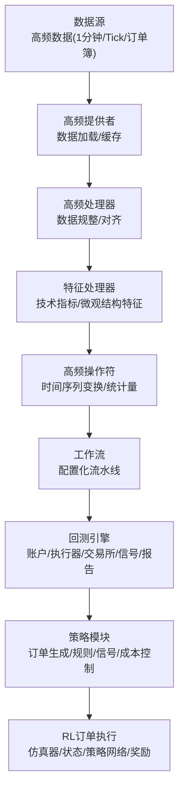
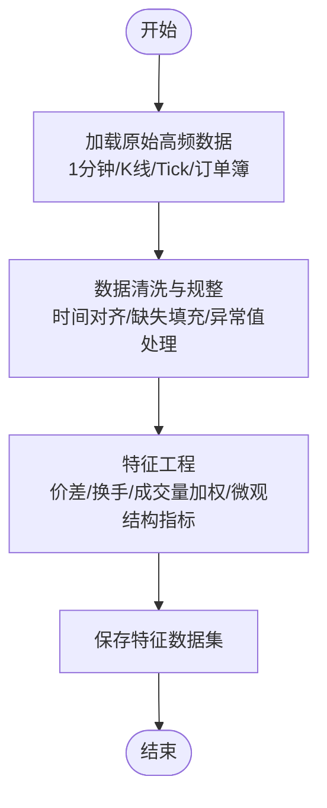
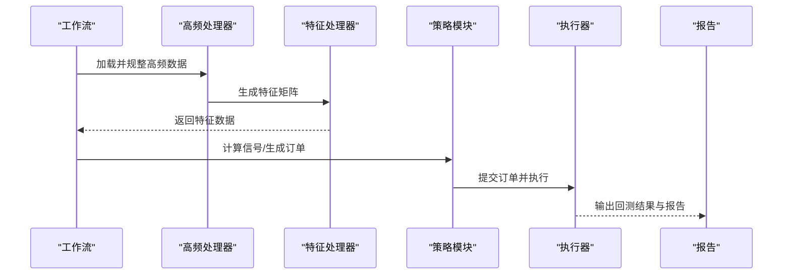
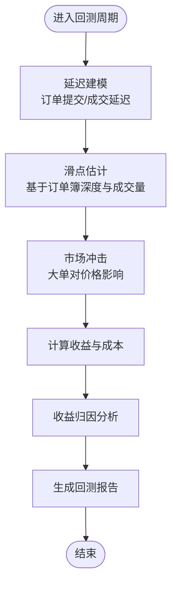
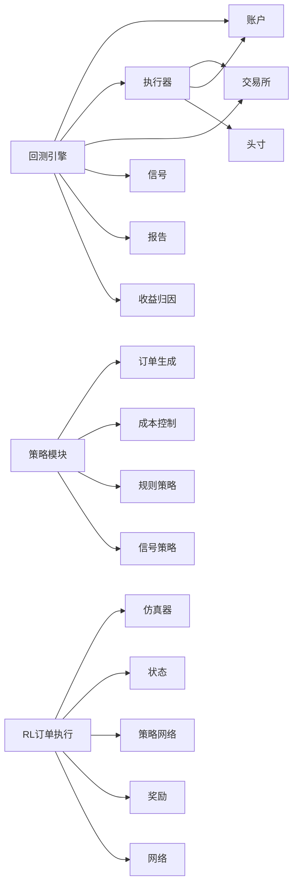

# 高频交易支持

<cite>
**本文引用的文件**
- [highfreq.rst](file://docs/component/highfreq.rst)
- [README.md](file://examples/highfreq/README.md)
- [highfreq_handler.py](file://examples/highfreq/highfreq_handler.py)
- [highfreq_processor.py](file://examples/highfreq/highfreq_processor.py)
- [highfreq_ops.py](file://examples/highfreq/highfreq_ops.py)
- [workflow.py](file://examples/highfreq/workflow.py)
- [workflow_config_High_Freq_Tree_Alpha158.yaml](file://examples/highfreq/workflow_config_High_Freq_Tree_Alpha158.yaml)
- [highfreq_handler.py](file://qlib/contrib/data/highfreq_handler.py)
- [highfreq_processor.py](file://qlib/contrib/data/highfreq_processor.py)
- [highfreq_provider.py](file://qlib/contrib/data/highfreq_provider.py)
- [high_freq.py](file://qlib/contrib/ops/high_freq.py)
- [backtest.py](file://qlib/backtest/backtest.py)
- [executor.py](file://qlib/backtest/executor.py)
- [exchange.py](file://qlib/backtest/exchange.py)
- [account.py](file://qlib/backtest/account.py)
- [position.py](file://qlib/backtest/position.py)
- [signal.py](file://qlib/backtest/signal.py)
- [report.py](file://qlib/backtest/report.py)
- [profit_attribution.py](file://qlib/backtest/profit_attribution.py)
- [order_generator.py](file://qlib/contrib/strategy/order_generator.py)
- [cost_control.py](file://qlib/contrib/strategy/cost_control.py)
- [rule_strategy.py](file://qlib/contrib/strategy/rule_strategy.py)
- [signal_strategy.py](file://qlib/contrib/strategy/signal_strategy.py)
- [simulator_qlib.py](file://qlib/rl/order_execution/simulator_qlib.py)
- [simulator_simple.py](file://qlib/rl/order_execution/simulator_simple.py)
- [state.py](file://qlib/rl/order_execution/state.py)
- [policy.py](file://qlib/rl/order_execution/policy.py)
- [reward.py](file://qlib/rl/order_execution/reward.py)
- [network.py](file://qlib/rl/order_execution/network.py)
- [test_high_freq_trading.py](file://tests/backtest/test_high_freq_trading.py)
</cite>

## 目录
1. [引言](#引言)
2. [项目结构](#项目结构)
3. [核心组件](#核心组件)
4. [架构总览](#架构总览)
5. [详细组件分析](#详细组件分析)
6. [依赖关系分析](#依赖关系分析)
7. [性能考虑](#性能考虑)
8. [故障排查指南](#故障排查指南)
9. [结论](#结论)
10. [附录](#附录)

## 引言
本文件面向需要在Qlib中进行高频交易研究与实践的用户，系统性介绍高频数据处理、微观结构分析、高频策略开发框架、高频回测与模拟交易，以及延迟建模、滑点处理、市场冲击成本等关键主题。内容基于仓库中的高频相关文档、示例与源码，帮助读者从数据接入到策略落地形成完整闭环。

## 项目结构
高频相关能力主要分布在以下区域：
- 文档：docs/component/highfreq.rst 提供高频专题文档
- 示例：examples/highfreq 展示高频数据处理、处理器、工作流与Alpha配置
- 核心实现：qlib/contrib/data 下的高频处理器、提供者与操作符
- 回测与执行：qlib/backtest 提供高频回测基础设施（账户、执行器、交易所、信号、报告）
- 策略模块：qlib/contrib/strategy 提供订单生成、成本控制、规则与信号策略
- RL订单执行：qlib/rl/order_execution 提供仿真器、状态、策略网络与奖励设计
- 测试：tests/backtest/test_high_freq_trading.py 提供高频回测测试用例

```mermaid
graph TB
subgraph "文档"
HFDoc["高频文档<br/>docs/component/highfreq.rst"]
end
subgraph "示例"
ExWF["工作流<br/>examples/highfreq/workflow.py"]
ExCfg["配置文件<br/>examples/highfreq/workflow_config_High_Freq_Tree_Alpha158.yaml"]
ExHandler["高频处理器示例<br/>examples/highfreq/highfreq_handler.py"]
ExProcessor["高频处理器示例<br/>examples/highfreq/highfreq_processor.py"]
ExOps["高频操作符示例<br/>examples/highfreq/highfreq_ops.py"]
end
subgraph "核心实现"
DataHFHandler["高频数据处理器<br/>qlib/contrib/data/highfreq_handler.py"]
DataHFProc["高频特征处理器<br/>qlib/contrib/data/highfreq_processor.py"]
DataHFProv["高频数据提供者<br/>qlib/contrib/data/highfreq_provider.py"]
OpsHF["高频操作符<br/>qlib/contrib/ops/high_freq.py"]
end
subgraph "回测与执行"
BT["回测引擎<br/>qlib/backtest/backtest.py"]
Exec["执行器<br/>qlib/backtest/executor.py"]
Exch["交易所模型<br/>qlib/backtest/exchange.py"]
Acc["账户<br/>qlib/backtest/account.py"]
Pos["头寸<br/>qlib/backtest/position.py"]
Sig["信号<br/>qlib/backtest/signal.py"]
Rep["报告<br/>qlib/backtest/report.py"]
PA["收益归因<br/>qlib/backtest/profit_attribution.py"]
end
subgraph "策略"
OG["订单生成<br/>qlib/contrib/strategy/order_generator.py"]
CC["成本控制<br/>qlib/contrib/strategy/cost_control.py"]
RS["规则策略<br/>qlib/contrib/strategy/rule_strategy.py"]
SS["信号策略<br/>qlib/contrib/strategy/signal_strategy.py"]
end
subgraph "RL订单执行"
SimQL["仿真器(qlib)<br/>qlib/rl/order_execution/simulator_qlib.py"]
SimSimple["仿真器(简单)<br/>qlib/rl/order_execution/simulator_simple.py"]
State["状态<br/>qlib/rl/order_execution/state.py"]
Policy["策略网络<br/>qlib/rl/order_execution/policy.py"]
Reward["奖励<br/>qlib/rl/order_execution/reward.py"]
Net["网络<br/>qlib/rl/order_execution/network.py"]
end
subgraph "测试"
TestHF["高频回测测试<br/>tests/backtest/test_high_freq_trading.py"]
end
HFDoc --> ExWF
ExWF --> ExCfg
ExWF --> ExHandler
ExWF --> ExProcessor
ExWF --> ExOps
ExWF --> BT
BT --> Exec
BT --> Exch
BT --> Acc
BT --> Pos
BT --> Sig
BT --> Rep
BT --> PA
BT --> OG
BT --> CC
BT --> RS
BT --> SS
BT --> SimQL
BT --> SimSimple
BT --> State
BT --> Policy
BT --> Reward
BT --> Net
BT --> TestHF
```

图表来源
- [highfreq.rst](file://docs/component/highfreq.rst)
- [workflow.py](file://examples/highfreq/workflow.py)
- [highfreq_handler.py](file://examples/highfreq/highfreq_handler.py)
- [highfreq_processor.py](file://examples/highfreq/highfreq_processor.py)
- [highfreq_ops.py](file://examples/highfreq/highfreq_ops.py)
- [workflow_config_High_Freq_Tree_Alpha158.yaml](file://examples/highfreq/workflow_config_High_Freq_Tree_Alpha158.yaml)
- [highfreq_handler.py](file://qlib/contrib/data/highfreq_handler.py)
- [highfreq_processor.py](file://qlib/contrib/data/highfreq_processor.py)
- [highfreq_provider.py](file://qlib/contrib/data/highfreq_provider.py)
- [high_freq.py](file://qlib/contrib/ops/high_freq.py)
- [backtest.py](file://qlib/backtest/backtest.py)
- [executor.py](file://qlib/backtest/executor.py)
- [exchange.py](file://qlib/backtest/exchange.py)
- [account.py](file://qlib/backtest/account.py)
- [position.py](file://qlib/backtest/position.py)
- [signal.py](file://qlib/backtest/signal.py)
- [report.py](file://qlib/backtest/report.py)
- [profit_attribution.py](file://qlib/backtest/profit_attribution.py)
- [order_generator.py](file://qlib/contrib/strategy/order_generator.py)
- [cost_control.py](file://qlib/contrib/strategy/cost_control.py)
- [rule_strategy.py](file://qlib/contrib/strategy/rule_strategy.py)
- [signal_strategy.py](file://qlib/contrib/strategy/signal_strategy.py)
- [simulator_qlib.py](file://qlib/rl/order_execution/simulator_qlib.py)
- [simulator_simple.py](file://qlib/rl/order_execution/simulator_simple.py)
- [state.py](file://qlib/rl/order_execution/state.py)
- [policy.py](file://qlib/rl/order_execution/policy.py)
- [reward.py](file://qlib/rl/order_execution/reward.py)
- [network.py](file://qlib/rl/order_execution/network.py)
- [test_high_freq_trading.py](file://tests/backtest/test_high_freq_trading.py)

章节来源
- [highfreq.rst](file://docs/component/highfreq.rst)
- [README.md](file://examples/highfreq/README.md)

## 核心组件
- 高频数据处理
  - 高频处理器：负责对1分钟级别、Tick、订单簿等高频数据进行特征提取与清洗
  - 高频提供者：封装数据源访问与缓存策略
  - 高频操作符：提供高频维度的计算与变换能力
- 高频回测与执行
  - 回测引擎：统一调度账户、执行器、交易所、信号、报告与收益归因
  - 执行器与交易所：模拟真实市场环境下的成交与报价行为
  - 成本控制与订单生成：内置滑点、市场冲击与延迟的成本建模
- 策略模块
  - 订单生成、规则策略、信号策略：为高频场景提供可插拔的决策逻辑
- RL订单执行
  - 仿真器、状态空间、策略网络与奖励：支持基于强化学习的执行策略训练与评估

章节来源
- [highfreq_handler.py](file://qlib/contrib/data/highfreq_handler.py)
- [highfreq_processor.py](file://qlib/contrib/data/highfreq_processor.py)
- [highfreq_provider.py](file://qlib/contrib/data/highfreq_provider.py)
- [high_freq.py](file://qlib/contrib/ops/high_freq.py)
- [backtest.py](file://qlib/backtest/backtest.py)
- [executor.py](file://qlib/backtest/executor.py)
- [exchange.py](file://qlib/backtest/exchange.py)
- [account.py](file://qlib/backtest/account.py)
- [position.py](file://qlib/backtest/position.py)
- [signal.py](file://qlib/backtest/signal.py)
- [report.py](file://qlib/backtest/report.py)
- [profit_attribution.py](file://qlib/backtest/profit_attribution.py)
- [order_generator.py](file://qlib/contrib/strategy/order_generator.py)
- [cost_control.py](file://qlib/contrib/strategy/cost_control.py)
- [rule_strategy.py](file://qlib/contrib/strategy/rule_strategy.py)
- [signal_strategy.py](file://qlib/contrib/strategy/signal_strategy.py)
- [simulator_qlib.py](file://qlib/rl/order_execution/simulator_qlib.py)
- [simulator_simple.py](file://qlib/rl/order_execution/simulator_simple.py)
- [state.py](file://qlib/rl/order_execution/state.py)
- [policy.py](file://qlib/rl/order_execution/policy.py)
- [reward.py](file://qlib/rl/order_execution/reward.py)
- [network.py](file://qlib/rl/order_execution/network.py)

## 架构总览
高频交易在Qlib中的整体架构围绕“数据-特征-回测-执行-策略”展开，强调可扩展的数据接入、灵活的特征工程、高保真的回测执行与可插拔的策略模块。

图表来源
- [highfreq_provider.py](file://qlib/contrib/data/highfreq_provider.py)
- [highfreq_handler.py](file://qlib/contrib/data/highfreq_handler.py)
- [highfreq_processor.py](file://qlib/contrib/data/highfreq_processor.py)
- [high_freq.py](file://qlib/contrib/ops/high_freq.py)
- [workflow.py](file://examples/highfreq/workflow.py)
- [backtest.py](file://qlib/backtest/backtest.py)
- [executor.py](file://qlib/backtest/executor.py)
- [exchange.py](file://qlib/backtest/exchange.py)
- [account.py](file://qlib/backtest/account.py)
- [position.py](file://qlib/backtest/position.py)
- [signal.py](file://qlib/backtest/signal.py)
- [report.py](file://qlib/backtest/report.py)
- [order_generator.py](file://qlib/contrib/strategy/order_generator.py)
- [cost_control.py](file://qlib/contrib/strategy/cost_control.py)
- [rule_strategy.py](file://qlib/contrib/strategy/rule_strategy.py)
- [signal_strategy.py](file://qlib/contrib/strategy/signal_strategy.py)
- [simulator_qlib.py](file://qlib/rl/order_execution/simulator_qlib.py)
- [simulator_simple.py](file://qlib/rl/order_execution/simulator_simple.py)
- [state.py](file://qlib/rl/order_execution/state.py)
- [policy.py](file://qlib/rl/order_execution/policy.py)
- [reward.py](file://qlib/rl/order_execution/reward.py)
- [network.py](file://qlib/rl/order_execution/network.py)

## 详细组件分析

### 高频数据处理能力
- 1分钟级别数据
  - 数据接入：通过高频提供者加载1分钟K线，支持多市场、多品种
  - 数据规整：高频处理器对齐时间戳、填充缺失、处理异常值
  - 特征工程：利用高频特征处理器生成价差、换手、成交量加权平均等指标
- Tick数据
  - 原始Tick读取与解析，支持逐笔成交、挂单变更
  - 时间序列对齐与聚合，便于后续订单簿建模
- 订单簿数据
  - 买卖盘深度、挂单量、最优买卖价等结构化字段提取
  - 订单簿动态变化的时序化表示，支持滑点与市场冲击建模

图表来源
- [highfreq_provider.py](file://qlib/contrib/data/highfreq_provider.py)
- [highfreq_handler.py](file://qlib/contrib/data/highfreq_handler.py)
- [highfreq_processor.py](file://qlib/contrib/data/highfreq_processor.py)
- [high_freq.py](file://qlib/contrib/ops/high_freq.py)

章节来源
- [highfreq.rst](file://docs/component/highfreq.rst)
- [highfreq_handler.py](file://examples/highfreq/highfreq_handler.py)
- [highfreq_processor.py](file://examples/highfreq/highfreq_processor.py)
- [highfreq_ops.py](file://examples/highfreq/highfreq_ops.py)
- [workflow.py](file://examples/highfreq/workflow.py)
- [workflow_config_High_Freq_Tree_Alpha158.yaml](file://examples/highfreq/workflow_config_High_Freq_Tree_Alpha158.yaml)

### 微观结构分析功能
- 市场微观结构理论应用
  - 使用订单簿数据计算买卖价差、挂单深度、流动性指标
  - 分析价格发现过程中的信息到达与价格调整机制
- 流动性分析
  - 通过高频成交量与价差估计流动性供给弹性
  - 利用滑点与市场冲击衡量交易成本与流动性质量
- 价格发现机制
  - 基于Tick级价格变动与成交量识别价格驱动因素
  - 结合订单簿动态刻画价格形成过程

章节来源
- [highfreq.rst](file://docs/component/highfreq.rst)
- [highfreq_processor.py](file://qlib/contrib/data/highfreq_processor.py)
- [high_freq.py](file://qlib/contrib/ops/high_freq.py)

### 高频策略开发框架
- 订单簿数据处理
  - 将订单簿转换为可用于策略的状态向量
  - 设计状态空间以捕捉市场瞬时动态
- 市场冲击建模
  - 在回测中引入非线性市场冲击函数，模拟大额订单对价格的影响
- 执行算法优化
  - 基于规则策略与信号策略的组合，结合成本控制模块
  - 支持TWAP、VWAP等经典执行算法的扩展与自定义

图表来源
- [workflow.py](file://examples/highfreq/workflow.py)
- [highfreq_handler.py](file://qlib/contrib/data/highfreq_handler.py)
- [highfreq_processor.py](file://qlib/contrib/data/highfreq_processor.py)
- [order_generator.py](file://qlib/contrib/strategy/order_generator.py)
- [cost_control.py](file://qlib/contrib/strategy/cost_control.py)
- [executor.py](file://qlib/backtest/executor.py)
- [report.py](file://qlib/backtest/report.py)

章节来源
- [order_generator.py](file://qlib/contrib/strategy/order_generator.py)
- [cost_control.py](file://qlib/contrib/strategy/cost_control.py)
- [rule_strategy.py](file://qlib/contrib/strategy/rule_strategy.py)
- [signal_strategy.py](file://qlib/contrib/strategy/signal_strategy.py)

### 高频回测与模拟交易
- 延迟建模
  - 在回测中引入订单提交与成交的延迟，模拟真实市场环境
- 滑点处理
  - 基于订单簿深度与成交量估计滑点，提高回测真实性
- 市场冲击成本
  - 采用非线性函数建模大额订单对价格的冲击
- 收益归因
  - 对回测收益进行分解，识别alpha、择时与交易成本贡献

图表来源
- [backtest.py](file://qlib/backtest/backtest.py)
- [executor.py](file://qlib/backtest/executor.py)
- [exchange.py](file://qlib/backtest/exchange.py)
- [account.py](file://qlib/backtest/account.py)
- [position.py](file://qlib/backtest/position.py)
- [signal.py](file://qlib/backtest/signal.py)
- [report.py](file://qlib/backtest/report.py)
- [profit_attribution.py](file://qlib/backtest/profit_attribution.py)

章节来源
- [backtest.py](file://qlib/backtest/backtest.py)
- [executor.py](file://qlib/backtest/executor.py)
- [exchange.py](file://qlib/backtest/exchange.py)
- [account.py](file://qlib/backtest/account.py)
- [position.py](file://qlib/backtest/position.py)
- [signal.py](file://qlib/backtest/signal.py)
- [report.py](file://qlib/backtest/report.py)
- [profit_attribution.py](file://qlib/backtest/profit_attribution.py)

### 实际高频策略示例与性能优化
- 示例工作流
  - 使用示例工作流加载高频数据，配置Alpha与处理器，运行回测并输出报告
- 性能优化建议
  - 数据缓存与批处理：减少I/O与重复计算
  - 向量化与并行：利用NumPy/Pandas高效处理时间序列
  - 特征选择与降维：降低维度灾难，提升模型与回测效率
  - 执行器参数调优：滑点、冲击与延迟参数的敏感性分析

章节来源
- [README.md](file://examples/highfreq/README.md)
- [workflow.py](file://examples/highfreq/workflow.py)
- [workflow_config_High_Freq_Tree_Alpha158.yaml](file://examples/highfreq/workflow_config_High_Freq_Tree_Alpha158.yaml)

## 依赖关系分析
高频回测与执行模块之间的耦合关系如下：

图表来源
- [backtest.py](file://qlib/backtest/backtest.py)
- [account.py](file://qlib/backtest/account.py)
- [executor.py](file://qlib/backtest/executor.py)
- [exchange.py](file://qlib/backtest/exchange.py)
- [position.py](file://qlib/backtest/position.py)
- [signal.py](file://qlib/backtest/signal.py)
- [report.py](file://qlib/backtest/report.py)
- [profit_attribution.py](file://qlib/backtest/profit_attribution.py)
- [order_generator.py](file://qlib/contrib/strategy/order_generator.py)
- [cost_control.py](file://qlib/contrib/strategy/cost_control.py)
- [rule_strategy.py](file://qlib/contrib/strategy/rule_strategy.py)
- [signal_strategy.py](file://qlib/contrib/strategy/signal_strategy.py)
- [simulator_qlib.py](file://qlib/rl/order_execution/simulator_qlib.py)
- [simulator_simple.py](file://qlib/rl/order_execution/simulator_simple.py)
- [state.py](file://qlib/rl/order_execution/state.py)
- [policy.py](file://qlib/rl/order_execution/policy.py)
- [reward.py](file://qlib/rl/order_execution/reward.py)
- [network.py](file://qlib/rl/order_execution/network.py)

章节来源
- [backtest.py](file://qlib/backtest/backtest.py)
- [executor.py](file://qlib/backtest/executor.py)
- [exchange.py](file://qlib/backtest/exchange.py)
- [account.py](file://qlib/backtest/account.py)
- [position.py](file://qlib/backtest/position.py)
- [signal.py](file://qlib/backtest/signal.py)
- [report.py](file://qlib/backtest/report.py)
- [profit_attribution.py](file://qlib/backtest/profit_attribution.py)
- [order_generator.py](file://qlib/contrib/strategy/order_generator.py)
- [cost_control.py](file://qlib/contrib/strategy/cost_control.py)
- [rule_strategy.py](file://qlib/contrib/strategy/rule_strategy.py)
- [signal_strategy.py](file://qlib/contrib/strategy/signal_strategy.py)
- [simulator_qlib.py](file://qlib/rl/order_execution/simulator_qlib.py)
- [simulator_simple.py](file://qlib/rl/order_execution/simulator_simple.py)
- [state.py](file://qlib/rl/order_execution/state.py)
- [policy.py](file://qlib/rl/order_execution/policy.py)
- [reward.py](file://qlib/rl/order_execution/reward.py)
- [network.py](file://qlib/rl/order_execution/network.py)

## 性能考虑
- 数据层
  - 使用批处理与缓存减少I/O开销；对时间序列进行向量化操作
- 特征层
  - 控制特征维度，避免冗余；优先使用低计算复杂度的统计量
- 回测层
  - 合理设置延迟与滑点参数，避免过度拟合；对执行器参数进行网格/贝叶斯优化
- 策略层
  - 规则与信号策略应保持简洁；成本控制模块需与执行器紧密耦合

## 故障排查指南
- 回测结果异常
  - 检查延迟、滑点与市场冲击参数是否合理
  - 核对订单生成与执行路径，确认信号与策略一致性
- 数据不一致或缺失
  - 复核高频提供者的加载流程与时间对齐逻辑
  - 检查特征处理器的边界条件与空值处理
- 性能瓶颈
  - 定位I/O密集环节，启用缓存与并行
  - 减少不必要的特征计算与回测循环内的重复操作

章节来源
- [test_high_freq_trading.py](file://tests/backtest/test_high_freq_trading.py)

## 结论
Qlib为高频交易提供了从数据接入、特征工程到回测执行与策略优化的完整能力。通过高频提供者、处理器与操作符，用户可以高效构建1分钟、Tick与订单簿等多维度的高频数据管线；借助回测引擎与成本控制模块，能够真实地模拟市场环境并评估策略表现；结合RL订单执行框架，可进一步探索智能执行策略。建议在实践中持续优化数据与特征质量、执行器参数与策略逻辑，以获得更稳健的高频策略。

## 附录
- 快速上手步骤
  - 配置高频数据源与工作流
  - 运行示例工作流，查看回测报告
  - 调参与策略迭代，逐步引入RL执行策略